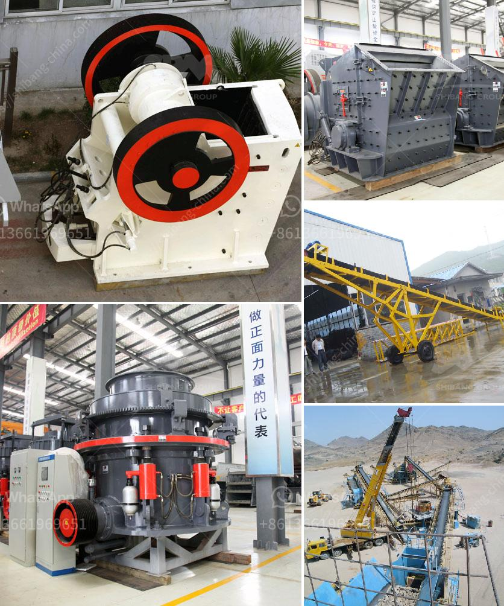

<h3>طريقة فحص عمودية</h3>
فحص العمودية هو عملية مهمة في مجال الهندسة المدنية. يهدف هذا الفحص إلى تحقيق السلامة الهيكلية للمبنى أو المنشأة العمودية. يمكن أن يتعرض العمود لعوامل تؤثر على قوته واستقراره، مثل الأحمال المفرطة أو التآكل أو تلف الأجزاء، ومن هنا يصبح الفحص الدوري للعمود ضروريًا.

تتكون عملية فحص العمودية من عدة خطوات. أولاً، يتم تفحص خارج العمود للتحقق من وجود أي تلف مرئي أو تشققات. يمكن أن يؤدي تلف العمود الخارجي إلى ضعف قوته وتهديد استقراره.

بعد ذلك، يتم اختبار العمود للتحقق من قوته. يمكن استخدام جهاز قياس قوة العمود لقياس قدرته على تحمل الضغط والشد. يتم ضبط الجهاز وتطبيق القوة المحددة على العمود، ويتم قياس التشوه الحدث في العمود. إذا كان التشوه ضمن الحدود المقبولة، فإن العمود يعتبر قويًا ويستطيع تحمل الأحمال المطلوبة. وإذا كان هناك تشوه أكبر من المقبول، فيجب اتخاذ التدابير اللازمة لتعزيز العمود.

قد تشمل التدابير التصحيحية على سبيل المثال إضافة مواد بناء إضافية للعمود أو تعزيز التثبيت بواسطة القوابض. قد يكون من الضروري أيضًا استبدال العمود بأخر جديد إذا كان التلف شديدا.

بعد إجراء الفحص واتخاذ التدابير اللازمة، يجب أن يتم توثيق النتائج والتدابير المتخذة. يجب أن تحتوي التوثيق على معلومات مثل تاريخ الفحص والمعلومات التقنية المتعلقة بالعمود وأية توصيات تم اتخاذها.

باختصار، يعتبر فحص العمودية عملية أساسية للحفاظ على السلامة الهيكلية للمباني والمنشآت العمودية. عن طريق التحقق من وجود أي تلف واختبار قوة العمود، يمكن اتخاذ التدابير اللازمة للحفاظ على استقرار العمود وضمان سلامة المبنى أو المنشأة بشكل عام.
<h3>Contact us</h3><ul><li><strong>Whatsapp:&nbsp;<a href="https://wa.me/8613661969651">+8613661969651</a></strong></li><li><a href="https://swt.shibang-china.com/?git&amp;zhl&amp;طريقة فحص عمودية"><strong>Online Service(chat now)</strong></a></li></ul><h3>Related</h3><ul><li><a href='تكلفة ناقل الحزام لصناعة التعدين.md'>تكلفة ناقل الحزام لصناعة التعدين</a></li><li><a href='كسارة الحجر في ماليزيا.md'>كسارة الحجر في ماليزيا</a></li><li><a href='مطاحن الكرة للبيع في زيمبابوي.md'>مطاحن الكرة للبيع في زيمبابوي</a></li><li><a href='معدات طحن الباريت.md'>معدات طحن الباريت</a></li><li><a href='آلة تكسير وطحن مناجم الذهب.md'>آلة تكسير وطحن مناجم الذهب</a></li></ul>