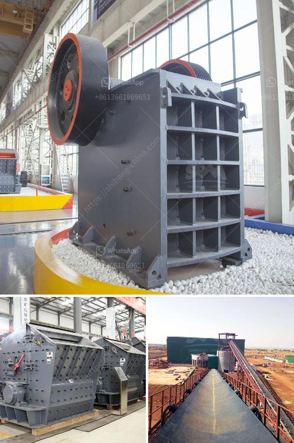

<h3>طواحين الطوابع الذهبية في زيمبابوي</h3>
تعتبر طواحين الطوابع الذهبية في زيمبابوي من المعالم التاريخية الهامة، والتي تشهد على الثقافة والتاريخ الغني لهذا البلد. وتُعد هذه الطواحين معلماً سياحياً رائعاً يجذب العديد من الزوار الذين يهتمون بتاريخ التعدين والعملات المعدنية.

تأسست طواحين الطوابع الذهبية في زيمبابوي في أوائل القرن العشرين، وتُعد واحدة من أجمل وأكبر المجمعات التي تعبد للتعدين بأنواعه المختلفة، وبخاصة تعدين الذهب. تم استخدام هذه الطواحين لطحن الصخور والخامات المحملة بالذهب، بهدف استخراج الذهب منها.

تتميز هذه الطواحين بتصميمها الفريد، حيث تتألف من أربعة إلى ستة طواحين صغيرة مصممة بشكل دائري، تستخدم لطحن الصخور بواسطة طحن الذهب. إنها تشبه الجواد (الموءوسة) في المظهر، وتعزف لفظيًا نفس الدور الذي كانت تعزفه على الحجارة.

جدير بالذكر أن طواحين الطوابع الذهبية كانت في الماضي تعتبر وسيلة هامة للاطغضاء على التعدين وتنقية الذهب من الصخور المستخدمة في العملية. وقد تم استخدامها بنجاح كبير في زمن التعدين الذهبي الذي تعرفه زيمبابوي، فقد تم تصدير كميات كبيرة من الذهب من طريق استخدام هذه الطواحين.

علاوة على ذلك، تتميز طواحين الطوابع الذهبية بتصميمها المعماري المتقن. فقد تم بناؤها من الحجر والحديد المطاوع بشكل يدل على مهارة الحرفيين التقليديين. لا يزال بعض هذه الطواحين قائمة ومحافظة على العمارة الأصلية، في حين تم تحويل البعض الآخر إلى متاحف تعرض التاريخ والعملية الفنية لتلك الطواحين.

إن طواحين الطوابع الذهبية في زيمبابوي تمثل نقطة انطلاق لاكتشاف الثروات العظيمة التي تحتضنها أراضيها. وتعتبر هذه المعالم السياحية شاهداً حضاريّاً واسع النطاق على تاريخ البلاد، وتجذب الزوار من جميع أنحاء العالم للاستمتاع بجمال هذه الآثار القديمة وفهم العملية الضرورية لنموها الاقتصادي. لذلك، فإن طواحين الطوابع الذهبية في زيمبابوي تعتبر واحدة من أبرز الوجهات السياحية في البلاد، وتستحق بلا شك زيارة كل من يهتم بالتاريخ والثقافة.
<h3>Contact us</h3><ul><li><strong>Whatsapp:&nbsp;<a href="https://wa.me/8613661969651">+8613661969651</a></strong></li><li><a href="https://swt.shibang-china.com/?git&amp;zhl&amp;طواحين الطوابع الذهبية في زيمبابوي"><strong>Online Service(chat now)</strong></a></li></ul><h3>Related</h3><ul><li><a href='كسارة الحجر الهامر.md'>كسارة الحجر الهامر</a></li><li><a href='إعداد وحدة طحن الأسمنت بسعة 100 طن يوميًا.md'>إعداد وحدة طحن الأسمنت بسعة 100 طن يوميًا</a></li><li><a href='استخدام مسحوق الجبس في البناء.md'>استخدام مسحوق الجبس في البناء</a></li><li><a href='سعر كسارة الحجر المحمول في باكستان.md'>سعر كسارة الحجر المحمول في باكستان</a></li><li><a href='آفاق صناعة كسارة الجرانيت.md'>آفاق صناعة كسارة الجرانيت</a></li></ul>