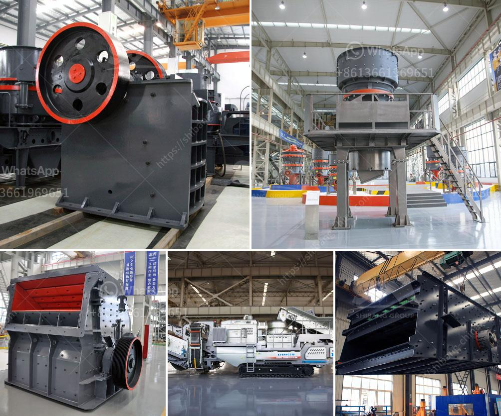

<h3>عرض مصنع معالجة الجير</h3>
يعتبر مصنع معالجة الجير من المصانع الهامة في قطاع صناعة البناء والتشييد، حيث يلعب دورًا كبيرًا في إنتاج الجير المُحسّن المستخدم في العديد من التطبيقات الصناعية. وفي هذه المقالة سأعرض على القارئ بعض المعلومات الأساسية حول مصانع معالجة الجير.

يعتبر مصنع معالجة الجير مكانًا حيث يتم استخراج الجير من الصخور الجيرية ومن ثم تنقيته وتقوية خواصه لاستخدامه في عدة صناعات مختلفة. الجير هو مادة معدنية تستخدم في عمليات البناء والصناعات الكيميائية والزراعة والمعادن وغيرها من التطبيقات.

تتم عملية معالجة الجير في مصنع عبر عدة خطوات. أولًا، يتم استخراج الصخور الجيرية من المحاجر ونقلها إلى المصنع. بعد ذلك يتم سحق الصخور وطحنها إلى مسحوق ناعم. يتم تسخين هذا المسحوق في فرن خاص لزيادة تركيز الجير وتحسين خواصه. ثم يتم تبريد المادة وتخزينها في صوامع خاصة لتجفيفها بشكل مناسب.

بعد تجفيفها، يتم تعبئة الجير في أكياس أو حاويات جاهزة للتوزيع والتسويق. ويتم توزيع الجير إما في السوق المحلية أو تصديره إلى الأسواق العالمية حسب الطلب. يتم اختيار نوعية الجير وتعبئتها وتسميتها وفقًا لمعايير التصنيع ومتطلبات العملاء المختلفة.

من أهم التطبيقات الصناعية للجير هو استخدامه في صناعة الأسمنت. حيث يتم استخدام الجير المُحسّن للتحكم في خواص الأسمنت وتحسين متانته ومقاومته. كما يستخدم الجير أيضًا في صناعة الصابون والمحاليل المنظفة ومستحضرات التجميل، حيث يعطي اللون والتركيب المناسب لهذه المنتجات. كما يستخدم الجير أيضًا في تصنيع الزجاج والورق والمعادن وتحسين خواص التربة في الزراعة.

من الجدير بالذكر أن مصانع معالجة الجير تعتمد على تكنولوجيا متطورة وتجهيزات خاصة لضمان جودة وكفاءة المنتج. كما تلتزم هذه المصانع بمعايير الصحة والسلامة والحفاظ على البيئة في جميع عملياتها.

باختصار، يعتبر مصنع معالجة الجير من المصانع الهامة التي تلعب دورًا كبيرًا في صناعة البناء والتشييد. ويعتمد نجاح هذه المصانع على مراعاة معايير الجودة والكفاءة والاستخدام المستدام للموارد الطبيعية في إنتاج الجير الممتاز والمطابق لمتطلبات العملاء المختلفة.
<h3>Contact us</h3><ul><li><strong>Whatsapp:&nbsp;<a href="https://wa.me/8613661969651">+8613661969651</a></strong></li><li><a href="https://swt.shibang-china.com/?git&amp;zhl&amp;عرض مصنع معالجة الجير"><strong>Online Service(chat now)</strong></a></li></ul><h3>Related</h3><ul><li><a href='كسارة مخروطية للبيع.md'>كسارة مخروطية للبيع</a></li><li><a href='آلة طحن الصخور والألغام والخامات المسحوقة.md'>آلة طحن الصخور والألغام والخامات المسحوقة</a></li><li><a href='أحزمة ناقلة الشيفرون في الفلبين.md'>أحزمة ناقلة الشيفرون في الفلبين</a></li><li><a href='كسارة تعدين الحجر الجيري في فيتنام.md'>كسارة تعدين الحجر الجيري في فيتنام</a></li><li><a href='مطاحن الحجر للبيع في كينيا.md'>مطاحن الحجر للبيع في كينيا</a></li></ul>