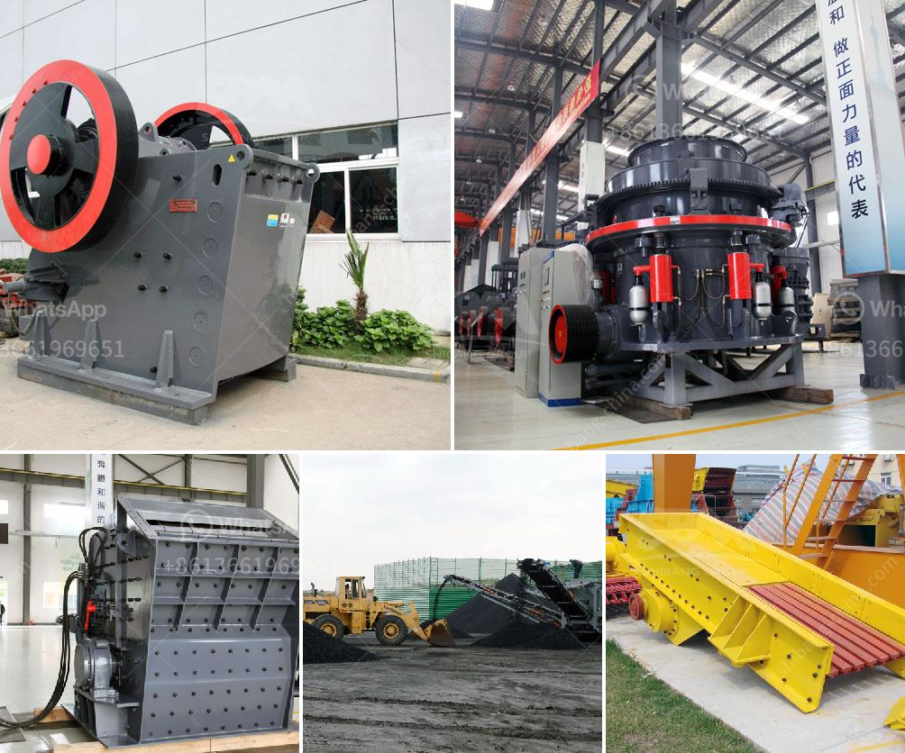

<h3>عصابات كسارة الحجر في جامايكا</h3>
تعد عصابات كسارة الحجر في جامايكا ظاهرة متفشية ومشكلة خطيرة تؤثر على حياة الناس واقتصاد البلاد. تقوم هذه العصابات بالسيطرة على مناطق معينة وتحكم في عمليات استخراج وتداول الحجر بشكل غير قانوني.

تعود جذور تشكل هذه العصابات إلى فترة الاستعمار البريطاني في جامايكا، حيث استخدمت قوة الأسلحة والعنف لاستغلال فقراء البلاد وسطوتها عليهم. على مر السنين، تطورت هذه العصابات وتعلقت بأنشطة غير قانونية أخرى مثل المخدرات والسلاح، حيث تعتبر جامايكا وجهة مهمة لتهريب الماريجوانا وغيرها من المخدرات إلى الولايات المتحدة الأمريكية وأوروبا.

تعمل عصابات كسارة الحجر عبر الاستيلاء على المحاجر والتسلط على العمال فيها. وعلى الرغم من الرسوم والقوانين التي تنظم عملية استخراج الحجر، إلا أن هذه العصابات تتجاوزها وتقوم بتهديد وترهيب العمال وسحقهم إلى تنفيذ أوامرها. كما تستغل تلك العصابات أيضًا الفقر والبطالة المرتفعة في البلاد لجذب الأفراد وانضمامهم إلى صفوفها.

تؤدي نشاطات عصابات كسارة الحجر إلى عدة تداعيات سلبية على المجتمع والاقتصاد المحلي. فإلى جانب التهديدات والعنف المرتبط بهذه العصابات، يتم التأثير على العمال وحقوقهم، حيث يتم تعريضهم للظروف السيئة والأجور المنخفضة. كما يتسبب تجارة الحجر غير القانونية في ضرر بالبيئة المحلية، حيث يتم استخراج الحجر بشكل غير مسؤول دون الالتزام بالتدابير البيئية اللازمة للحد من الأثر السلبي على المناطق المحيطة.

تعمل الحكومة الجامايكية بالتعاون مع الشرطة والقوات الأمنية الأخرى على محاربة هذه العصابات ومكافحة الجريمة المنظمة. يتم تنفيذ عمليات أمنية لتفكيك شبكات التهريب وتوفير الحماية للعمال والسكان المحليين. بالإضافة إلى ذلك، تسعى الحكومة أيضًا إلى توفير الوظائف والفرص الاقتصادية للشباب في جامايكا بهدف تقليل التجنيد في صفوف هذه العصابات ومعالجة جذور هذه المشكلة الاجتماعية والاقتصادية.

في الختام، يجب على الحكومة الجامايكية العمل بجد لمكافحة عصابات كسارة الحجر وتقديم العدالة للمتضررين. ينبغي توفير الحماية للعمال والمواطنين وملاحقة المسؤولين عن الجرائم المرتبطة بهذه العصابات. بالإضافة إلى ذلك، يجب تعزيز التعليم وتوفير فرص عمل للشباب بهدف حل هذه المشكلة الاجتماعية والاقتصادية العرقية في جامايكا.
<h3>Contact us</h3><ul><li><strong>Whatsapp:&nbsp;<a href="https://wa.me/8613661969651">+8613661969651</a></strong></li><li><a href="https://swt.shibang-china.com/?git&amp;zhl&amp;عصابات كسارة الحجر في جامايكا"><strong>Online Service(chat now)</strong></a></li></ul><h3>Related</h3><ul><li><a href='تقرير المشروع حول وحدة تكسير الحجر.md'>تقرير المشروع حول وحدة تكسير الحجر</a></li><li><a href='أنواع كسارة الحصى.md'>أنواع كسارة الحصى</a></li><li><a href='خط إنتاج الباريت.md'>خط إنتاج الباريت</a></li><li><a href='رسم لآلات غسل الرمل كسارة مطحنة.md'>رسم لآلات غسل الرمل كسارة مطحنة</a></li><li><a href='مصنع الأسمنت من الصهر 100 طن.md'>مصنع الأسمنت من الصهر 100 طن</a></li></ul>