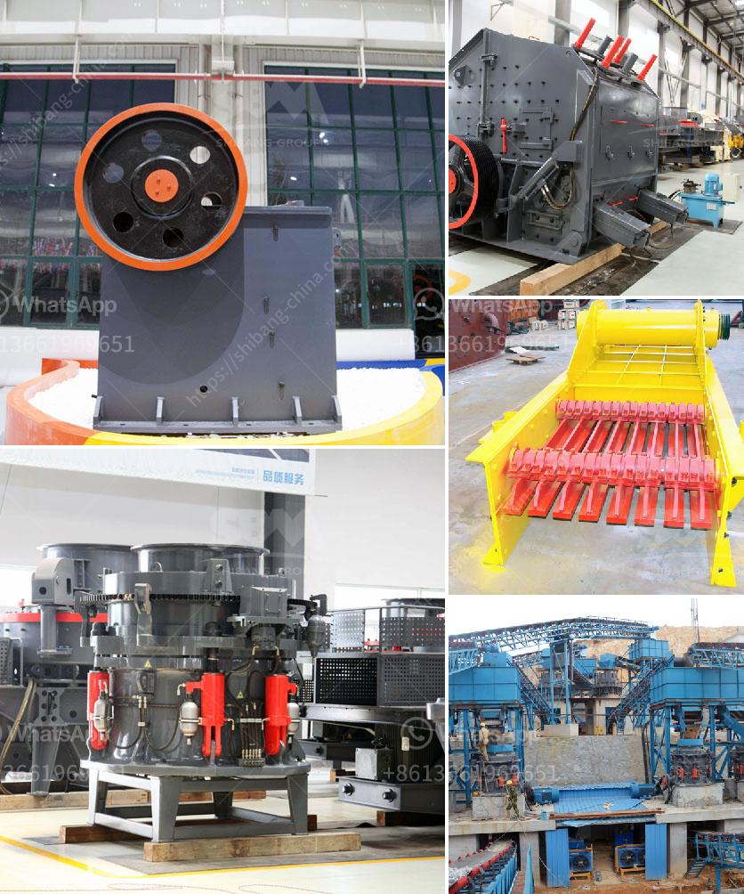

<h3>علامات الناقل والكسارات في إندونيسيا</h3>
تعتبر إندونيسيا من بين الدول النامية الرائدة في العالم، والتي تعتمد بشكل كبير على النقل والكسارات في التنمية الاقتصادية والبنية التحتية. تشهد البلاد نموًا سكانيًا سريعًا وزيادة في الطلب على البنية التحتية للطرق والجسور والمباني والمرافق العامة. ومن أجل تلبية هذا الطلب المتزايد، باتت وجودة وتطوير نظام النقل والكسارات ضرورة حاسمة.

تعد علامات النقل في إندونيسيا أحد المؤشرات الرئيسية للتنمية الاقتصادية. تعمل حكومة البلاد بجد لتعزيز القطاعات اللوجستية وتحسين أنظمة النقل البري والماء والجو. تمتلك إندونيسيا شبكة واسعة من الطرق السريعة والطرق الرئيسية وخطوط السكة الحديد، والتي تمتد عبر الجزيرة الرئيسية والجزر الأخرى المؤلفة للبلاد. تساهم هذه البنية القوية في تسهيل حركة البضائع والأفراد داخل البلاد وخارجها.

على النقيض من ذلك، فإن قطاع الكسارات في إندونيسيا هو قطاع حيوي في إمدادات البنية التحتية والصناعات الأخرى في البلاد. الكسارات تعتمد على تكسير المواد الخام مثل الحجر والرمل والحصى لاستخدامها في البناء والتشييد. مع توسع البنية التحتية والتطور العمراني، قد يكون هناك حاجة زائدة للكسارات في السنوات القادمة.

على الرغم من وجود قطاعات النقل والكسارات القوية في إندونيسيا، إلا أنها ما زالت تواجه بعض التحديات. تشكل الطرق الزحمة ونقص التمويل وضعف البنية التحتية التحديات الرئيسية التي يجب حلها. من الضروري أن تعزز الحكومة الاستثمار في البنية التحتية وتوفر التمويل الكافي لتطوير وإصلاح الطرق وتحديث سكة الحديد. هذه الإجراءات ستسهم في تحسين فعالية النقل وتخفيف الزحام وتعزيز التنمية الاقتصادية.

بشكل مماثل، يجب أن تهتم الحكومة أيضًا بتنظيم قطاع الكسارات، وتطبيق المعايير البيئية والصحية اللازمة لضمان عمليات التعدين المستدامة. يمكن تحقيق ذلك من خلال تنظيم التصاريح والرقابة على الانبعاثات وإدارة المخلفات. عن طريق تطبيق هذه الإجراءات، يمكن لقطاع الكسارات أن يكون عاملًا مهمًا في التنمية الاقتصادية والصناعية، دون التأثير السلبي على البيئة وصحة الأفراد.

وباختصار، فإن علامات النقل والكسارات تعتبر عناصر حاسمة في تطور إندونيسيا الاقتصادي والبناء العمراني. استثمار الحكومة في تحسين هذه القطاعات وتوفير التمويل اللازم سيسهم في تعزيز التنمية المستدامة وتحسين جودة الحياة للمواطنين في البلاد.
<h3>Contact us</h3><ul><li><strong>Whatsapp:&nbsp;<a href="https://wa.me/8613661969651">+8613661969651</a></strong></li><li><a href="https://swt.shibang-china.com/?git&amp;zhl&amp;علامات الناقل والكسارات في إندونيسيا"><strong>Online Service(chat now)</strong></a></li></ul><h3>Related</h3><ul><li><a href='كسارة الفك تركيا.md'>كسارة الفك تركيا</a></li><li><a href='مصنع سلاغ السيليكو من الحديد في ألمانيا.md'>مصنع سلاغ السيليكو من الحديد في ألمانيا</a></li><li><a href='كسارة الحجر في تركيا.md'>كسارة الحجر في تركيا</a></li><li><a href='استثمار مصنع كسارة الحجر.md'>استثمار مصنع كسارة الحجر</a></li><li><a href='مصنع غسل الذهب msi المستخدم.md'>مصنع غسل الذهب msi المستخدم</a></li></ul>