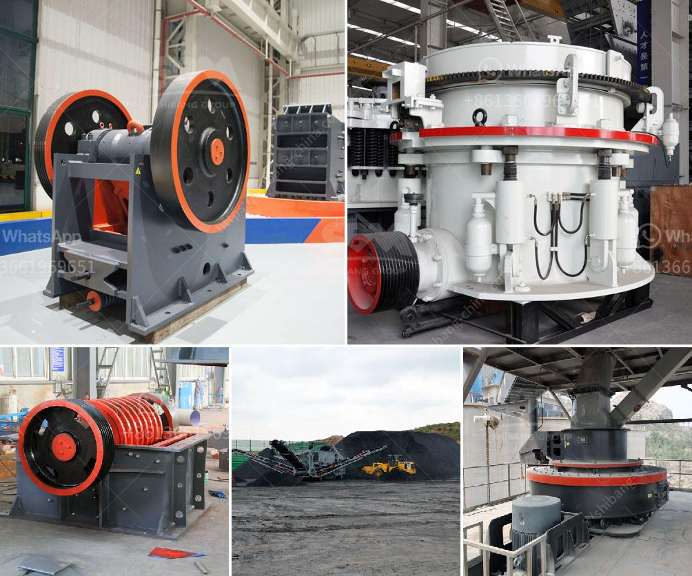

<h3>علامات مصنع كسارة المحجر مطحنة الكرة</h3>
تعد مصانع كسارات المحاجر ومطاحن الكرة من العتاد الهام في عملية تكسير الصخور وطحنها للاستفادة منها في العديد من الصناعات. تتميز هذه الآلات بعدة علامات تميزها عن غيرها من الآلات القديمة والتي تساعد في تحسين كفاءتها وزيادة إنتاجيتها.

أحد العوامل المهمة في مصنع كسارة المحجر هو السعة. تعتمد سعة الكسارة على حجم ونوع الصخور التي ستتم معالجتها. فعلى سبيل المثال، إذا كان يحتاج المصنع إلى كسر الصخور ذات الحجم الكبير، فيحتاج إلى محرك كبير الحجم ويتطلب طاقة أكبر. ومن المهم أن يتم اختيار مصنع كسارة المحجر المتوافق مع الاحتياجات المحددة للصناعة والإنتاج.

تعتمد مطاحن الكرة على الاهتزاز والحركة الدورانية للكرات داخل الأسطوانة لطحن الصخور الخام. يمكن استخدام مطاحن الكرة في عمليات الطحن المباشر والطحن الجاف أو الطحن الرطب. تأتي هذه الآلات في أحجام وطاقات مختلفة لتلبية احتياجات المستخدمين المختلفة. كما يتوفر العديد من الملحقات المتاحة لمصانع مطاحن الكرة لتحقيق الطحن بأعلى كفاءة.

علامة أخرى لمصنع كسارة المحجر هو جودة التصنيع والمتانة. يجب أن تكون الآلات مصنوعة من مواد عالية الجودة لتتحمل التأثيرات القوية والتآكل الناتج عن عملية التكسير والطحن. يجب أن تتمتع الآلات بتصميم قوي ودقة عالية لتعمل بفعالية وتحقق أعلى إنتاجية.

وأخيرًا، يجب أن تأتي المصانع بميزات إضافية مثل الأتمتة والتحكم عن بُعد والأمان. يجب أن تكون هذه الميزات متوفرة لتسهيل عملية التشغيل والضبط ولتحسين سلامة العمال والآلات.

باختصار، تعد مصانع كسارة المحجر ومطاحن الكرة أدوات مهمة في صناعة تكسير الصخور وطحنها. يتميز هذا العتاد بالعديد من العلامات التجارية التي تجعلها أكثر كفاءة وإنتاجية، ويشمل ذلك السعة والجودة والتصميم والميزات الإضافية. لذلك، فإن اختيار مصنع المحجر ومطحنة الكرة المناسبة هو أمر حاسم لتحقيق أفضل النتائج في عملية التكسير والطحن.
<h3>Contact us</h3><ul><li><strong>Whatsapp:&nbsp;<a href="https://wa.me/8613661969651">+8613661969651</a></strong></li><li><a href="https://swt.shibang-china.com/?git&amp;zhl&amp;علامات مصنع كسارة المحجر مطحنة الكرة"><strong>Online Service(chat now)</strong></a></li></ul><h3>Related</h3><ul><li><a href='كسارة الخرسانة المستعملة للبيع.md'>كسارة الخرسانة المستعملة للبيع</a></li><li><a href='مطحنة رايموند للبيع مستعملة.md'>مطحنة رايموند للبيع مستعملة</a></li><li><a href='آلة كسارة محمولة.md'>آلة كسارة محمولة</a></li><li><a href='معدات تعدين الذهب على نطاق صغير للبيع في مزاد.md'>معدات تعدين الذهب على نطاق صغير للبيع في مزاد</a></li><li><a href='مصنع سحق الحجر الجيري.md'>مصنع سحق الحجر الجيري</a></li></ul>