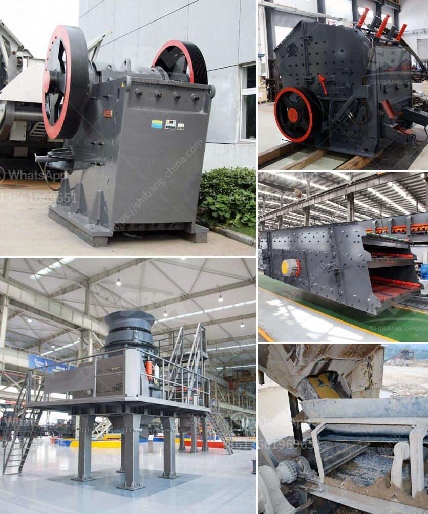

<h3>عمل المطحنة الكرة بالهندية</h3>
كرة المطحنة هي آلة تستخدم لطحن المواد الخام في صناعة الأسمنت والصناعات الأخرى. تعد الهند من أكبر الدول المنتجة للأسمنت في العالم، حيث تمتلك العديد من الشركات المطاحن الكرة التي تلعب دورًا حاسمًا في عملية إنتاج الأسمنت. سنتحدث في هذه المقالة عن كيفية عمل المطحنة الكرة بالهندية، ودورها الحاسم في صناعة الأسمنت.

يتألف عمل المطحنة الكرة من عدة مراحل. تبدأ العملية بتحميل المواد الخام داخل المطحنة، وهي تتكون عادةً من الحجر الجيري والسيليكات والطين. تجرى هذه المرحلة في محطات الإنتاج الخاصة بالمطاحن.

بمجرد تحميل المواد الخام يتم طحنها وسحقها داخل المطاحن باستخدام الكرات المعدنية. تقوم الكرات بطحن المواد الخام بفعل قوة الجاذبية وحركة دوران المطحنة. تساعد الكرات على تقليل حجم المواد وتحويلها إلى مسحوق ناعم يسمى الأسمنت الخام.

ثم يتم تفريغ الأسمنت الخام من المطحنة ونقلها إلى مُزَوِّدات إعادة التدوير. تحتوي هذه الآلات على مصافي تساعد على فصل الأسمنت الخام عن المواد الصلبة الأخرى التي لم تتم طحنها جيدًا، وتعيد استخدام هذه المواد في دورة الطحن مرةً أخرى.

تعتبر المطاحن الكرة مهمة بشكل كبير في صناعة الأسمنت، حيث تلعب دورًا حاسمًا في عملية طحن المواد الخام وتحويلها إلى أسمنت ناعم ومتجانس. بفضل المطاحن الكرة، يتم تحقيق جودة عالية للأسمنت النهائي.

إلى جانب ذلك، تعد المطاحن الكرة مهمة أيضًا في تحقيق كفاءة عالية في عمليات الإنتاج. فهي تتميز بقدرتها على تحمل التحميل الثقيل والعمل المستمر لفترات طويلة، مما يعني أنها تمكن المصانع من تشغيلها بشكل مستمر دون توقف.

باختصار، تعد المطاحن الكرة جزءًا حيويًا من عملية إنتاج الأسمنت في الهند. تحقق هذه الآلات تحويل المواد الخام إلى أسمنت ناعم ومتجانس، وتساعد في تحقيق كفاءة عالية في عمليات الإنتاج. تعد الهند واحدة من أكبر الدول المنتجة للأسمنت، مما يعني أن المطاحن الكرة تلعب دورًا حاسمًا في تلبية احتياجات السوق المحلية والعالمية.
<h3>Contact us</h3><ul><li><strong>Whatsapp:&nbsp;<a href="https://wa.me/8613661969651">+8613661969651</a></strong></li><li><a href="https://swt.shibang-china.com/?git&amp;zhl&amp;عمل المطحنة الكرة بالهندية"><strong>Online Service(chat now)</strong></a></li></ul><h3>Related</h3><ul><li><a href='تكلفة آلة معالجة الفلدسبار.md'>تكلفة آلة معالجة الفلدسبار</a></li><li><a href='التكلفة الرأسمالية لمصنع تحسين خام الكروم.md'>التكلفة الرأسمالية لمصنع تحسين خام الكروم</a></li><li><a href='تكلفة سيور النقل.md'>تكلفة سيور النقل</a></li><li><a href='مصنع غسيل الفحم المتنقل في جنوب أفريقيا.md'>مصنع غسيل الفحم المتنقل في جنوب أفريقيا</a></li><li><a href='قائمة الشركات المستخرجة في الفلبين.md'>قائمة الشركات المستخرجة في الفلبين</a></li></ul>