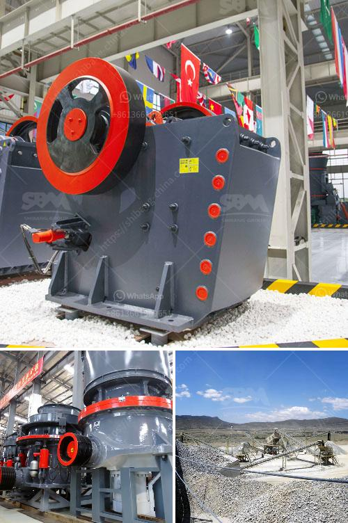

<h3>عمل كسارة الفك</h3>
تعتبر كسارة الفك من أهم الأدوات المستخدمة في صناعة التعدين ومعالجة المواد الصلبة، حيث تقوم بتحطيم المواد الخام إلى قطع صغيرة قابلة للتصفية والتجهيز اللاحق. تعد كسارة الفك جزءاً أساسياً في عملية تفصيل المواد وتحضيرها للمراحل اللاحقة من التصنيع.

تتكون كسارة الفك من صندوق صلب يحتوي على فكين قابلين للفتح والإغلاق. تعمل الفكوك على تمرير وتحطيم المواد الخام عن طريق الانضغاط والتصادم عندما تتحرك.

تتمتع كسارة الفك بالعديد من المزايا، منها قدرتها العالية على التحمل والاستدامة في التعامل مع المواد الصعبة والمقاومة للتأثير والقوى الشد. كما أنها تتميز بكفاءة عالية في تطحين المواد وتفتيتها، مما يؤدي إلى توفير الكثير من الوقت والموارد في عملية التصنيع.

تستخدم كسارة الفك على نطاق واسع في مجالات مختلفة مثل التعدين، والصناعات الكيماوية، والبناء، والطاقة، والصناعات البترولية. ففي صناعة التعدين، تستخدم كسارة الفك لتحطيم الصخور الكبيرة والأحجار الصلبة إلى قطع صغيرة جداً يسهل تحميلها وتجهيزها في العملية التالية من الخام. وفي البناء، يتم استخدام كسارة الفك لتحطيم الخرسانة والأحجار الكبيرة لتجهيزها للاستخدام في الهياكل المختلفة.

كما أن كسارة الفك توفر تكاليف العمالة والوقت المستغرق في هذه العملية، حيث يمكنها التعامل مع مختلف أنواع المواد وتحطيمها بسرعة وسهولة. وبالتالي، يمكن أن تؤدي إلى زيادة الإنتاجية وتقليل التكاليف العامة للصناعة.

في النهاية، تعد كسارة الفك أداة فعالة وأساسية في صناعة التعدين والصناعات الأخرى المتعلقة. تساهم في تحويل المواد الخام إلى مواد تجارية جاهزة للاستخدام في الإنتاج والتصنيع، مما يعزز الإنتاجية ويوفر الموارد والوقت في العملية الإنتاجية.
<h3>Contact us</h3><ul><li><strong>Whatsapp:&nbsp;<a href="https://wa.me/8613661969651">+8613661969651</a></strong></li><li><a href="https://swt.shibang-china.com/?git&amp;zhl&amp;عمل كسارة الفك"><strong>Online Service(chat now)</strong></a></li></ul><h3>Related</h3><ul><li><a href='مشغل مصنع كسارة في كسارة.md'>مشغل مصنع كسارة في كسارة</a></li><li><a href='مصنع تحسين الكروميت في ماليزيا.md'>مصنع تحسين الكروميت في ماليزيا</a></li><li><a href='تكلفة كسارة الحجر.md'>تكلفة كسارة الحجر</a></li><li><a href='كيف يتم استخدام مسحوق الدولوميت في البناء.md'>كيف يتم استخدام مسحوق الدولوميت في البناء</a></li><li><a href='مطحنة الأسطوانة في الهند.md'>مطحنة الأسطوانة في الهند</a></li></ul>