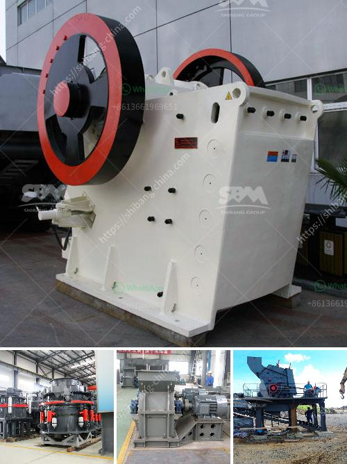

<h3>عمليات سحق الركام</h3>
عمليات سحق الركام هي عمليات تهدف إلى تقليل حجم الركام الصخري أو الخرساني، وتحويله إلى حجم أصغر مثل الرمل أو الحصى. يتم استخدامها على نطاق واسع في صناعة البناء والهندسة المدنية، حيث يتم استخدام الركام سواء في البناء العمودي أو الأفقي.

تختلف عمليات سحق الركام حسب الغرض ونوع الركام المراد سحقه. هناك طرق عديدة لسحق الركام، بدءًا من الطرق اليدوية البسيطة إلى الطرق الأكثر تطوراً والتي تشمل استخدام آلات سحق متنوعة.

تتضمن الطرق اليدوية سحق الركام باستخدام المطارق الضخمة أو اللكمات الثقيلة. يقوم العمال في هذه العملية بتطبيق القوة على الركام الصخري أو الخرساني بشكل يدوي لتقليل حجمه. على الرغم من أن هذه الطرق بدائية وتستغرق وقتًا طويلاً، إلا أنها لا تزال تستخدم في بعض البناءات الصغيرة.

بالمقابل، تشتمل الطرق المتطورة على استخدام آلات سحق ميكانيكية متنوعة. تتضمن هذه الآلات كسارات الفك وكسارات الصدم والكسارات المخروطية والكسارات الدوارة. تستخدم هذه الآلات قوة ميكانيكية عالية لسحق الركام وتحويله إلى أحجام أصغر.

تتمتع عمليات سحق الركام بالعديد من الفوائد. فعلى سبيل المثال، تقلل من حجم الركام وبالتالي تقلل من حجم النقل والتخزين المطلوبين له. تزيد أيضًا من كفاءة استخدام الركام في البناء وتحسن جودته، مما يؤدي في النهاية إلى تقليل التكاليف وتحسين المتانة والأداء الهيكلي للمباني والهياكل.

بينما تستخدم عمليات سحق الركام على نطاق واسع في مجال البناء والهندسة المدنية، يجب أن يتم تنفيذ هذه العمليات بعناية فائقة وفقًا للمعايير الفنية والمعايير البيئية المطبقة في الدولة. علاوة على ذلك، يجب أن تتوفر المعدات والآلات الملائمة لأداء عملية السحق بكفاءة وأمان.

باختصار، عمليات سحق الركام هي عمليات حاسمة في صناعة البناء والهندسة المدنية. تقلل من حجم الركام وتحسن استخدامه، مما يؤدي إلى تحسين كفاءة البناء وجودة المباني والهياكل. لذا، يجب أن تنفذ هذه العمليات بعناية فائقة وتطبق المعايير الفنية والبيئية المعتمدة.
<h3>Contact us</h3><ul><li><strong>Whatsapp:&nbsp;<a href="https://wa.me/8613661969651">+8613661969651</a></strong></li><li><a href="https://swt.shibang-china.com/?git&amp;zhl&amp;عمليات سحق الركام"><strong>Online Service(chat now)</strong></a></li></ul><h3>Related</h3><ul><li><a href='سحق الحجر الأسود تايلاند.md'>سحق الحجر الأسود تايلاند</a></li><li><a href='طاحونة مسحوق ناعمة جدا.md'>طاحونة مسحوق ناعمة جدا</a></li><li><a href='البحث عن معدات تجهيز الفحم الصغيرة.md'>البحث عن معدات تجهيز الفحم الصغيرة</a></li><li><a href='كسارة الحجر ومصنع المحجر في بنجلاديش.md'>كسارة الحجر ومصنع المحجر في بنجلاديش</a></li><li><a href='آلة معالجة الكاولين في المصنع.md'>آلة معالجة الكاولين في المصنع</a></li></ul>