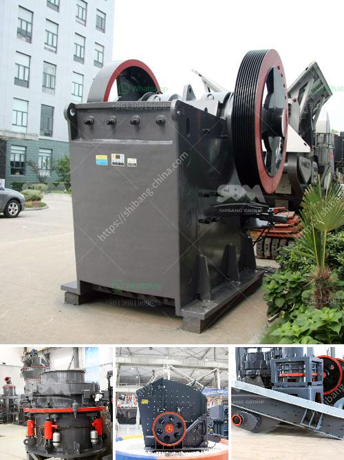

<h3>عمليات كسارة وغسل الحجر</h3>
تعد كسارة وغسل الحجر من العمليات الأساسية في مجال التعدين والبناء. تهدف هذه العمليات إلى تحطيم وغسل الحجر الطبيعي أو الصخور الكبيرة لتصبح حصى ورمل معتمدين على احتياجات الصناعة المختلفة. يتم استخدام هذه الحصى والرمل المنتجة في إنتاج الخرسانة والأسفلت والرمل الاصطناعي والزجاج والسيراميك وغيرها من المنتجات الإنشائية.

تتكون عملية الكسارة من عدة مراحل تبدأ بالتغذية الأولية للحجر إلى الكسارة الفكية أو الكسارة الصدمية. يتم اختيار نوع الكسارة اعتمادًا على حجم الحجر ومتطلبات المشروع. تعمل الكسارة على تحطيم الحجر إلى قطع أصغر بحجم محدد يتراوح بين بعض الميليمترات إلى بضعة سنتيمترات. تستخدم كسارات الفك للحجارة الكبيرة بينما تستخدم الكسارات الصدمية للحجارة الأصغر حجمًا وللمواد الصلبة.

بعد عملية الكسارة، يتم نقل الحصى والحجارة الأصغر إلى آلات غسيل الحجر. يهدف غسل الحجر إلى إزالة العوالق والأوساخ والشوائب الأخرى من الحجر المكسر وتحسين جودته. يتم استخدام المياه والمواد الكيميائية الخاصة في هذه العملية. يتم غسل الحجر بالطريقة الرطبة أو الجافة، حيث يتم استخدام الغرابيل وأجهزة غسيل أخرى لتصنيف الحصى والرمل حسب الحجم.

يعتبر قطاع كسارة وغسل الحجر من القطاعات الهامة في صناعة البناء، حيث يتم توفير مادة خام مهمة للعديد من التطبيقات الإنشائية. تساهم هذه العمليات في تعزيز استدامة البناء وتوفير موارد طبيعية محدودة من خلال إعادة استخدام وإعادة تدوير المواد في عملية الإنتاج.

بالاختصار، تلعب عمليات كسارة وغسل الحجر دورًا حيويًا في صناعة التعدين والبناء. يهدف العمليتان إلى تحطيم الحجارة الكبيرة وتصنيفها وغسلها للحصول على مواد مناسبة للاستخدام في العديد من الصناعات الإنشائية. يسهم هذا القطاع في تلبية احتياجات البناء وتوفير مواد بناء ذات جودة عالية.
<h3>Contact us</h3><ul><li><strong>Whatsapp:&nbsp;<a href="https://wa.me/8613661969651">+8613661969651</a></strong></li><li><a href="https://swt.shibang-china.com/?git&amp;zhl&amp;عمليات كسارة وغسل الحجر"><strong>Online Service(chat now)</strong></a></li></ul><h3>Related</h3><ul><li><a href='تكلفة مصنع كسارة الحجر الجيري.md'>تكلفة مصنع كسارة الحجر الجيري</a></li><li><a href='مصنع كسارة في كينيا.md'>مصنع كسارة في كينيا</a></li><li><a href='كسارات مزدوجة التبديل.md'>كسارات مزدوجة التبديل</a></li><li><a href='سعة كسارة الحجر.md'>سعة كسارة الحجر</a></li><li><a href='سير الناقل في ميريدا.md'>سير الناقل في ميريدا</a></li></ul>