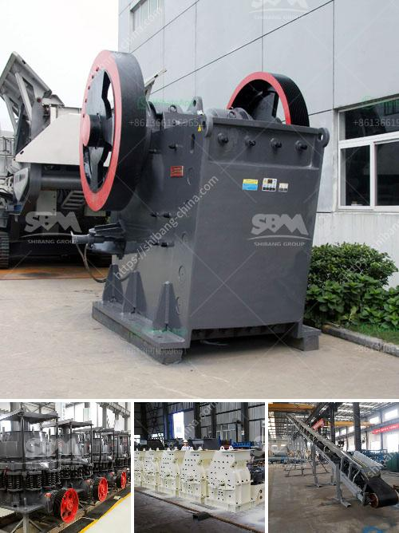

<h3>عمليات محجر الحجر الجيري</h3>
تعتبر عمليات محجر الحجر الجيري من العمليات الرئيسية في صناعة البناء والمقاولات. يتم استخراج الحجر الجيري من الطبقات الجغرافية باستخدام عدة طرق وآليات.

تبدأ العملية بالتحقيق في الموقع المحتمل للمحجر حيث يتم تقييم الصخور واختبارها للتأكد من جودتها وملائمتها للاستخدام المطلوب. يتم ذلك من خلال أخذ عينات من الصخور واختبارها في المختبر لتحليل تركيبتها الكيميائية وخواصها الفيزيائية.

بعد تحديد الموقع المحتمل، يتم بناء البنية التحتية للمحجر. تتضمن هذه البنية الطرق والممرات لنقل الحجر الجيري بشكل آمن وفعال. تعتمد هذه البنية على حجم وكمية الحجر المتوقعة للاستخراج. عادة ما يتم استخدام الشاحنات والحفارات الثقيلة لنقل واستخراج الحجر الجيري.

بعد تثبيت البنية التحتية، يبدأ عملية استخراج الحجر الجيري. يتم ذلك عن طريق حفر الصخور باستخدام الحفارات وإزالة الأتربة والأحجار الصغيرة بواسطة الشاحنات لتسهيل عملية الاستخراج. الحجر الجيري الناتج من هذه العملية يتم نقله إلى ورشة الفحص والتصنيع.

في ورشة الفحص والتصنيع، يتم فحص الحجر الجيري لفصل الصخور الغير مرغوب فيها وفقًا للحجم والجودة. يتم تفتيت الحجر الجيري الطبيعي بواسطة آلات التكسير للحصول على أحجام مختلفة من الأحجار. يتم عادة تخزين الحجر الجيري المكسر في مستودعات حتى يتم استخدامه في المشاريع.

يمكن استخدام الحجر الجيري في العديد من المجالات مثل صناعة الأسمنت والزجاج والصلصال والدهانات. بالإضافة إلى ذلك، فإن الحجر الجيري يستخدم أيضًا لتعدين المعادن مثل الذهب والفضة. يعد الحجر الجيري أيضًا مادة بناء شائعة في صناعة البلاط والحجر الصناعي.

لخلاصة، عمليات محجر الحجر الجيري تشمل عمليات التحقيق والاستخراج والنقل والفحص والتصنيع. يعد الحجر الجيري أحد المواد الأساسية في صناعة البناء ويستخدم في الكثير من التطبيقات المختلفة. تلعب هذه العمليات دورًا مهمًا في تلبية احتياجات السوق وتلبية متطلبات العملاء المختلفة.
<h3>Contact us</h3><ul><li><strong>Whatsapp:&nbsp;<a href="https://wa.me/8613661969651">+8613661969651</a></strong></li><li><a href="https://swt.shibang-china.com/?git&amp;zhl&amp;عمليات محجر الحجر الجيري"><strong>Online Service(chat now)</strong></a></li></ul><h3>Related</h3><ul><li><a href='كسارات الحجر المستخدمة في ألمانيا.md'>كسارات الحجر المستخدمة في ألمانيا</a></li><li><a href='مورد سير ناقل في الصين.md'>مورد سير ناقل في الصين</a></li><li><a href='قائمة معدات تعدين الذهب.md'>قائمة معدات تعدين الذهب</a></li><li><a href='عملية سحق الكسارة.md'>عملية سحق الكسارة</a></li><li><a href='مطرقة الذهب المستخدمة للبيع في زيمبابوي.md'>مطرقة الذهب المستخدمة للبيع في زيمبابوي</a></li></ul>