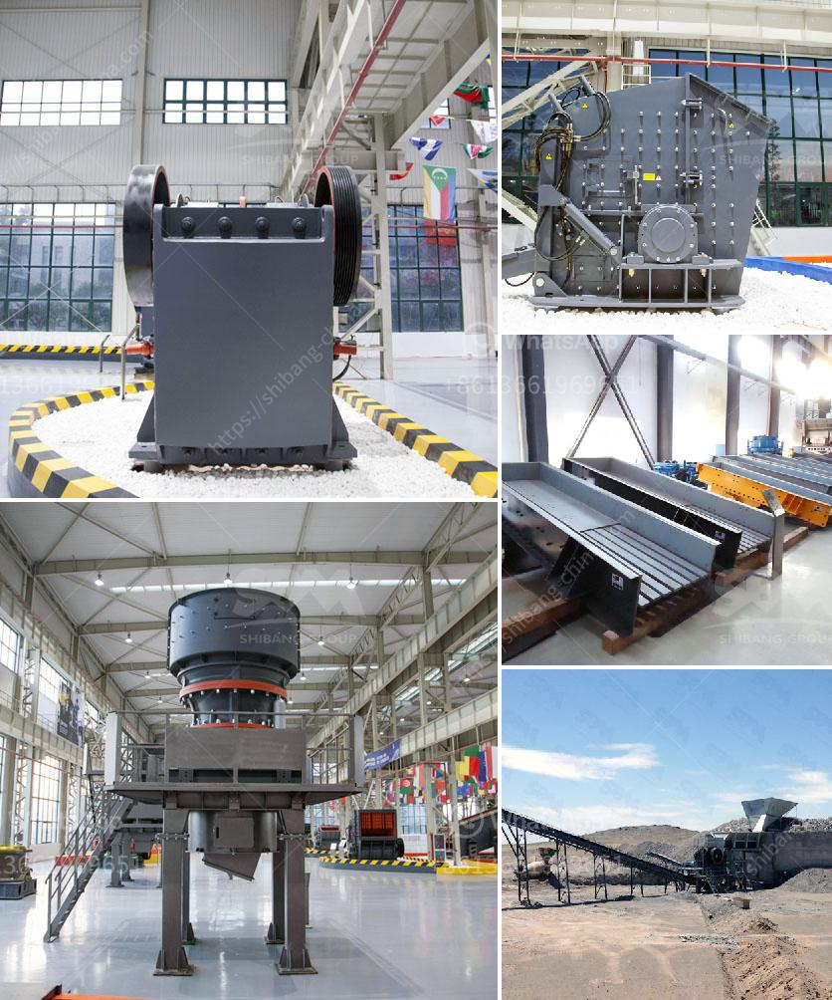

<h3>عمليات مصنع كسارة الصخور</h3>
تعتبر كسارة الصخور أحد المعدات الرئيسية في صناعة التعدين والبناء، حيث يتم استخدامها لسحق الصخور الكبيرة إلى حجم صغير أو متوسط. تختلف عمليات مصنع كسارة الصخور باختلاف الأنواع والموديلات، ولكن هناك بعض الخطوات الأساسية التي تشترك في جميع العمليات.

أول خطوة في عملية مصنع كسارة الصخور هو تحميل الصخور الكبيرة على حامل الصخور باستخدام حفارة أو أي آلة تحميل أخرى. يجب أن يتم فحص الصخور قبل تحميلها للتأكد من خلوها من الشوائب الكبيرة والمواد الغريبة التي قد تؤثر على عملية التكسير.

تأخذ الصخور المحملة إلى مرحلة التكسير الأولي التي تتم بواسطة كسارة فكية. يتم استخدام الكسارة الفكية لتحطيم الصخور الكبيرة إلى قطع صغيرة تتراوح أحجامها من 6 إلى 10 بوصات.

ثم يتم نقل الصخور المكسورة إلى مرحلة التكسير الثانوي باستخدام كسارة مخروطية. تستخدم الكسارة المخروطية لطحن الصخور إلى أحجام أصغر تتراوح من 2 إلى 3 بوصات.

بعد ذلك، يتم تحويل الصخور المكسورة إلى مرحلة التكسير الثالثة باستخدام كسارة صدمية. تعمل الكسارة الصدمية على تحطيم الصخور إلى أحجام أصغر مثل 0.75 بوصة.

بعد عملية التكسير الثالثة، يتم فصل المواد الناتجة عن الصخور غير المكسورة باستخدام أجهزة فصل المغناطيسية والغرابيل. وهذه العمليات تهدف إلى إزالة المعادن الغريبة والمواد غير المرغوب فيها.

أما بالنسبة للصخور المكسورة، يتم تخزينها في أحواض تخزين مؤقت حتى يتم توزيعها واستخدامها في مواقع البناء أو في صناعة التعدين اللاحقة.

عمليات مصنع كسارة الصخور هي عمليات هامة جداً في صناعة البناء والتعدين، حيث تساهم في توفير المواد الأساسية التي تستخدم في البنية التحتية والمشاريع الهندسية الكبيرة. بوجود التكنولوجيا المتقدمة والمعدات الفعالة، يمكن تحقيق إنتاجية عالية وتوفير الوقت والجهد في إنتاج الصخور المكسورة بطريقة سهلة وفعالة.
<h3>Contact us</h3><ul><li><strong>Whatsapp:&nbsp;<a href="https://wa.me/8613661969651">+8613661969651</a></strong></li><li><a href="https://swt.shibang-china.com/?git&amp;zhl&amp;عمليات مصنع كسارة الصخور"><strong>Online Service(chat now)</strong></a></li></ul><h3>Related</h3><ul><li><a href='تقرير مشروع وحدات كسارة الحجر.md'>تقرير مشروع وحدات كسارة الحجر</a></li><li><a href='مصنع تكسير الحجر في الهند بسعر مناسب.md'>مصنع تكسير الحجر في الهند بسعر مناسب</a></li><li><a href='آلات مطحنة في جنوب أفريقيا.md'>آلات مطحنة في جنوب أفريقيا</a></li><li><a href='مطحنة الكرة لمسحوق الألمنيوم.md'>مطحنة الكرة لمسحوق الألمنيوم</a></li><li><a href='آلة حبيبات الجبس في الهند.md'>آلة حبيبات الجبس في الهند</a></li></ul>