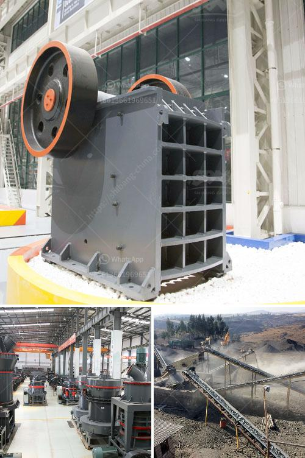

<h3>عملية إنتاج الجبس</h3>
يُعتبر الجبس أحد المواد الأساسية في صناعة البناء والديكور، وتتم عملية إنتاجه من خلال عملية صناعية يتم فيها تحويل مادة الجبس الخام إلى منتج نهائي. تعد عملية إنتاج الجبس عملية فنية تتطلب خبرة ومعرفة محددة وامتلاك معدات ومواد بسيطة.

تبدأ عملية إنتاج الجبس عند محجر أو منجم الجبس، حيث يتم استخراج الجبس الخام الذي يتكون من كبريتات الكالسيوم. تتم عملية كسر الجبس الخام إلى قطع صغيرة وتُنقل إلى المخزن العام لاستخدامها في العملية التالية.

ثم يتم نقل الجبس الخام إلى مصنع الجبس حيث تتم عملية طحن الجبس الخام لتحويله إلى مسحوق ناعم. هذا المسحوق يمر بعملية معالجة كيميائية لإزالة الشوائب الزائدة وتحسين خصائصه التقنية. بالإضافة إلى ذلك، يتم إضافة مواد مساعدة ومثبتة لتحسين جودة الجبس.

تتبع عملية الطحن مرحلة مهمة هي مرحلة التكثيف، حيث يتم خلط الجبس المطحون مع الماء لتشكيل معجون الجبس، ويتم العمل على إزالة الهواء الزائد والحصول على معجون الجبس النهائي بتجهيزه في وعاء معين. يتم نقل معجون الجبس إلى آلة الصنع الأوتوماتيكية حيث يتم تشكيله إلى لوحات جبسية بالأبعاد المطلوبة. تُنقل اللوحات إلى غرف الجفاف حيث يتم تجفيف الجبس بواسطة الهواء الساخن حتى يتم استخدامه في التركيبات والمشروعات البنائية.

بعد عملية الجفاف، يتم اختبار الجبس من حيث قوته ومقاومة الانهيار والصلابة. هذه الاختبارات تُجرى لضمان أن الجبس يلبي المواصفات والمعايير القياسية المطلوبة قبل توزيعه في السوق. يتم تخزين الجبس النهائي في حاويات خاصة ويتم توزيعه لاحقًا إلى المستهلكين.

في الختام، عملية إنتاج الجبس تحتاج إلى العديد من الخطوات والتجهيزات. يتم المحافظة على جودة الجبس من خلال التحكم في العمليات واختباره بشكل دوري. تُستخدم منتجات الجبس في مجموعة واسعة من التطبيقات بما في ذلك الجدران الداخلية، والسقف، والتزيين والديكور، ومواد البناء، مما يجعلها أحد أهم المواد التي يعتمد عليها في صناعة البناء والتشييد.
<h3>Contact us</h3><ul><li><strong>Whatsapp:&nbsp;<a href="https://wa.me/8613661969651">+8613661969651</a></strong></li><li><a href="https://swt.shibang-china.com/?git&amp;zhl&amp;عملية إنتاج الجبس"><strong>Online Service(chat now)</strong></a></li></ul><h3>Related</h3><ul><li><a href='كسارات البلارست في Alibaba.md'>كسارات البلارست في Alibaba</a></li><li><a href='مصنع تكسير صخور متنقل وثابت جديد.md'>مصنع تكسير صخور متنقل وثابت جديد</a></li><li><a href='مصانع معدات مصانع رمال الفراك.md'>مصانع معدات مصانع رمال الفراك</a></li><li><a href='سعر كسارة الحصى في رانشي.md'>سعر كسارة الحصى في رانشي</a></li><li><a href='كسارات الحجر الجيري المحمولة الصغيرة.md'>كسارات الحجر الجيري المحمولة الصغيرة</a></li></ul>