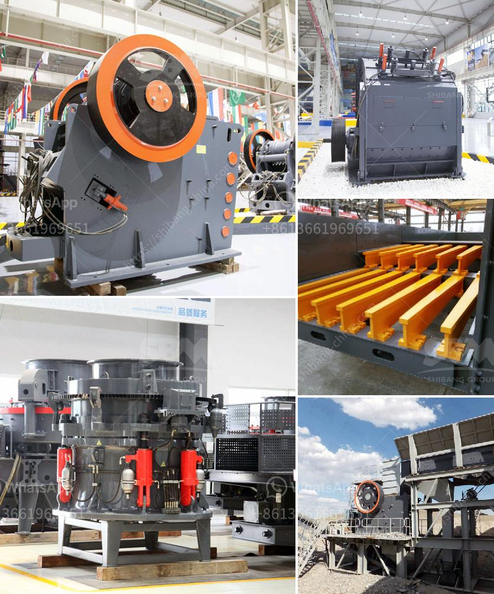

<h3>عملية إنتاج الطين</h3>
تُعد عملية إنتاج الطين عملية مهمة للغاية في صناعة البناء والتشييد، حيث يتم استخدام الطين في صناعة الطوب والأواني والأدوات المنزلية الأخرى. تعود صناعة الطين إلى العصور القديمة، حيث كانت تعتبر من أقدم الصناعات في التاريخ. وتعتبر العملية التقليدية لإنتاج الطين أحد أقدم العمليات الحرفية.

يبدأ عملية إنتاج الطين بجمع الطين الطبيعي الذي يمكن العثور عليه في الأراضي المنسوجة أو المستنقعات أو الأودية المائية. يتم جمع الطين في أماكن محددة وتحمله إلى الموقع. ثم يتم تنقيته من الشوائب مثل الحجارة أو العوالق الأخرى. قد يتم غسله أيضًا لإزالة أي آثار من الألوان أو المواد الأخرى.

بعد ذلك، يتم وضع الطين في "المصنع" حيث ستتم عملية التجهيز. تختلف عملية التجهيز حسب طبيعة الطين والغرض من الاستخدام. يتم إضافة الماء تدريجيًا للطين ويتم خلطه جيدًا للحصول على قوام صلب ومتجانس. وتستمر عملية الخلط حتى يتم الحصول على تركيبة طينية مثالية للغرض المرغوب.

بمجرد الانتهاء من عملية الخلط، يتم تشكيل الطين ووضعه في أشكال معينة، مثل القوالب، أثناء عملية إنتاج الطوب. وبعد ذلك، يترك الطين ليجف تدريجيًا لفترة من الوقت، قد تصل إلى أسابيع، حسب حجم ونوع المنتج. ثم يتم وضع الأشكال المجففة في فرن حراري للطهي.

فيما يلي، يخضع الطين لعملية الحرق لفترة زمنية ودرجة حرارة محددة. تتفاعل الطين وتتصلب بمرور الوقت بفضل التفاعلات الكيميائية التي تحدث أثناء الحرق. هذا يضمن أن يكون المنتج النهائي متينًا ومستدامًا. بعد الانتهاء من عملية الحرق، يتم تبريده وتنظيفه من الأوساخ والشوائب الأخرى.

بدلاً من العملية التقليدية، تستخدم اليوم تكنولوجيا حديثة توفر عملية إنتاج الطين بشكل أسرع وأكثر كفاءة. يتم استخدام الآلات الحديثة والمعدات لتبسيط وتسريع العملية. ومع ذلك، يبقى الهدف الرئيسي هو الحفاظ على جودة الطين والمنتج النهائي.

في الختام، يُعد إنتاج الطين عملية تقليدية ومهمة في صناعة البناء والتشييد. وتعتبر عملية تحضير وتجهيز الطين وتشكيله وحرقه أهم خطوات في هذه العملية. بفضل التكنولوجيا الحديثة، أصبحت العملية أسرع وأكثر كفاءة، ولكن الهدف الرئيسي لا يزال هو الحفاظ على جودة الطين والمنتج النهائي.
<h3>Contact us</h3><ul><li><strong>Whatsapp:&nbsp;<a href="https://wa.me/8613661969651">+8613661969651</a></strong></li><li><a href="https://swt.shibang-china.com/?git&amp;zhl&amp;عملية إنتاج الطين"><strong>Online Service(chat now)</strong></a></li></ul><h3>Related</h3><ul><li><a href='مصانع الكسارات تصنع.md'>مصانع الكسارات تصنع</a></li><li><a href='آلة صنع مسحوق الرخام.md'>آلة صنع مسحوق الرخام</a></li><li><a href='شركة معدات تعدين الذهب في اليابان.md'>شركة معدات تعدين الذهب في اليابان</a></li><li><a href='هل هناك طاحونة فائقة الدقة عمودية للأسطوانة.md'>هل هناك طاحونة فائقة الدقة عمودية للأسطوانة</a></li><li><a href='شركة تصنيع الحجر في داكا.md'>شركة تصنيع الحجر في داكا</a></li></ul>