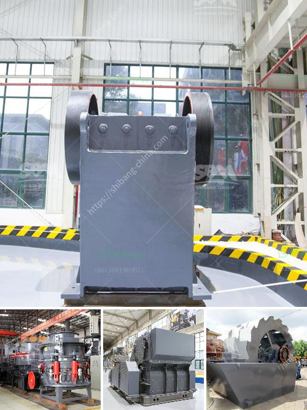

<h3>عملية إنتاج رمل الصخور بتنسيق PDF</h3>
إن رمل الصخور هو عبارة عن مادة مُكسرة حبيبية تشتمل على حوامض السيليكون والكوارتز، ويعتبر مادة أساسية في العديد من الصناعات مثل صناعة الزجاج والإسمنت والخرسانة. ويتم إنتاج رمل الصخور عن طريق عمليتين رئيسيتين: التعدين والتكسير.

تبدأ عملية إنتاج رمل الصخور بعملية التعدين، حيث يتم استخراج الصخور الرسوبية من مناجم التعدين. يتم تفجير الصخور الكبيرة باستخدام المتفجرات وأدوات الحفر الثقيلة، حتى يتمكن العمال من الوصول إلى الطبقات الصخرية التي تحتوي على السيليكا والكوارتز.

بعد استخراج الصخور، تتم عملية التكسير، حيث يتم تقسيم الصخور الكبيرة إلى قطع صغيرة باستخدام الكسارات المختلفة. تساعد الكسارات في تحويل الصخور الضخمة إلى حبيبات صغيرة قابلة للاستخدام في صناعة رمل الصخور.

ثم تتم عملية الفرز والتصنيف للحصول على حبيبات رملية متجانسة في الحجم والشكل. يتم غسل الحبيبات لإزالة الشوائب والمواد العضوية وإعطاء الرمل مظهرًا نظيفًا. بعد ذلك، يتم تجفيف الرمل بواسطة أفران خاصة أو تجفيفه تحت أشعة الشمس.

أخيرًا، يتم تعبئة الرمل في حاويات أو أكياس جاهزة للاستخدام أو للتخزين. يجب تخزين رمل الصخور في مكان جاف ونظيف للحفاظ على جودته.

عملية إنتاج رمل الصخور تتطلب استخدام تجهيزات خاصة ومعدات تكسير متعددة. وتهدف هذه العملية إلى إنتاج رمل عالي الجودة يلبي متطلبات الصناعة المختلفة. تعتبر عملية إنتاج رمل الصخور عملية تقنية متقدمة تحتاج إلى مهندسين وعمال مهرة لضمان جودة المنتج النهائي.

في الختام، يمكن القول بأن عملية إنتاج رمل الصخور تعتبر عملية مهمة وضرورية لإنتاج مادة رملية مفيدة في العديد من الصناعات. يتطلب الأمر خبرة ومعدات متخصصة لضمان جودة المنتج النهائي.
<h3>Contact us</h3><ul><li><strong>Whatsapp:&nbsp;<a href="https://wa.me/8613661969651">+8613661969651</a></strong></li><li><a href="https://swt.shibang-china.com/?git&amp;zhl&amp;عملية إنتاج رمل الصخور بتنسيق PDF"><strong>Online Service(chat now)</strong></a></li></ul><h3>Related</h3><ul><li><a href='تكلفة مصنع كسارة خام الحديد.md'>تكلفة مصنع كسارة خام الحديد</a></li><li><a href='تقدير لعمليات تكسير الحجر.md'>تقدير لعمليات تكسير الحجر</a></li><li><a href='سينغ كسارة الحجر ناشيك.md'>سينغ كسارة الحجر ناشيك</a></li><li><a href='كسارة حجر في العمود الفقري.md'>كسارة حجر في العمود الفقري</a></li><li><a href='أسعار كسارات الحجر الصغيرة.md'>أسعار كسارات الحجر الصغيرة</a></li></ul>