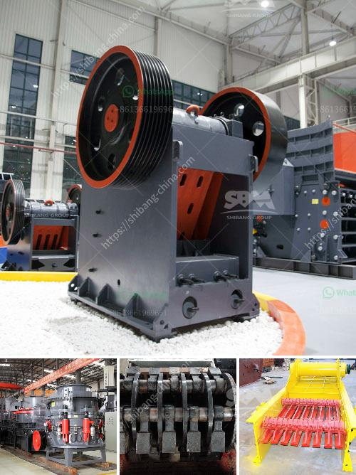

<h3>عملية إنتاج لوحات الجبس</h3>
لوحات الجبس هي منتجات بناء شائعة ومفيدة تستخدم في صناعة الجدران الداخلية والأسقف. تعتبر لوحات الجبس خفيفة الوزن وسهلة التركيب والتشكيل، وتوفر أيضًا مقاومة جيدة للحرائق والصوت. يتم إنتاجها عن طريق عملية تصنيع مبتكرة تتضمن العديد من الخطوات.

أولاً، يتم جمع وتجهيز المكونات الرئيسية للوحات الجبس. تشمل هذه المكونات الجبس الطبيعي أو الجبس الصناعي، الألياف الزجاجية، المواد الحافظة، المواد المساعدة والماء. يتم خلط المكونات باستخدام ماكينات خاصة حتى تتشكل عجينة لينة ومتجانسة.

ثانياً، يتم وضع العجينة في قوالب مستطيلة للشكل النهائي المطلوب للوحات. يتم استخدام معدات متطورة لتشكيل العجينة في القوالب وضغطها للحصول على سطح مستوٍ وسلس. يمكن أيضًا إضافة عوازل إلى العجينة خلال هذه الخطوة لزيادة خصائص العزل الحراري والصوتي للوحات.

ثالثًا، يتم تجفيف الوحات في فرن خاص باستخدام حرارة معتدلة. يجب أن تبقى الوحات في الفرن لفترة زمنية كافية حتى تجف تمامًا، ويتم التحقق من ذلك باستخدام معدات قياس الرطوبة. يتم التحكم في حرارة ورطوبة الفرن بعناية لضمان عملية التجفيف الصحيحة والفعالة.

رابعًا، بعد التجفيف، يتم فحص الوحات بدقة للتأكد من جودتها وسلامتها. يتم إزالة أي عيوب أو تشوهات محتملة وتصنيف الوحات حسب المواصفات المطلوبة. يتم تغليف الوحات وتعبئتها بعناية للتأكد من عدم تعرضها للتلف أثناء النقل والتخزين.

أخيراً، يتم تسويق وتوزيع لوحات الجبس إلى العملاء. تستخدم في مشاريع البناء الكبرى والصغرى في القطاع السكني والتجاري. يمكن استخدامها لبناء الجدران الداخلية، الأسقف المعلقة، وأثاث الجدران كالديكورات والرفوف.

باختصار، يتضمن إنتاج لوحات الجبس عملية دقيقة يتم خلالها جمع وتجهيز المكونات، تشكيلها في قوالب، تجفيفها، فحصها وتعبئتها قبل التسويق. هذه العملية تتطلب استخدام مواد خام عالية الجودة ومعدات متقدمة لضمان جودة المنتج النهائي. تلعب لوحات الجبس دورًا حاسمًا في صناعة البناء وتعزز الجودة والمتانة والجاذبية العامة للمنازل والمباني.
<h3>Contact us</h3><ul><li><strong>Whatsapp:&nbsp;<a href="https://wa.me/8613661969651">+8613661969651</a></strong></li><li><a href="https://swt.shibang-china.com/?git&amp;zhl&amp;عملية إنتاج لوحات الجبس"><strong>Online Service(chat now)</strong></a></li></ul><h3>Related</h3><ul><li><a href='مصنع استخراج النحاس الصغير.md'>مصنع استخراج النحاس الصغير</a></li><li><a href='معدات صنع الحصى.md'>معدات صنع الحصى</a></li><li><a href='معدات تعدين مستخدمة.md'>معدات تعدين مستخدمة</a></li><li><a href='مطحنة الكرات المطحنة في الهند.md'>مطحنة الكرات المطحنة في الهند</a></li><li><a href='كسارات محمولة في محجر جنوب أفريقيا.md'>كسارات محمولة في محجر جنوب أفريقيا</a></li></ul>