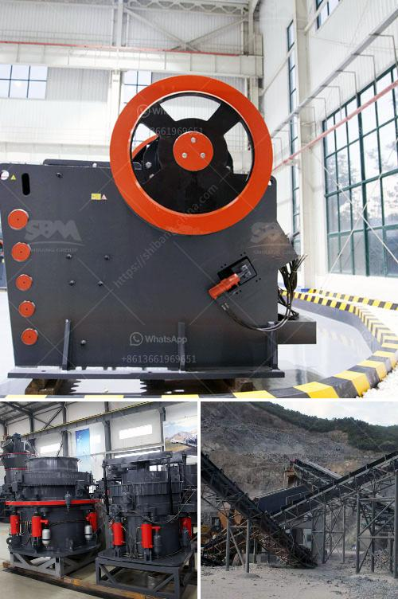

<h3>عملية إنتاج مسحوق الباريت</h3>
يعتبر مسحوق الباريت مادة معدنية مهمة يتم استخدامها في العديد من الصناعات المختلفة مثل العمليات الصناعية، وصناعة النفط والغاز، والحفر، وصناعة المطاط، وإنتاج الألواح الضوئية، وغيرها. ولكي يتم الحصول على مسحوق الباريت يجب عمل عملية إنتاج متقنة يتم توضيحها في المقال التالي.

يتم إنتاج مسحوق الباريت من خلال عمليات متعددة تشمل عمليات التعدين والتكسير والطحن. في بداية العملية، يتم استخراج الباريت من المناجم باستخدام آلات التعدين المعتادة. يتم جمع المنتج وتمريره عبر سلسلة من الآلات لإزالة الشوائب والأوساخ.

ثم يتم نقل الباريت إلى مراحل التكسير، حيث تستخدم الكسارات لتفتيت الصخور إلى قطع صغيرة قبل الدخول إلى عملية الطحن. الطحن هو الخطوة الرئيسية في إنتاج مسحوق الباريت، حيث يتم طحن القطع الصغيرة إلى حجم أصغر يمكن تحويله إلى مسحوق ناعم.

تستخدم عادة مطاحن الكرة أو المطاحن العمودية في عملية الطحن. يتم تحميل القطع الصغيرة في المطحنة حيث تدور بسرعة عالية، مما يؤدي إلى تحطيم الجسيمات الكبيرة وتقليل حجمها. الجسيمات الناتجة عن هذه العملية تمر عبر شاشات تصفية للتخلص من أي مواد غير مرغوب فيها.

في النهاية، يتم تجميع المسحوق المطحون في حاويات للاستخدام المستقبلي. يمكن استخدام تقنيات التجفيف للتخلص من الرطوبة المحتملة التي يحتوي عليها المسحوق. بعد ذلك، يتم فحص المسحوق وفقًا للمواصفات والمعايير المطلوبة قبل تعبئته في أكياس أو حاويات ذات حجم ووزن محدد.

يمكن أن تتفاوت جودة مسحوق الباريت المنتج حسب العملية المستخدمة في الإنتاج والتكنولوجيا المستخدمة. لذا فإن التحكم بعملية الطحن وجودة المعدات المستخدمة لها تأثير كبير على نوعية المنتج النهائي. توجد أيضاً طرق إنتاج مسحوق الباريت باستخدام تقنيات التكلس والتلقيم الحبيبي، ولكن العملية التقليدية المذكورة أعلاه هي الأكثر انتشاراً وشيوعًا.

في الختام، إن عملية إنتاج مسحوق الباريت تعتبر عملية معقدة وتتطلب استخدام تقنيات ومعدات خاصة. يجب الحرص على تنفيذ عملية الإنتاج بدقة وفقًا للمعايير المطلوبة لضمان الحصول على منتج ذو جودة عالية وأداء ممتاز في التطبيقات المختلفة.
<h3>Contact us</h3><ul><li><strong>Whatsapp:&nbsp;<a href="https://wa.me/8613661969651">+8613661969651</a></strong></li><li><a href="https://swt.shibang-china.com/?git&amp;zhl&amp;عملية إنتاج مسحوق الباريت"><strong>Online Service(chat now)</strong></a></li></ul><h3>Related</h3><ul><li><a href='قائمة معدات مصنع الأسمنت.md'>قائمة معدات مصنع الأسمنت</a></li><li><a href='تكلفة كسارة السيليكا.md'>تكلفة كسارة السيليكا</a></li><li><a href='مصنعون لكسارات في أوروبا.md'>مصنعون لكسارات في أوروبا</a></li><li><a href='شاشة اهتزاز الحصى.md'>شاشة اهتزاز الحصى</a></li><li><a href='بيع كسارة طحن إندونيسيا.md'>بيع كسارة طحن إندونيسيا</a></li></ul>