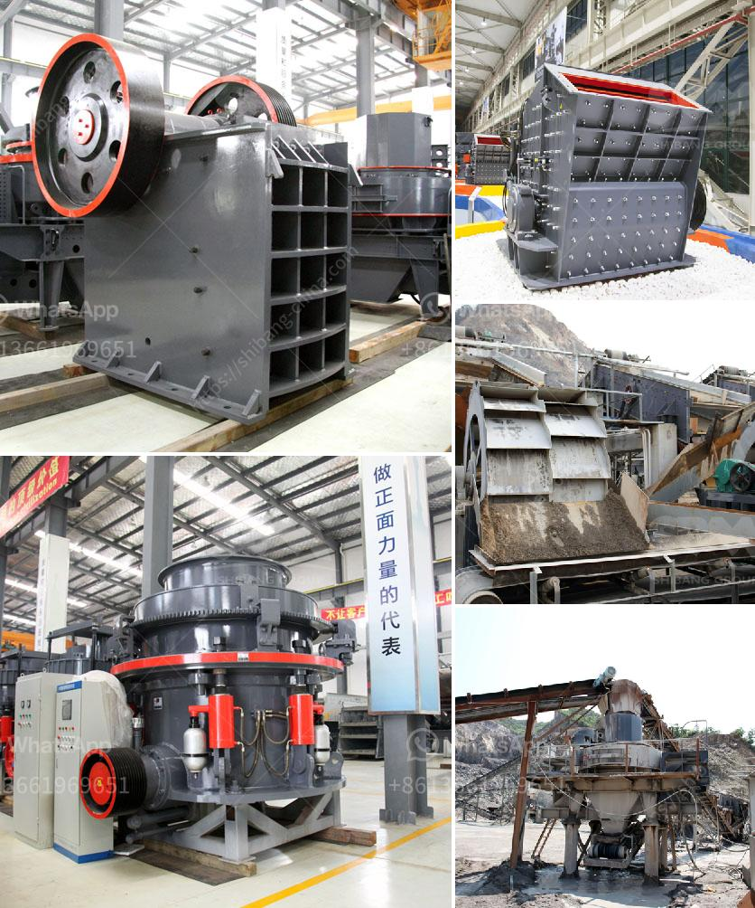

<h3>عملية استخراج الحجر الجيري</h3>
تُعد عملية استخراج الحجر الجيري من المحاجر عملية مهمة في صناعة البناء والإنشاءات. يتم استخراج الحجر الجيري من الأرض لاستخدامه في تصنيع المواد الإنشائية والمعمارية مثل الأسمنت والجبس والحجر المعالج.

عملية استخراج الحجر الجيري تبدأ بتحديد منطقة الاستخراج، حيث تتواجد الترسبات الجيرية. تُجرى دراسات جيولوجية معمقة لتحديد تواجد الحجر بدقة وتحديدها عبر التعدين. يراعى في هذه الدراسات عوامل مثل نوعية الصخور وعمقها وكثافتها ومدى تواجد الحجر الجيري في المنطقة المحددة.

بمجرد تحديد المنطقة المناسبة، يتم وضع خطة لتنفيذ عملية التعدين. تشمل الخطة إجراءات الأمان والتنظيف اللازمة للمحاجر وأي تأثيرات بيئية قد تحدث نتيجة لعملية الاستخراج.

تتم عملية استخراج الحجر الجيري عادةً بإحدى الطرق الآتية: الطريقة التقليدية أو العصرية.

في الطريقة التقليدية، يتم استخدام الأدوات اليدوية المتطورة مع الآلات الثقيلة للتعامل مع الحجارة الكبيرة ونقلها لتجهيزها. تتطلب هذه الطريقة مهارات عالية وقدرة على العمل الشاق.

بالمقابل، توفر الطريقة العصرية معدات متقدمة وتكنولوجيا حديثة تسهم في زيادة الإنتاجية وتحسين سلامة العمال وتقليل التكاليف. يتم استخدام الحفارات والجرافات الضخمة لتفتيت الصخور الكبيرة ونقلها عبر الناقلات إلى المصنع لمعالجتها.

بمجرد استخراج الصخور الكبيرة، يتم تفتيتها وطحنها للحصول على مسحوق الحجر الجيري. يضاف هذا المسحوق إلى معامل الأسمنت ومصانع الجبس لتصنيع المنتج النهائي.

يجب الإشارة إلى أن عملية استخراج الحجر الجيري تتطلب الامتثال للقوانين البيئية والصحية. يجب أن يتم استعادة وتجديد المناظر الطبيعية بعد الانتهاء من عملية التعدين ومراعاة تأثيرات الأتربة والضجيج والتلوث المحتملة.

في الختام، تُعد عملية استخراج الحجر الجيري عملية حيوية في صناعة البناء والإنشاءات. تتطلب خطة جيدة والتكنولوجيا المناسبة لتحقيق أقصى استفادة من هذه المادة القيمة وتحقيق الاستدامة البيئية.
<h3>Contact us</h3><ul><li><strong>Whatsapp:&nbsp;<a href="https://wa.me/8613661969651">+8613661969651</a></strong></li><li><a href="https://swt.shibang-china.com/?git&amp;zhl&amp;عملية استخراج الحجر الجيري"><strong>Online Service(chat now)</strong></a></li></ul><h3>Related</h3><ul><li><a href='مطحنة كرة مطحنة مطرقة.md'>مطحنة كرة مطحنة مطرقة</a></li><li><a href='أفكار مشروع مصفاة النحاس صغيرة المقياس.md'>أفكار مشروع مصفاة النحاس صغيرة المقياس</a></li><li><a href='مطحنة كرات صغيرة لهنان الصين.md'>مطحنة كرات صغيرة لهنان الصين</a></li><li><a href='مورد معدات الكسارة في غانا.md'>مورد معدات الكسارة في غانا</a></li><li><a href='تصميم آلة تكسير الحجر.md'>تصميم آلة تكسير الحجر</a></li></ul>