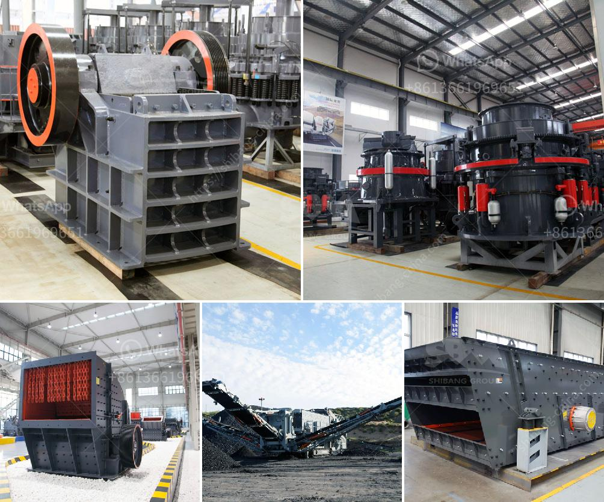

<h3>عملية التئام الذاتي للحجر الجيري</h3>
عملية التئام الذاتي للحجر الجيري تعتبر عملية طبيعية ومهمة، تتم من خلالها عملية الاستحالة في الحجر الجيري المتكون من جسيمات متنوعة، وتتمثل في تحول هذه الجسيمات إلى طبقة صلبة ومتراصة. تتسبب الظروف المتغيرة في أعماق الأرض مثل درجات الحرارة العالية والضغط الكبير في حدوث عملية التئام الذاتي للحجر الجيري.

تبدأ عملية التئام الذاتي بتأثير الضغط الناتج عن وزن الطبقات العلوية للأرض على الجسيمات المكونة للحجر الجيري. تزداد هذه الضغوط عندما يتراكم الحجر الجيري بفعل ظروف الترسيب، ويؤدي الضغط المستمر إلى تقارب الجسيمات وتلاصقها ببعضها البعض.

من المهم أن نذكر أن وجود الماء يلعب دورًا حاسمًا في عملية التئام الذاتي للحجر الجيري. عند توافر الماء وتواجده في مسامات الحجر الجيري، يحدث تفاعل كيميائي بين الماء والكالسيوم الموجود في الحجر الجيري، وهو ما يؤدي إلى تشكل مركب كربونات الكالسيوم. ينتج هذا التفاعل عن ترسيب المعادن الناتجة داخل المسام والفراغات بين الجسيمات.

مع مرور الوقت، تتفاعل الجسيمات مع بعضها البعض بفعل الحرارة العالمة والضغط المستمر، مما يؤدي إلى تحولها إلى طبقة صلبة ومتجمعة. تستغرق عملية التئام الذاتي وقتًا طويلًا قد يمتد لعدة آلاف من الأعوام، وتختلف المدة المستغرقة بالطبع بناءً على الظروف البيئية.

يتمتع الحجر الجيري المتراص بخواص ميكانيكية قوية تتيح له التحمل العالي للأحمال والتأثيرات البيئية. وتجعله هذه الخواص مناسبًا جدًا للاستخدام في البناء والهندسة المدنية. فهو يمتاز بالمتانة والقدرة على تحمل العوامل الجوية، مثل الرطوبة والأمطار والحرارة.

في الختام، عملية التئام الذاتي للحجر الجيري هي عملية طبيعية وحيوية تنتج عن الظروف الجيولوجية والكيميائية المناسبة. تتميز هذه العملية بالقوة والمتانة، مما يجعل الحجر الجيري الناتج منها مادة مثالية للاستخدام في البناء والعديد من التطبيقات الهندسية الأخرى.
<h3>Contact us</h3><ul><li><strong>Whatsapp:&nbsp;<a href="https://wa.me/8613661969651">+8613661969651</a></strong></li><li><a href="https://swt.shibang-china.com/?git&amp;zhl&amp;عملية التئام الذاتي للحجر الجيري"><strong>Online Service(chat now)</strong></a></li></ul><h3>Related</h3><ul><li><a href='آلة سحق في الفلبين.md'>آلة سحق في الفلبين</a></li><li><a href='كسارات الخرسانة المصغرة.md'>كسارات الخرسانة المصغرة</a></li><li><a href='سعر مصنع معالجة الحجر الجيري.md'>سعر مصنع معالجة الحجر الجيري</a></li><li><a href='مطاحن الأسطوانات في الدول.md'>مطاحن الأسطوانات في الدول</a></li><li><a href='مطحنة للحجر الجيري في إيطاليا.md'>مطحنة للحجر الجيري في إيطاليا</a></li></ul>