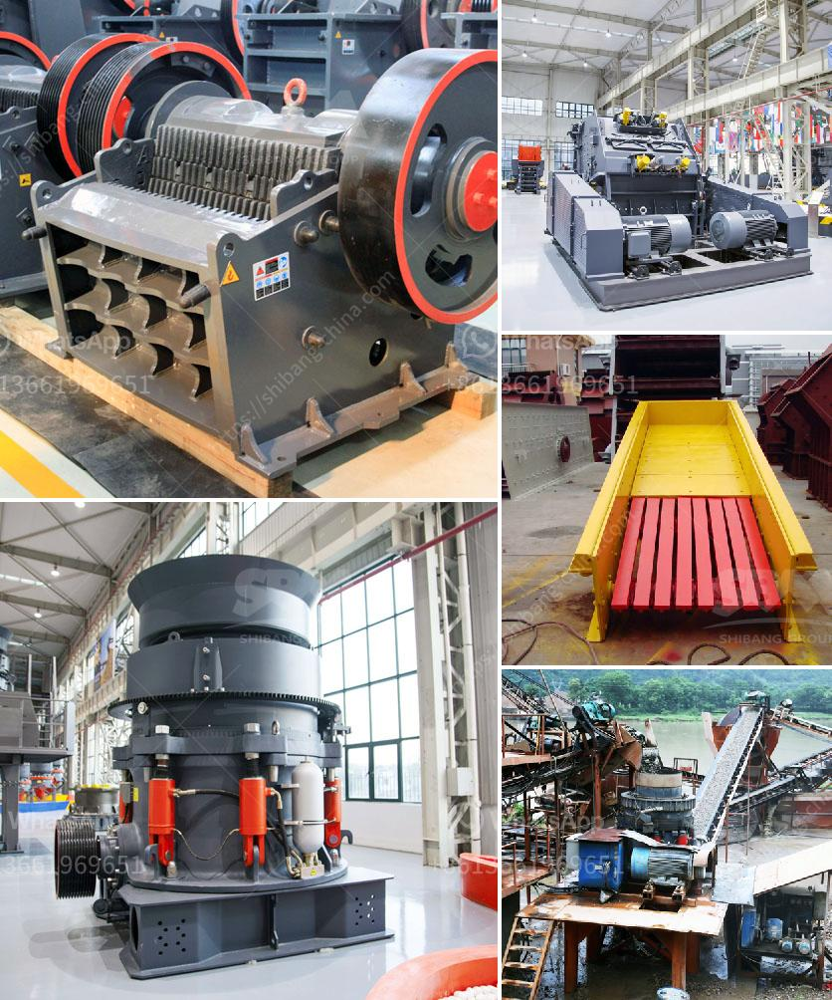

<h3>عملية التحول للأسمنت</h3>
عملية التحول للأسمنت هي عملية تهدف إلى تحويل المكونات الخام للأسمنت إلى منتج نهائي يستخدم في مجموعة متنوعة من التطبيقات في البناء والهندسة المدنية. تعتبر هذه العملية أساسية في صناعة الإنشاءات وتسمح بالإنتاج المستدام للمواد الأسمنتية.

عملية التحول للأسمنت تشمل عدة خطوات أساسية. في البداية، يتم استخراج المواد الخام الأساسية مثل الحجر الجيري والرمل والطين. يتم تكسير هذه المواد الخام وخلطها مع بعضها البعض وفقاً للتركيز المطلوب للأسمنت المطلوب والذي يتم تحديده وفقاً للاستخدام النهائي.

ثم، تتم معالجة المزيج الخام في فرن الأسمنت الدوار ويتم تسخينه حتى درجة حرارة عالية تتراوح بين 1400-1600 درجة مئوية. هذا التسخين يسمح بحدوث عملية الكالسينة، حيث يتم تحويل الكربونات في المواد الخام إلى كربونات الكالسيوم وثاني أكسيد الكربون بالإضافة إلى العديد من المركبات الأخرى. يحدث هذا التحول في المرحلة الأولى من الفرن حيث تكون درجة الحرارة أعلى.

بعد ذلك، يتم تبريد الكلنكر إلى درجة حرارة أقل وتكوين الطفلة. وفي هذه المرحلة يتم طحن الكلنكر إلى مسحوق ناعم يعرف باسم الأسمنت الأبيض أو الرمادي حسب المكونات المستخدمة في العملية. كما يمكن إضافة بعض المواد الإضافية مثل الجير السائل أو الصمغ لتحسين خصائص الأسمنت النهائي.

تعتبر عملية التحول للأسمنت عملية حرارية معقدة وتحتاج إلى معدات متخصصة وتكنولوجيا متقدمة لضمان جودة المنتج النهائي. وتعتبر صناعة الأسمنت من الصناعات الضارة بالبيئة نظراً لانبعاثات الغازات الضارة في عملية الحرق، ولذلك يجب اتباع إجراءات صارمة للحد من هذه الانبعاثات والسيطرة على التلوث البيئي.

في الختام، عملية التحول للأسمنت هي عملية أساسية في صناعة البناء والهندسة المدنية وتسمح بإنتاج الأسمنت بطريقة مستدامة. على الرغم من تحديات حماية البيئة، فإن صناعة الأسمنت لا تزال تشهد تطورات مستمرة في تقنيات الإنتاج والابتكارات الجديدة لتلبية احتياجات المجتمع المتزايدة.
<h3>Contact us</h3><ul><li><strong>Whatsapp:&nbsp;<a href="https://wa.me/8613661969651">+8613661969651</a></strong></li><li><a href="https://swt.shibang-china.com/?git&amp;zhl&amp;عملية التحول للأسمنت"><strong>Online Service(chat now)</strong></a></li></ul><h3>Related</h3><ul><li><a href='مصنع كسارة للبيع في المملكة العربية السعودية.md'>مصنع كسارة للبيع في المملكة العربية السعودية</a></li><li><a href='تقرير تفصيلي حول مصنع مسحوق الكوارتز.md'>تقرير تفصيلي حول مصنع مسحوق الكوارتز</a></li><li><a href='سيور ناقلة للخرسانة.md'>سيور ناقلة للخرسانة</a></li><li><a href='كسارة تأثير من الصين.md'>كسارة تأثير من الصين</a></li><li><a href='مطحنة الكرة لمسحوق الكوارتز في تاميل نادو.md'>مطحنة الكرة لمسحوق الكوارتز في تاميل نادو</a></li></ul>