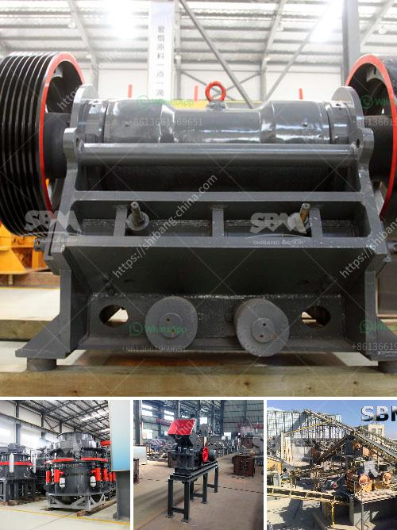

<h3>عملية الحجر الجيري</h3>
تُعد عملية الحجر الجيري من العمليات الهامة في صناعة البناء والتشييد. يتكون الحجر الجيري من تراكمات من الرسوبية الكيماوية التي تحتوي على نسبة عالية من مركب الكالسيوم الكربونيت. يستخدم الحجر الجيري في إنتاج الأسمنت والجص والجير وغيرها من المواد الأخرى التي تستخدم في البناء والتشييد.

تبدأ عملية استخراج الحجر الجيري بعملية التنقيب والاستكشاف. يتم استخدام التقنيات الحديثة لتحديد الأماكن التي تحتوي على تراكمات الحجر الجيري الممتدة تحت سطح الأرض. يتم حفر بئر استكشافية حيث يتم أخذ عينات من الصخور لتحليلها واختبارها في المختبر. إذا تم تأكيد وجود كميات كبيرة من الحجر الجيري ، يتم بناء منجم لاستخراجه.

تتضمن عملية استخراج الحجر الجيري في المناجم استخدام المعدات الثقيلة مثل الحفارات والجرافات لنقل الصخور الضخمة وفصلها عن بقية التربة والصخور الغير ضرورية. تحتاج هذه المعدات الثقيلة إلى تشغيل براعة ومهارة حيث يجب توخي الحذر لتفادي أي ضرر قد يحدث للعمال أو المعدات أثناء العملية.

بعد استخراج الحجر الجيري من المنجم ، يتم نقله إلى مصانع المعالجة حيث يتم طحنه وتكسيره إلى أجزاء أصغر باستخدام الكسارات والمطاحن. تُستخدم أيضًا الكسارات لفصل الشوائب الأخرى مثل الرمال والطمي عن الحجر الجيري النقي.

بعد طحن الحجر الجيري ، يتم تسخينه في الأفران الدوارة لإزالة الرطوبة والشوائب. يتم تحويل الحجر الجيري المسخن إلى مادة تسمى "الكلنكر" والتي يتم استخدامها كمادة أساسية في إنتاج الأسمنت. يتم تحطيم الكلنكر ثم طحنه إلى مسحوق ناعم يستخدم في إنتاج الأسمنت النهائي.

بالإضافة إلى صناعة الأسمنت ، يستخدم الحجر الجيري في إنتاج الجص والجير والرخام الصناعي والسمنت المُضاف إليه الحجر الجيري وغيرها من المنتجات. يعتبر الحجر الجيري مادة خام قيمة في الصناعات التحويلية وله أهمية كبيرة في تشكيل البنية التحتية للمجتمعات.

باختصار ، تتضمن عملية الحجر الجيري العديد من المراحل المعقدة من التنقيب والاستخراج والمعالجة والتحويل. تعتبر الصناعات التي تستخدم الحجر الجيري مهمة للغاية في بناء وتطوير البنية التحتية للمجتمعات وتلبية احتياجاتها في البناء والتشييد.
<h3>Contact us</h3><ul><li><strong>Whatsapp:&nbsp;<a href="https://wa.me/8613661969651">+8613661969651</a></strong></li><li><a href="https://swt.shibang-china.com/?git&amp;zhl&amp;عملية الحجر الجيري"><strong>Online Service(chat now)</strong></a></li></ul><h3>Related</h3><ul><li><a href='مبيعات آلة التكسير المحمولة في جنوب أفريقيا.md'>مبيعات آلة التكسير المحمولة في جنوب أفريقيا</a></li><li><a href='مصانع تحسين الكوارتز في الهند.md'>مصانع تحسين الكوارتز في الهند</a></li><li><a href='إغلاق محطة الكسارة.md'>إغلاق محطة الكسارة</a></li><li><a href='كسارات متنقلة للتأجير في جوهانسبرغ.md'>كسارات متنقلة للتأجير في جوهانسبرغ</a></li><li><a href='سعر الكسارة بمقدار الطن في الساعة.md'>سعر الكسارة بمقدار الطن في الساعة</a></li></ul>