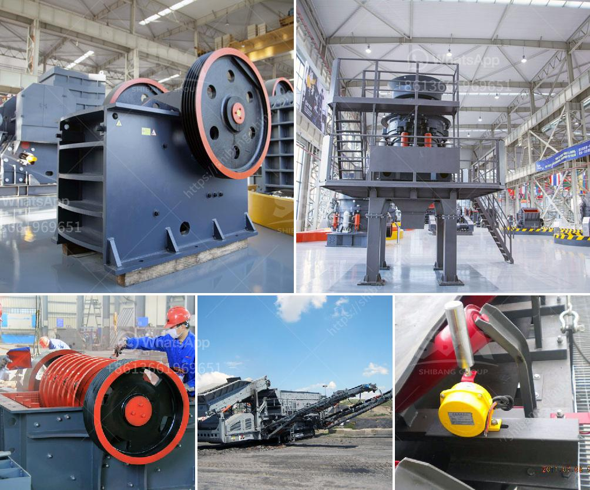

<h3>عملية الطحن الرطب</h3>
عملية الطحن الرطب هي عملية مهمة في صناعة البن والحبوب والمواد الغذائية الأخرى. تتضمن هذه العملية طحن المواد الخام باستخدام سائل للحصول على منتج نهائي ناعم ومتجانس. يمكن استخدام الماء أو الحليب أو الزيت أو أي سائل آخر حسب الاحتياجات المحددة للصناعة.

تُستخدم الطواحين الرطبة لطحن الحبوب والقمح والأرز والشوفان والذرة والكاكاو وغيرها من المكونات الأساسية في الصناعة الغذائية. تعتبر عملية الطحن الرطب ضرورية لإزالة القشرة الخارجية للحبوب ولتجنب مشاكل مثل التكتلات والمواد الغريبة الموجودة في المنتج الخام.

خلال عملية الطحن الرطب، يتم غمر المواد الخام بالسائل المحدد لفترة زمنية محددة، ويتم طحنها باستخدام آلة طحن معينة. يعتبر السائل المستخدم جزءًا من المبيدات والمحسنات التي تستخدم لتحسين خصائص المنتج النهائي. على سبيل المثال، يُضاف الماء للخبز لتسهيل عملية العجن وزيادة الليونة وتحسين جودة المنتج النهائي.

ميزة الطحن الرطب هي تحقيق مستوى عال من الدقة في عملية الطحن. يتم ضبط واستبدال الحبيبات الخشنة والصغيرة بينما يختلط المنتج النهائي بالسائل المستخدم. بالإضافة إلى ذلك، تسمح العملية بزيادة كفاءة الانتاج وتقليل الفاقد، حيث يكون أكثر المواد المفيدة موجودة في المنتج النهائي بعد الطحن.

ومع ذلك، هناك بعض العيوب المحتملة في هذه العملية مثل إمكانية تلوث المنتج بالميكروبات والبكتيريا إذا لم يتم التعامل معه بشكل صحيح. لذا، يجب أن يلتزم الصناع بمعايير الجودة والسلامة الصحية المطلوبة لتجنب أي مخاطر صحية.

تعتبر عملية الطحن الرطب عملية لا غنى عنها في الصناعات الغذائية. فهي تسهم في تحقيق المنتج النهائي ذو الجودة العالية والأداء المحسن، مع الحفاظ على سلامة المنتج وصحة المستهلكين. وباستخدام الطحن الرطب، يمكن تعزيز الكفاءة والإنتاجية في الصناعة الغذائية وتحقيق مستوى أفضل من الربحية والتنافسية.
<h3>Contact us</h3><ul><li><strong>Whatsapp:&nbsp;<a href="https://wa.me/8613661969651">+8613661969651</a></strong></li><li><a href="https://swt.shibang-china.com/?git&amp;zhl&amp;عملية الطحن الرطب"><strong>Online Service(chat now)</strong></a></li></ul><h3>Related</h3><ul><li><a href='إجراءات مكتبية لمصنع كسارة الحجر في مدى.md'>إجراءات مكتبية لمصنع كسارة الحجر في مدى</a></li><li><a href='قائمة أسعار مصنع التكسير.md'>قائمة أسعار مصنع التكسير</a></li><li><a href='مصانع غسيل صغيرة للبيع.md'>مصانع غسيل صغيرة للبيع</a></li><li><a href='كسارات وشاشات متنقلة مستعملة في جنوب أفريقيا.md'>كسارات وشاشات متنقلة مستعملة في جنوب أفريقيا</a></li><li><a href='مشروع كلنكر الإسمنت في الهند.md'>مشروع كلنكر الإسمنت في الهند</a></li></ul>