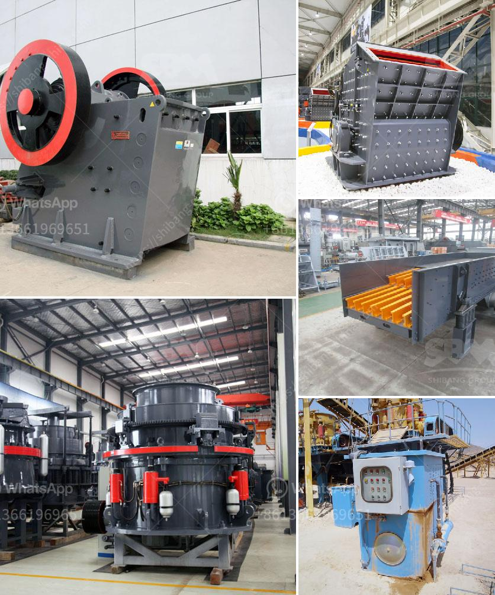

<h3>عملية الكرة الطحن</h3>
عملية الكرة الطحن هي عملية تستخدم لطحن المواد الصلبة إلى حجم الجسيمات الدقيقة باستخدام كرات معدنية. يتم طحن المواد الصلبة باستخدام الاحتكاك والصدمات بين الكرات والمواد الخام في وعاء الطحن. يتم استخدام هذه العملية في مجالات مختلفة مثل صناعة الأسمنت، وصناعة البلاستيك، وصناعة الدهانات، وصناعة المواد الغذائية والصيدلانية.

يتم تشغيل الكرة الطحن بواسطة محرك يقوم بتدوير الوعاء الذي يحتوي على الكرات المعدنية. عندما يتم وضع المواد الخام في الوعاء، فإن الكرات تبدأ في التحرك والدوران وتضرب المواد الصلبة الموجودة داخل الوعاء. تتولد قوى الاحتكاك والصدمات لتكسير وسحق المواد الصلبة.

يعتبر حجم الكرات والوعاء مهمين في عملية الكرة الطحن. حجم الكرات يجب أن يكون كافيًا لتكسير المواد الصلبة ولكنه لا يجب أن يكون كبيرًا للغاية حتى لا يتسبب في تلف المعدة. بالإضافة إلى ذلك، يجب أن يكون حجم الوعاء كبيرًا بما يكفي لسماح بتدوير الكرات بحرية وتحركها.

تتأثر عملية الكرة الطحن بالعديد من العوامل مثل سرعة الدوران، وزمن الطحن، وحجم الكرات، ونسبة المادة الصلبة إلى الوعاء. يتم تعديل هذه العوامل وفقًا لاحتياجات عملية الطحن المختلفة. على سبيل المثال، إذا كانت المواد الصلبة هشة، يمكن زيادة سرعة الدوران لتحقيق طحن سريع وفعال. ومع ذلك، إذا كانت المواد الصلبة لينة، فيمكن تقليل سرعة الدوران للحفاظ على حجم الجسيمات المطلوب.

يمكن استخدام الكرة الطحن لتحقيق عدة أهداف مختلفة مثل تقليل حجم الجسيمات، وتحسين توحيد الحجم، وتكسير المواد الصلبة. يعتبر هذا النوع من الطحن مناسبًا للمواد الصلبة التي لا يمكن طحنها بواسطة أساليب أخرى مثل الطحن اليدوي أو القص. تساهم عملية الكرة الطحن في تحسين جودة المنتج وتحقيق الاستفادة القصوى من المواد الصلبة.

باختصار، يمثل الكرة الطحن عملية مهمة تستخدم لطحن المواد الصلبة إلى حجم الجسيمات الدقيقة. تعتمد العملية على الاحتكاك والصدمات بين الكرات المعدنية والمواد الخام في وعاء الطحن. تعد هذه العملية مفيدة في العديد من الصناعات وتحقق تحسينًا في جودة المنتج النهائي.
<h3>Contact us</h3><ul><li><strong>Whatsapp:&nbsp;<a href="https://wa.me/8613661969651">+8613661969651</a></strong></li><li><a href="https://swt.shibang-china.com/?git&amp;zhl&amp;عملية الكرة الطحن"><strong>Online Service(chat now)</strong></a></li></ul><h3>Related</h3><ul><li><a href='كيفية صنع كسارة كرات.md'>كيفية صنع كسارة كرات</a></li><li><a href='تطبيق محطة الكسارة.md'>تطبيق محطة الكسارة</a></li><li><a href='مصنعو كسارات الجيري.md'>مصنعو كسارات الجيري</a></li><li><a href='مورد كسارة في الصين.md'>مورد كسارة في الصين</a></li><li><a href='كسارة الخرسانة للبيع في نيو جيرسي.md'>كسارة الخرسانة للبيع في نيو جيرسي</a></li></ul>