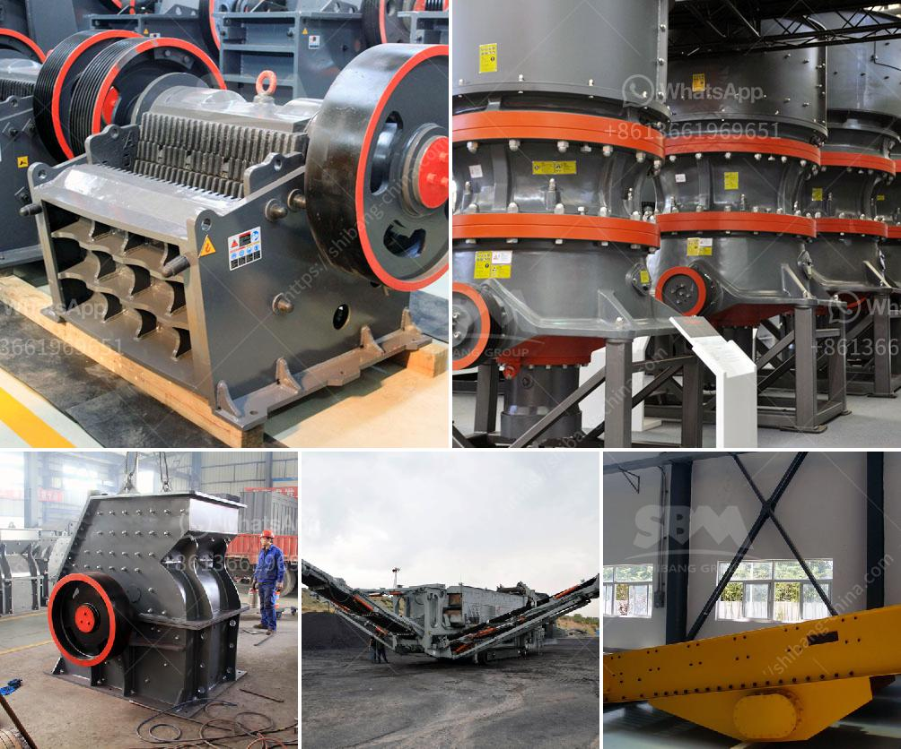

<h3>عملية تحسين الحجر الجيري</h3>
عملية تحسين الحجر الجيري هي عملية تهدف إلى تحسين خواص الحجر الجيري المستخدم في العديد من الصناعات. الحجر الجيري هو صخر رسوبي يتكون أساسًا من كربونات الكالسيوم. يستخدم الحجر الجيري في صناعة الأسمدة، والمنتجات العازلة، وصناعة الزجاج، وصناعة الحديد والصلب، وغيرها من الصناعات.

تحسين الحجر الجيري يمكن أن يكون من خلال عملية تعدين متقدمة وتقنيات تجهيز. يجب أن يتم اختيارة عملية التعدين بعناية لضمان حصولنا على أعلى جودة من الحجر الجيري. بعد الحصول على الحجر الجيري، يتم تنظيفه وتفتيته وفرزه وتجفيفه بطرق مختلفة.

من أهم طرق تحسين الحجر الجيري هو معالجته بالحرارة لإزالة الشوائب والمسام غير المرغوب فيها، وهذا يساهم في تحسين قوة الحجر الجيري واستقراره الكيميائي. يتم تسخين الحجر الجيري إلى درجة حرارة عالية وعادة في فرن كهربائي، وهذا يعزز تحرير ثاني أكسيد الكربون (CO2) من الحجر الجيري. يمكن أن يتم استخدام هذا الغاز في صناعات أخرى، مثل إنتاج الأسمدة أو التجفيف.

عملية تحسين الحجر الجيري يمكن أيضًا تحقيقها من خلال استخدام مواد كيميائية. على سبيل المثال، يمكن استخدام البلورات الصغيرة من الكيماويات لتحسين الخواص الميكانيكية للحجر الجيري. بالإضافة إلى ذلك، يمكن استخدام المواد الكيميائية لتحسين خواص اللون والمظهر الجمالي للحجر الجيري.

آخر عملية هامة في تحسين الحجر الجيري هي طحنه للحصول على حجم الجسيمات المناسب. الحجم الجذري للحبيبات يؤثر على عدة خصائص مثل مقاومة الحجر للتآكل وسهولة استخدامه في الصناعة. يتم طحن الحجر الجيري بواسطة مطاحن مختلفة للحصول على الحبيبات المطلوبة.

بشكل عام، تحسين الحجر الجيري هو عملية مهمة للحصول على منتج نهائي عالي الجودة ومناسب للاستخدام في العديد من الصناعات المختلفة. هذه العملية تحقق تحسين الخواص الميكانيكية والكيميائية والفيزيائية للحجر الجيري. يساهم تحسين الحجر الجيري في زيادة كفاءة الإنتاج وتحسين الأداء وتوفير الكلفة في الصناعات التي تعتمد على استخدام الحجر الجيري.
<h3>Contact us</h3><ul><li><strong>Whatsapp:&nbsp;<a href="https://wa.me/8613661969651">+8613661969651</a></strong></li><li><a href="https://swt.shibang-china.com/?git&amp;zhl&amp;عملية تحسين الحجر الجيري"><strong>Online Service(chat now)</strong></a></li></ul><h3>Related</h3><ul><li><a href='سعر كسارة الفحم.md'>سعر كسارة الفحم</a></li><li><a href='مطحنة كرات مخروطية للبيع.md'>مطحنة كرات مخروطية للبيع</a></li><li><a href='موردي آلات الأسمنت ووحدة الطحن.md'>موردي آلات الأسمنت ووحدة الطحن</a></li><li><a href='تكلفة تقديرية لمصنع التعدين.md'>تكلفة تقديرية لمصنع التعدين</a></li><li><a href='آلة طحن الكوارتز المستعملة للبيع.md'>آلة طحن الكوارتز المستعملة للبيع</a></li></ul>