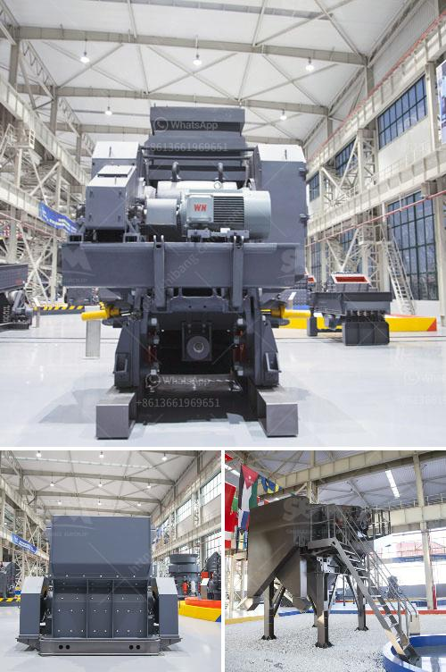

<h3>عملية تحويل الحجر الجيري إلى الإسمنت</h3>
إعداد الإسمنت هو عملية معقدة يتم فيها تحويل الحجر الجيري إلى مادة أسمنتية تستخدم في البناء والإنشاءات. يتكون الإسمنت من مجموعة من المركبات الكيميائية التي تتفاعل مع بعضها البعض لتكوين مادة رابطة تربط المواد الأخرى معًا.

تبدأ عملية تحويل الحجر الجيري إلى الإسمنت بجمع الحجر الجيري من المحاجر، حيث يتم نقلها إلى موقع المصنع عن طريق الشاحنات أو الحزام الناقل. يتم طحن الحجر الجيري في طواحين خاصة حتى يتم تحويله إلى مسحوق ناعم يسمى البودرة الجيرية.

بعد ذلك، يتم خلط البودرة الجيرية مع مواد أخرى مثل السيليكا والألومينا والحديد في كميات محددة للحصول على التركيبة المطلوبة للإسمنت. تتم عملية الخلط في مصنع الإسمنت باستخدام معدات خاصة مثل الخلاطات. يتم تفعيل المواد الكيميائية في الخلاط والتحكم في درجة الحرارة للتأكد من التفاعل الصحيح بين المكونات.

مرحلة مهمة في عملية إنتاج الإسمنت هي مرحلة الحرق، حيث يتم تسخين المواد المختلفة إلى درجات حرارة عالية في أفران الصهر. يتم تسخين المواد المختلطة حتى تصبح مادة دمغة تسمى "الكلنكر"، وهو اسمنت غامض يتم بعد ذلك طحنه إلى مسحوق ناعم للحصول على الإسمنت النهائي.

بالإضافة إلى مرحلة الحرق، هناك أيضًا مراحل أخرى في عملية تحويل الحجر الجيري إلى الإسمنت مثل المرحلة السابقة للحرق التي تتضمن تجفيف المكونات وطحنها بعناية. كما يتم إجراء عمليات مراقبة مستمرة لضمان جودة الإسمنت النهائي والامتثال للمواصفات القياسية.

باختصار، عملية تحويل الحجر الجيري إلى الإسمنت هي عملية معقدة يتطلب القدرة على مزج المواد الكيميائية بشكل صحيح والاحتفاظ بظروف التحول المناسبة للحصول على منتج نهائي عالي الجودة. يتطلب هذا العمل الجهد والمهارة والمراقبة المستمرة للمحافظة على جودة الإسمنت وضمان السلامة والمتانة في الإنشاءات.
<h3>Contact us</h3><ul><li><strong>Whatsapp:&nbsp;<a href="https://wa.me/8613661969651">+8613661969651</a></strong></li><li><a href="https://swt.shibang-china.com/?git&amp;zhl&amp;عملية تحويل الحجر الجيري إلى الإسمنت"><strong>Online Service(chat now)</strong></a></li></ul><h3>Related</h3><ul><li><a href='آلة طحن مطحنة الرمل السيليكا.md'>آلة طحن مطحنة الرمل السيليكا</a></li><li><a href='مطاحن الكرة الاصطناعية الجبس.md'>مطاحن الكرة الاصطناعية الجبس</a></li><li><a href='تكلفة آلة طحن الرمال السيليكا.md'>تكلفة آلة طحن الرمال السيليكا</a></li><li><a href='استثمار مصنع كسارة الحجر.md'>استثمار مصنع كسارة الحجر</a></li><li><a href='كسارات الحطام للبيع.md'>كسارات الحطام للبيع</a></li></ul>