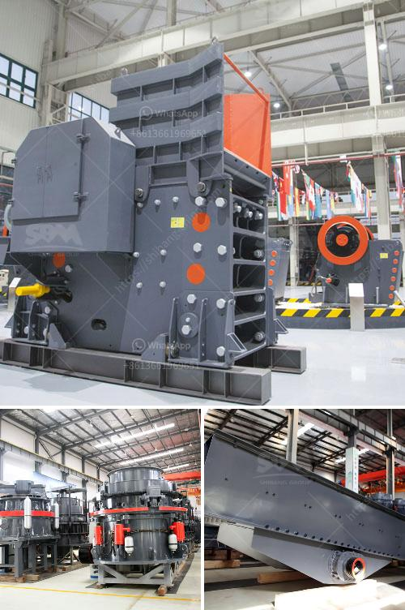

<h3>عملية تدمير صخور الحجر الجيري آلة كسارة الحجر</h3>
تعتبر آلة كسارة الحجر من الأدوات التي تستخدم في عملية تدمير صخور الحجر الجيري. يستخدم هذا النوع من الحجر في العديد من التطبيقات المختلفة مثل صناعة البناء، والطرق، والأعمال الزراعية، وغيرها الكثير. وعندما يحتاج الشخص إلى تدمير صخرة من الحجر الجيري، فإنه يعتمد على آلة كسارة الحجر لتسهيل هذه العملية.

تتألف آلة كسارة الحجر من جزئين رئيسيين، الأول هو الفك المتحرك والثابت، والثاني هو الطاحونة. يعمل الفك المتحرك والثابت بالتناوب لتحطيم الحجر الجيري بقوة. يتم وضع الصخور داخل فك الكسارة وعند غلقها، يقوم الفك المتحرك بالتحرك للأسفل بقوة عالية ويقوم بتحطيم الحجر الجيري.

عندما تتم دورة تحريك الفك المتحرك للأسفل، يتم تحطيم الصخور إلى حجم أصغر. يتم نقل الحجر الجيري المحطم عبر حزام ناقل إلى الطاحونة التي توجد بها مطرقة ضخمة. تعمل المطرقة على تحطيم الصخور الأصغر إلى حجم أصغر وتفتتها بشكل أكبر.

يتم استخدام آلة كسارة الحجر بشكل واسع في الصناعة بسبب فعاليتها وقدرتها على توفير الكثير من الوقت والجهد. كما أنها تستخدم لتحطيم الصخور الكبيرة إلى أحجام قابلة للتحكم. وتعتمد قوة الكسارة على عوامل عديدة بشكل عام مثل نوع الحجر الجيري وحجمه ومقاومته.

بشكل عام، فإن آلة كسارة الحجر يمكن أن تعتبر واحدة من أهم الأدوات في صناعة البناء والبنية التحتية بشكل عام. فهي تساهم في توفير الحجر الجيري الذي يستخدم في بناء المباني والجسور والأرصفة. كما أنها تعمل على تحسين فعالية العمل في مواقع البناء وتوفير الوقت والمال.

في الختام، آلة كسارة الحجر هي أداة لا غنى عنها في عملية تدمير صخور الحجر الجيري. تقدم هذه الآلة الفوائد العديدة في صناعة البناء وتساهم في توفير قوة العمل والوقت. يتم استخدامها على نطاق واسع في الصناعة وتبقى أحد الأدوات الرئيسية التي تساهم في تقدم البنية التحتية بشكل عام.
<h3>Contact us</h3><ul><li><strong>Whatsapp:&nbsp;<a href="https://wa.me/8613661969651">+8613661969651</a></strong></li><li><a href="https://swt.shibang-china.com/?git&amp;zhl&amp;عملية تدمير صخور الحجر الجيري آلة كسارة الحجر"><strong>Online Service(chat now)</strong></a></li></ul><h3>Related</h3><ul><li><a href='مطاحن الكرة الأرجنتينية.md'>مطاحن الكرة الأرجنتينية</a></li><li><a href='المعدات المطلوبة لتعدين الفحم.md'>المعدات المطلوبة لتعدين الفحم</a></li><li><a href='طحن الفلدسبار بواسطة مطحنة الكرة في الفلبين.md'>طحن الفلدسبار بواسطة مطحنة الكرة في الفلبين</a></li><li><a href='جول بيلي كسارة حجر مستعملة.md'>جول بيلي كسارة حجر مستعملة</a></li><li><a href='عمود المرفق لكسارة الفك.md'>عمود المرفق لكسارة الفك</a></li></ul>