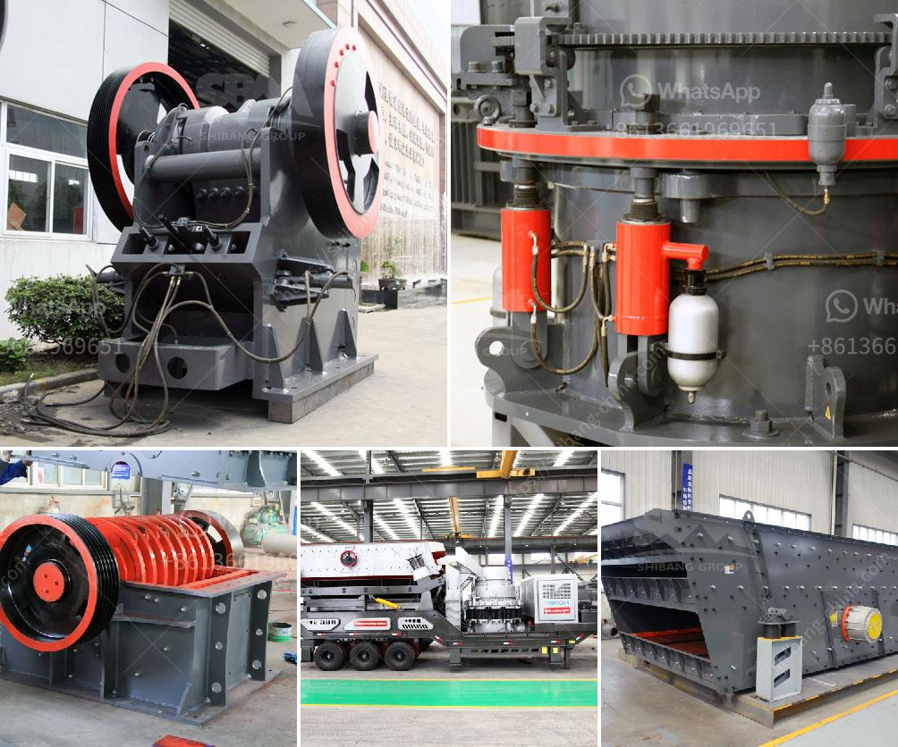

<h3>عملية تشكيل الأسمنت</h3>
تعتبر عملية تشكيل الأسمنت من الخطوات الأساسية في صناعة الإسمنت. يقصد بالأسمنت مادة مسحوقية تستخدم في البناء والإنشاءات لربط المواد الأخرى معًا وتشكيل مواد البناء.

تبدأ عملية تشكيل الأسمنت بجمع الخامات الأساسية التي تشتمل على الحجر الجيري والطين والسيليكا والأتربة. يتم سحق هذه المواد وخلطها بنسب محددة في مصانع الأسمنت. يتم تسخين الخامات في فرن دوار عند درجة حرارة تتراوح بين 1400 إلى 1500 درجة مئوية.

تحدث عملية تشكيل الأسمنت بعد تسخين الخامات، وتتمثل هذه العملية في طحن الكلنكر الناتج من الفرن الدوران. يضاف للكلنكر نسبة صغيرة من الجبس، وهو مادة تضاف لتنظيم وتسريع عملية التصلب. يتم طحن هذه المكونات معًا في مطاحن الأسمنت حتى يتم الحصول على مسحوق الأسمنت النهائي.

بعد طحن الأسمنت، يتم نقله إلى مخازن التخزين وتعبئته في أكياس أو إناءات كبيرة لتوزيعه واستخدامه في البناء والإنشاءات.

تشكيل الأسمنت هو عملية حساسة ومعقدة، تتطلب دقة عالية في المراحل المختلفة ومراقبة مستمرة للجودة. فعملية التحول الكيميائي الذي يحدث في الفرن يتطلب درجات حرارة عالية وضغوطًا محكمة، بينما طحن الأسمنت يتطلب مطاحن مختلفة بحسب نوع الأسمنت المطلوب.

تكنولوجيا تشكيل الأسمنت تطورت على مر السنين، مما ساهم في زيادة كفاءة العملية وتحسين جودة الأسمنت المنتجة. وتساعد المختبرات وأنظمة المراقبة في تحليل العينات واختبار الجودة، لضمان أن يتم الحصول على منتج نهائي متسق وذو جودة عالية.

في الختام، عملية تشكيل الأسمنت هي عملية حاسمة في صناعة الإسمنت. وتشكل مادة الأسمنت الأساسية التي تستخدم في البناء والإنشاءات. الاستخدام الصحيح لعملية تشكيل الأسمنت يسهم في حصولنا على مواد بنائية عالية الجودة ومتينة.
<h3>Contact us</h3><ul><li><strong>Whatsapp:&nbsp;<a href="https://wa.me/8613661969651">+8613661969651</a></strong></li><li><a href="https://swt.shibang-china.com/?git&amp;zhl&amp;عملية تشكيل الأسمنت"><strong>Online Service(chat now)</strong></a></li></ul><h3>Related</h3><ul><li><a href='كسارة حجر محمولة من تايوان.md'>كسارة حجر محمولة من تايوان</a></li><li><a href='مصنع مسحوق لوح الجبس في إثيوبيا.md'>مصنع مسحوق لوح الجبس في إثيوبيا</a></li><li><a href='كسارة الصدم PF لآلة تكسير الحجر للبيع.md'>كسارة الصدم PF لآلة تكسير الحجر للبيع</a></li><li><a href='كسارة الحجر الهامر.md'>كسارة الحجر الهامر</a></li><li><a href='حساب دورة في الدقيقة التشغيلية لمطحنة الكرة.md'>حساب دورة في الدقيقة التشغيلية لمطحنة الكرة</a></li></ul>