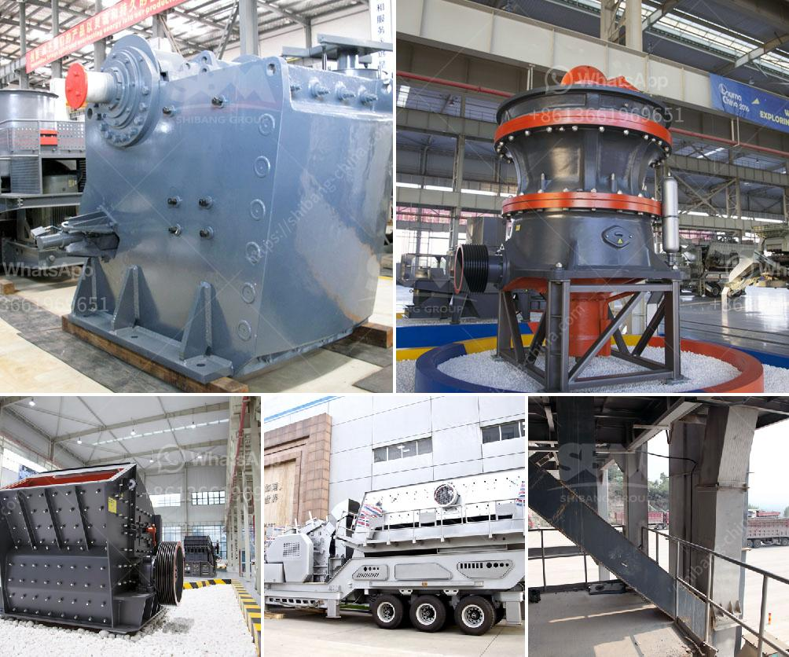

<h3>عملية تصنيع الإسمنت بالطريقة الرطبة</h3>
تصنيع الإسمنت واحدة من العمليات الهامة في صناعة البناء والإنشاءات، حيث يستخدم الإسمنت في مختلف التطبيقات مثل البناء، والأعمال المدنية، وتعبيد الطرق. توجد طرق عديدة لصناعة الإسمنت، وأحد هذه الطرق هي الطريقة الرطبة.

تتراوح الكلمة الأولى في عملية تصنيع الإسمنت بالطريقة الرطبة عندما تضاف مكونات الإسمنت الأساسية مثل الحجر الجيري والكلس والطين إلى طاحونة دوارة. يتم طحن المكونات حتى يتم الحصول على مسحوق ناعم يعرف بالخام الأولي.

بعد ذلك، يتم خلط المكونات الخام مع الماء في وعاء خلط كبير يسمى المصنع. يتم خلط المكونات حتى يتم الحصول على مادة سائلة تسمى خليط السيليكات.

يتم تسخين خليط السيليكات في فرن دوار عند درجة حرارة تتراوح بين 1400 إلى 1500 درجة مئوية. خلال هذه العملية، يتم تفاعل المكونات الكيميائية لخلق مركبات جديدة تسمى الكلنكر.

بعد مرحلة الحرق، يتم تبريد الكلنكر ببطء. يتم طحن الكلنكر مع الجبس في طواحين الأسمنت للحصول على مسحوق ناعم يعرف بالأسمنت النهائي.

أخيرًا، يتم تكوين الأسمنت النهائي في أكياس أو براميل جاهزة للتوزيع والاستخدام النهائي. يمكن استخدام الإسمنت النهائي في مشاريع البناء والأعمال المحلية والصناعية.

يتطلب إنتاج الإسمنت الرطب وجود تكنولوجيا متقدمة ومعدات خاصة للحد من حجم الجسيمات وضمان الجودة والكفاءة. يتطلب أيضًا استخدام كميات كبيرة من الماء لضمان تشكيل الخليط السائل اللازم لمعالجة وتصنيع المواد.

عملية تصنيع الإسمنت بالطريقة الرطبة تحتاج إلى اهتمام ورعاية مستمرة لضمان الحصول على منتج نهائي عالي الجودة والمستدام. يجب تكوين العملية وفقًا للمعايير الصارمة للحفاظ على البيئة والصحة العامة.

باختصار، عملية تصنيع الإسمنت بالطريقة الرطبة تنطوي على عدة خطوات من الطحن والمزج والحرق حتى تصل إلى المنتج النهائي القابل للاستخدام في مجالات مختلفة. تحقيق جودة الإسمنت يعتبر أمرًا هامًا ويتطلب جهودًا كبيرة للمحافظة على المعايير المطلوبة للجودة والأمان والبيئة.
<h3>Contact us</h3><ul><li><strong>Whatsapp:&nbsp;<a href="https://wa.me/8613661969651">+8613661969651</a></strong></li><li><a href="https://swt.shibang-china.com/?git&amp;zhl&amp;عملية تصنيع الإسمنت بالطريقة الرطبة"><strong>Online Service(chat now)</strong></a></li></ul><h3>Related</h3><ul><li><a href='مصنع كسارة للفحم.md'>مصنع كسارة للفحم</a></li><li><a href='مصنعي مطاحن الرايموند في الهند.md'>مصنعي مطاحن الرايموند في الهند</a></li><li><a href='مصنع معالجة خام الذهب 200 طن في الساعة.md'>مصنع معالجة خام الذهب 200 طن في الساعة</a></li><li><a href='إنتاج خط الإنتاج لكسارة الطوب.md'>إنتاج خط الإنتاج لكسارة الطوب</a></li><li><a href='تكلفة كسارة الصدم.md'>تكلفة كسارة الصدم</a></li></ul>