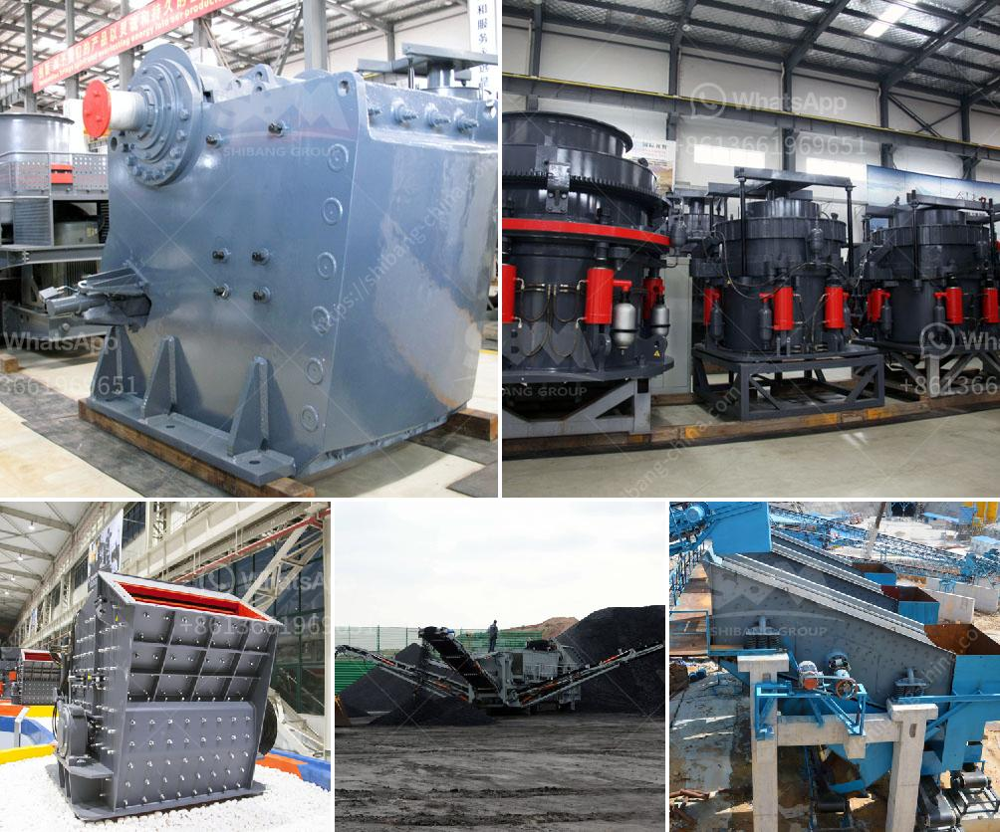

<h3>عملية تصنيع الحجر</h3>
تعتبر الأحجار من المواد الطبيعية الثمينة التي يتم استخدامها في البناء والديكور. تعد عملية تصنيع الحجر عملية معقدة وشاقة تتطلب مهارات فنية وخبرة عالية. اليوم، سأقدم لك نظرة عامة عن عملية تصنيع الحجر.

تبدأ عملية تصنيع الحجر بالبحث عن محاجر الحجر المناسبة. يتم دراسة الخواص الطبيعية للصخور، مثل القوة والمتانة واللون والمظهر العام. بعد تحديد المحجر المناسب، يتم التنقيب عن الحجر باستخدام آلات ثقيلة مثل الحفارات والكسارات الضخمة.

عندما يتم استخراج الصخور من المحجر، يتم نقلها إلى ورشة العمل حيث يتم تنظيفها وفحصها بعناية للتأكد من خلوها من الشوائب والتلف. يتم استخدام الماء والفرش وآلات التنظيف الخاصة لإزالة الأوساخ والأوساخ من الصخور.

بعد التنظيف، تتم عملية التشكيل والقص للحجر حسب القياسات اللازمة. يتم استخدام المشاشي لإعطاء الحجر شكله المطلوب، بينما تتم عملية القص بواسطة آلات القطع المحترفة التي تعمل بالليزر أو بالماء.

بعد عملية التشكيل والقص، يتم تجهيز الحجر للتشطيب النهائي. تتم هذه العملية عن طريق النقش والسنفرة والتلميع والتعرض للحرارة وتطبيق المواد الكيميائية وغيرها من العمليات. يتم استخدام الأدوات اليدوية والآلات الخاصة للحصول على النتيجة المطلوبة، مثل آلة النقش بالحجر وآلة السنفرة والماكينة البوليشية.

أخيراً، بعد عملية التشطيب، يتم تفحيم الحجر وتغليفه وتسليمه للعملاء النهائيين. يتم استخدام مواد التعبئة والتغليف المناسبة لحماية الحجارة أثناء عملية النقل والتخزين.

باختصار، عملية تصنيع الحجر تشمل العديد من الخطوات المهمة والمعقدة. تحتاج إلى فريق عمل ماهر ومتخصص بهذا المجال لضمان الجودة والدقة في كل خطوة من العملية. ومع ذلك، النتيجة النهائية تستحق كل الجهد المبذول، فالحجر الطبيعي يعتبر أحد التحف الفنية الرائعة التي تزيد من قيمة المباني والمساحات الداخلية.
<h3>Contact us</h3><ul><li><strong>Whatsapp:&nbsp;<a href="https://wa.me/8613661969651">+8613661969651</a></strong></li><li><a href="https://swt.shibang-china.com/?git&amp;zhl&amp;عملية تصنيع الحجر"><strong>Online Service(chat now)</strong></a></li></ul><h3>Related</h3><ul><li><a href='مطحنة الأسطوانة للطحن.md'>مطحنة الأسطوانة للطحن</a></li><li><a href='كسارة الخرسانة الصغيرة.md'>كسارة الخرسانة الصغيرة</a></li><li><a href='تكلفة تشغيل الكسارة في لاس فيغاس.md'>تكلفة تشغيل الكسارة في لاس فيغاس</a></li><li><a href='كسارة صنع الحصى.md'>كسارة صنع الحصى</a></li><li><a href='تأجير كسارة تأجير في غانا.md'>تأجير كسارة تأجير في غانا</a></li></ul>