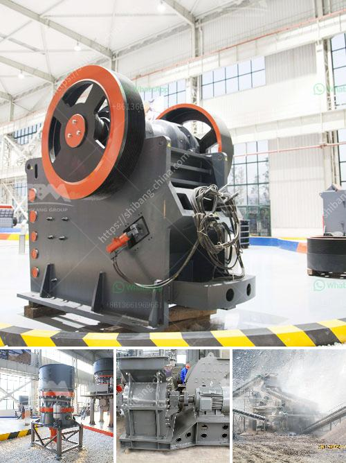

<h3>عملية تصنيع الرمل الاصطناعي</h3>
تتعدد استخدامات الرمل الاصطناعي في مجالات مختلفة مثل البناء والصباغة وصناعة الزجاج والإلكترونيات والنسيج والإعلانات، وعملية تصنيعه تعتبر من العمليات الهندسية المعقدة. الرمل الاصطناعي هو مادة حبيبية ناتجة عن تكسير الصخور الصلبة ثم معالجتها لتحقيق خواص مشابهة للرمال الطبيعية. سنتعرف في هذه المقالة على عملية تصنيع الرمل الاصطناعي.

يبدأ العملية بتكسير الصخور الصلبة مثل الغرانيت أو البازلت أو الحجر الجيري بواسطة ماكينات التكسير. يتم تكسير الصخور إلى قطع صغيرة بحجم حبة الرمل أو أصغر. وبعد ذلك، يتم تفتيت القطع الصغيرة إلى جسيمات أرضية رملية.

من المرحلة التالية في العملية هي فحص الرمل الأرضي لإزالة المواد المستخرجة غير المرغوب فيها مثل الأتربة والفضلات والصخور الصغيرة. يتم غسله بماء نظيف لإزالة الشوائب السطحية وإعطاء الرمل اللون والمظهر المطلوب.

ثم يتم تجفيف الرمل الرطب باستخدام فرن أو مجفف للحصول على رطوبة مناسبة. وفي هذه المرحلة، يمكن إضافة المواد الكيميائية المساعدة لتحسين خواص الرمال مثل المضادات الجرثومية أو مثبتات اللون.

بعد تجفيف الرمل، يتم غربلته للتحكم في حجم الحبيبات المطلوبة. يتم تصنيف الرمال وفقًا لأحجام الحبيبات، ويتم استبعاد أي رمل غير مطابق للمعايير المطلوبة.

في النهاية، يتم تعبئة الرمل الاصطناعي في أكياس أو شاحنات جاهزة للبيع والتوزيع.

يتميز الرمل الاصطناعي بعدة مزايا على الرمال الطبيعية، حيث يمكن تحكم دقيق في حجم وشكل المجمتعات الحبيبية، وهو أكثر سلاسة ونعومة ونقاء من الرمال الطبيعية، ويمتلك خواص فيزيائية وكيميائية محسنة. بالإضافة إلى ذلك، فإن استخدام الرمل الاصطناعي يحافظ على موارد الرمال الطبيعية ويحد من تدمير البيئة ويقلل من التأثير البيئي المحتمل لعمليات التعدين.

باختصار، عملية تصنيع الرمل الاصطناعي تتكون من خطوات متعددة بدءًا من تكسير الصخور ونخلها وغسلها وتجفيفها إلى تعبئتها وتوزيعها. وبفضل الرمل الاصطناعي، يمكن تلبية احتياجات الصناعات المختلفة والحفاظ على البيئة في نفس الوقت.
<h3>Contact us</h3><ul><li><strong>Whatsapp:&nbsp;<a href="https://wa.me/8613661969651">+8613661969651</a></strong></li><li><a href="https://swt.shibang-china.com/?git&amp;zhl&amp;عملية تصنيع الرمل الاصطناعي"><strong>Online Service(chat now)</strong></a></li></ul><h3>Related</h3><ul><li><a href='كيفية حساب كفاءة الكسارة.md'>كيفية حساب كفاءة الكسارة</a></li><li><a href='سعر كسارة متنقلة خام الكروم الرئيسية.md'>سعر كسارة متنقلة خام الكروم الرئيسية</a></li><li><a href='مصنع تكسير صخور متنقل وثابت جديد.md'>مصنع تكسير صخور متنقل وثابت جديد</a></li><li><a href='موردين لمصانع سحق ld slag في الهند.md'>موردين لمصانع سحق ld slag في الهند</a></li><li><a href='رسم بياني لعملية غسيل الرمال.md'>رسم بياني لعملية غسيل الرمال</a></li></ul>