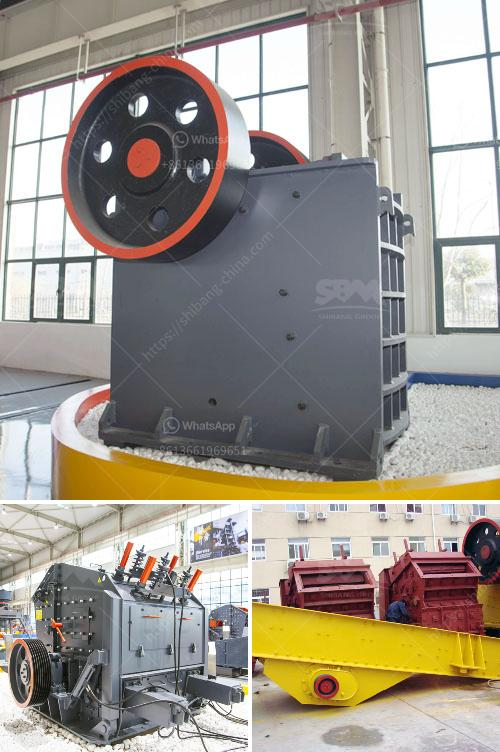

<h3>عملية تصنيع السلاغ</h3>
تعتبر السلاغ من المواد الهامة في صناعة النسيج، حيث يتم استخدامها بشكل رئيسي في صناعة الملابس والأقمشة المنزلية. تمتاز السلاغ بقدرتها على تحمل التلوث والتمدد، وتوفير الراحة والدفء للملابس. ولذلك، تكثر عمليات تصنيع السلاغ حول العالم لتلبية الطلب المتزايد على هذه المادة.

تبدأ عملية تصنيع السلاغ بانتقاء أفضل أنواع الصوف أو القطن للحصول على المواد الخام المثالية. يتم جمع الصوف من الخراف وتنسيجه بعد تنظيفه جيدًا وفصله عن بقايا البركة والأوساخ. من جهة أخرى، يتم جمع الألياف القطنية وتنقيتها من الشوائب والبذور.

ثم يتم تحويل المواد الخام إلى الشعيرات النسيجية عبر عدة عمليات. أولاً، يتم تفتيت الصوف أو القطن إلى قطع صغيرة باستخدام ماكينات خاصة تعرف بـ "المقصات" أو "الكيس". يتم بعدها إزالة الشوائب الأخرى باستخدام أجهزة تنظيف ميكانيكية تعمل بالهواء.

تأتي الخطوة التالية في عملية تصنيع السلاغ بتجهيز الشعيرات النسيجية وإعدادها للتركيب في الأقمشة المختلفة. يتم تمشيط الشعيرات باستخدام آلات تسمى "المشطيات"، والتي تقوم بفصل الشعيرات وتصفية وتمريرها في خانة تزويد. بعدها، يتم تشكيل الشعيرات في طبقات وتتملكها اللبادات في إعداد المحاصيل.

تنتقل العملية بعد ذلك إلى مرحلة التجهيز النهائية. تمر اللبادات عبر آلات النسج التي تعمل على تشكيلها وتكوينها في الأقمشة المناسبة. ولتعزيز خصائص السلاغ، تتم معالجته بالمواد الكيميائية المناسبة لضمان تحقيق النتائج المطلوبة.

في النهاية، تتم عملية فحص السلاغ بدقة لضمان جودتها ومطابقتها للمواصفات المطلوبة. تدق الأنظار لأي عيوب محتملة، مثل الشروخ أو الخطوط غير المهذبة. يتم تقديم السلاغ بعد ذلك إلى العملاء والشركات المصنعة للاستخدام في صناعة الملابس والأقمشة المنزلية.

باختصار، يعتبر تصنيع السلاغ عملية دقيقة ومتطورة، تشمل عدة خطوات للحصول على منتج نهائي عالي الجودة. تعتمد عملية التصنيع على الاهتمام بتفاصيل العملية وتحقيق المعايير العالية، مما يضمن توفير السلاغ النسيجي المتين والعالي الجودة.
<h3>Contact us</h3><ul><li><strong>Whatsapp:&nbsp;<a href="https://wa.me/8613661969651">+8613661969651</a></strong></li><li><a href="https://swt.shibang-china.com/?git&amp;zhl&amp;عملية تصنيع السلاغ"><strong>Online Service(chat now)</strong></a></li></ul><h3>Related</h3><ul><li><a href='كسارات تأثير ثانوية.md'>كسارات تأثير ثانوية</a></li><li><a href='كوماتسو بي آر كسارة للبيع.md'>كوماتسو بي آر كسارة للبيع</a></li><li><a href='مطحنة الكرة لخام الذهب للبيع في زيمبابوي.md'>مطحنة الكرة لخام الذهب للبيع في زيمبابوي</a></li><li><a href='تكلفة كسارة النحاس.md'>تكلفة كسارة النحاس</a></li><li><a href='مصنع تركيز النحاس الصغير.md'>مصنع تركيز النحاس الصغير</a></li></ul>