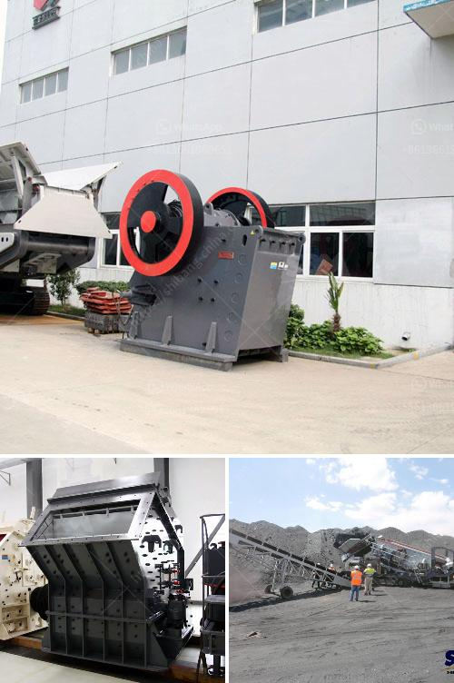

<h3>عملية تصنيع بروميد الكالسيوم</h3>
يعد بروميد الكالسيوم أحد المركبات الكيميائية المهمة التي تستخدم في العديد من التطبيقات المختلفة، مثل صناعة الأدوية والمواد الكيميائية والفوتوغرافية. تعد عملية تصنيع بروميد الكالسيوم عملية صناعية معقدة تشمل عدة خطوات. سنستعرض هنا بعض الخطوات الأساسية التي يتم اتباعها في عملية تصنيع بروميد الكالسيوم.

الخطوة الأولى في عملية تصنيع بروميد الكالسيوم هي استخراج المواد الأولية، أي الكالسيوم والبروم. يمكن الحصول على الكالسيوم من خلال معالجة خام الكالسيوم، مثل الحجر الجيري (CaCO3)، بواسطة الحرارة في فرن حيث يحدث تفاعل كيميائي يؤدي إلى تحويل الكالسيوم إلى أكسيد الكالسيوم (CaO)، ثم يتم تفاعله مع الماء للحصول على هيدروكسيد الكالسيوم (Ca(OH)2). أما البروم، فيمكن الحصول عليه من الأملاح البحرية أو من أملاح البلدان الباردة.

بعد الحصول على المواد الأولية، يتم خلطها معًا وتسخينها بحرارة عالية في أفران خاصة. يحدث عند ذلك تفاعل كيميائي بين الكالسيوم والبروم، حيث يتم تشكيل بروميد الكالسيوم. في هذه الخطوة، يتم تسخين المزيج إلى درجة حرارة معينة وتحت ضغط محدد لتسهيل التفاعل. وتعد هذه الخطوة الأكثر أهمية في عملية تصنيع بروميد الكالسيوم.

بعد الانتهاء من عملية التفاعل، يتم فصل بروميد الكالسيوم الناتج عن العملية بواسطة التبريد وتكثيف الغازات. حيث يتم دفع الغاز المتبقي في الفرن إلى أعلى معدل لعملية التكثيف، ومن ثم يتم تجميده وتقليل الضغط عليه للحصول على بروميد الكالسيوم الصلب.

الخطوة الأخيرة في عملية تصنيع بروميد الكالسيوم هي تنقيته وإعداده للتخزين والاستخدام المستقبلي. يتم ذلك عن طريق تنقية بروميد الكالسيوم من المواد الشوائب بواسطة الكربون النشط أو المعالجة بالمذابات العضوية المناسبة. ومن ثم يتم تغليفه وتخزينه في حاويات مغلقة ومحافظة على جفافه وعديمة الرطوبة لضمان استدامته وجودته.

بإتقان عملية تصنيع بروميد الكالسيوم والتحكم في جميع الخطوات الكيميائية المختلفة تمكننا من الحصول على بروميد الكالسيوم ذو الجودة العالية والنقاء العالي. يجد بروميد الكالسيوم تطبيقات واسعة في الصناعات المختلفة، ويعتبر مكونًا مهمًا في عديد من المنتجات الكيميائية والطبية.
<h3>Contact us</h3><ul><li><strong>Whatsapp:&nbsp;<a href="https://wa.me/8613661969651">+8613661969651</a></strong></li><li><a href="https://swt.shibang-china.com/?git&amp;zhl&amp;عملية تصنيع بروميد الكالسيوم"><strong>Online Service(chat now)</strong></a></li></ul><h3>Related</h3><ul><li><a href='شركة مصنعة مشهورة للكسارة والطاحونة في فرنسا.md'>شركة مصنعة مشهورة للكسارة والطاحونة في فرنسا</a></li><li><a href='بائعي آلة المحجر المحمولة في نيجيريا.md'>بائعي آلة المحجر المحمولة في نيجيريا</a></li><li><a href='آلة المحجر للبيع.md'>آلة المحجر للبيع</a></li><li><a href='مصنع تصنيع الدولوميت.md'>مصنع تصنيع الدولوميت</a></li><li><a href='قائمة شركات كسارة المحاجر في نيجيريا.md'>قائمة شركات كسارة المحاجر في نيجيريا</a></li></ul>