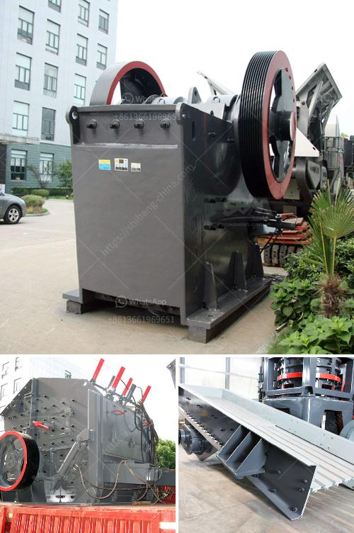

<h3>عملية تصنيع حجر الكوارتز</h3>
حجر الكوارتز هو نوع من الأحجار الطبيعية أو الاصطناعية التي تشتهر بجمالها ومتانتها. وتعتبر عملية تصنيع حجر الكوارتز عملية معقدة تتضمن عدة خطوات.

الخطوة الأولى في عملية تصنيع حجر الكوارتز هي جمع الكوارتز الطبيعي. ويتم ذلك عن طريق استخراج الكوارتز من المناجم باستخدام معدات ثقيلة لفصله عن الصخور الأخرى. يتم تنظيف الكوارتز وفرزه حسب الحجم والجودة المطلوبة.

بعد ذلك، يتم طحن الكوارتز إلى حبيبات صغيرة باستخدام آلات طحن متخصصة. يتم طحن الكوارتز للحصول على حجم وشكل موحد، مما يجعله جاهزًا للاستخدام في العملية التالية.

ثم، يتم خلط الكوارتز المطحون مع مادة رابطة، مثل الراتنجات الاصطناعية أو البوليستر، لتكوين خليط. يتم إضافة اللون إلى الخليط في هذه الخطوة أيضًا، حيث يتم استخدام أصباغ صناعية لإضفاء اللون المرغوب على الحجر. يتم خلط المكونات بشكل جيد باستخدام آلة خاصة.

بعد ذلك، يتم صب الخليط في قوالب لإنتاج الألواح أو البلاطات المستقبلية لحجر الكوارتز. يتم وضع القالب في آلة التشكيل حيث يتم ضغط الخليط للحصول على شكل نهائي. يتم تجفيف الألواح بعناية بهدف تقليل نسبة الرطوبة.

لنحصل على قوام متين ومتجانس، يتم وضع الألواح في فرن خاص لعملية الكي بدرجة حرارة عالية تصل إلى 90 درجة مئوية لفترة زمنية تدوم لعدة ساعات. هذه العملية تعزز متانة وصلابة الحجر وتجعله مقاومًا للخدش والتأثيرات الخارجية.

أخيرًا، تتم عملية سحق وتلميع الألواح لإزالة العيوب السطحية وتحسين اللمعان النهائي للحجر. يتم ذلك باستخدام آلات متخصصة تستخدم شفرات ماسية ومواد كاشطة لتحقيق النتيجة المطلوبة.

بهذا، ننتهي من عملية تصنيع حجر الكوارتز. هذه العملية تضمن الحصول على حجر طبيعي أو اصطناعي ذو جودة عالية ومتانة ممتازة. يتم استخدام حجر الكوارتز في تطبيقات مختلفة مثل تصميمات المطابخ والحمامات وأرضيات الفنادق ومناطق العرض التجارية وغيرها، حيث يوفر تأثيرًا جماليًا فريدًا ويدوم لفترة طويلة.
<h3>Contact us</h3><ul><li><strong>Whatsapp:&nbsp;<a href="https://wa.me/8613661969651">+8613661969651</a></strong></li><li><a href="https://swt.shibang-china.com/?git&amp;zhl&amp;عملية تصنيع حجر الكوارتز"><strong>Online Service(chat now)</strong></a></li></ul><h3>Related</h3><ul><li><a href='قائمة أسعار معدات كسارة الحجر الثقيلة.md'>قائمة أسعار معدات كسارة الحجر الثقيلة</a></li><li><a href='سعر كسارة الصخور.md'>سعر كسارة الصخور</a></li><li><a href='كسارة الكرة للحديد فقط الشركة.md'>كسارة الكرة للحديد فقط الشركة</a></li><li><a href='موزع كسارة في إندونيسيا.md'>موزع كسارة في إندونيسيا</a></li><li><a href='تطبيق محطة الكسارة.md'>تطبيق محطة الكسارة</a></li></ul>