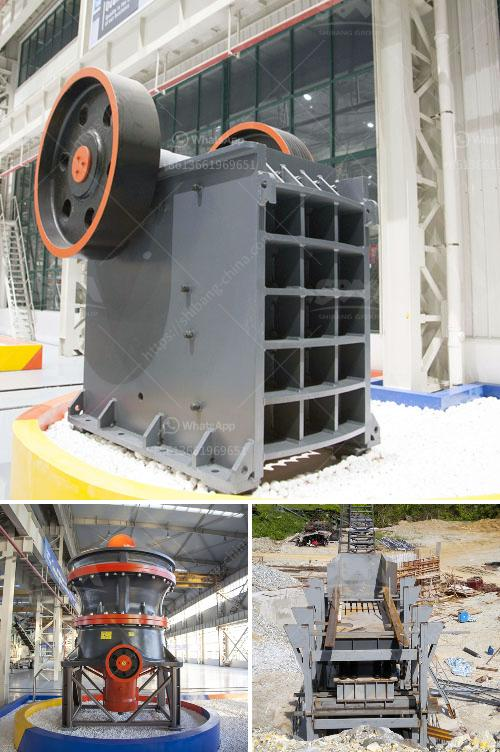

<h3>عملية تصنيع خام البنتونيت</h3>
تعتبر البنتونيت واحدة من المواد الطبيعية التي تستخدم في الصناعات المختلفة، والتي يتم الحصول عليها من عملية تصنيع تشتمل على عدة خطوات.

تعتبر البنتونيت صخرة طينية ناعمة تتكون بشكل رئيسي من العديد من المعادن مثل السيليكا والألمنيوم والأكسجين والبوتاسيوم وغيرها من العناصر الطبيعية. تتواجد البنتونيت في مختلف أنحاء العالم، ولكن الدول التي تعتبر منتجة رئيسية لهذه المادة هي الولايات المتحدة الأمريكية وروسيا والصين والهند.

عملية تصنيع خام البنتونيت تشمل عدة خطوات أساسية. أولاً، يتم استخراج البنتونيت من مناجم الطين الموجودة في الأرض عن طريق تفجير الصخور أو بواسطة الحفر. ثم يتم نقل الصخور الناتجة إلى المصانع، حيث يتم طحنها بواسطة المطاحن الكروية الكبيرة للحصول على جزيئات أصغر وأدق.

بعد ذلك، يتم غسل البنتونيت لإزالة الشوائب والمواد العالقة الأخرى. يتم غسلها بالمياه النظيفة، وتتم فصل الشوائب ورفعها عن البنتونيت بواسطة الطرق الميكانيكية مثل الفصل بواسطة الجاذبية أو استخدام العوامات.

ثم يتم تجفيف البنتونيت لإزالة الرطوبة. قد يتم تجفيفه بأشعة شمس الشمس المباشرة أو باستخدام فرن الحث الحراري. يهدف التجفيف إلى تقليل محتوى الرطوبة في البنتونيت لجعله جاهزًا للاستخدام في الصناعات المختلفة مثل الحفر والتربة والبناء ومعالجة المياه وغيرها.

أخيرًا، يتم طحن البنتونيت المجفف للحصول على حبيبات ناعمة. يتم استخدام المطاحن الخاصة لهذه العملية، ويتم تعبئة البنتونيت المفتت في حقائب أو أكياس في شكله النهائي للتوزيع والبيع.

تلخص هذه الخطوات عملية تصنيع خام البنتونيت. يعد البنتونيت مادة هامة في الصناعة بسبب خصائصها المميزة مثل الامتصاص العالي والتمدد واللزوجة. يتم استخدام البنتونيت في مجموعة واسعة من التطبيقات مثل صناعة الورق والسيراميك وزيت الحفر وتصفية المياه وأكثر من ذلك، مما يجعل عملية تصنيعه أمرًا ضروريًا ومهمًا في العديد من الصناعات.
<h3>Contact us</h3><ul><li><strong>Whatsapp:&nbsp;<a href="https://wa.me/8613661969651">+8613661969651</a></strong></li><li><a href="https://swt.shibang-china.com/?git&amp;zhl&amp;عملية تصنيع خام البنتونيت"><strong>Online Service(chat now)</strong></a></li></ul><h3>Related</h3><ul><li><a href='نوع مطحنة طاحونة عمودية في ماليزيا.md'>نوع مطحنة طاحونة عمودية في ماليزيا</a></li><li><a href='سعر الشاشة الاهتزازية في الهند.md'>سعر الشاشة الاهتزازية في الهند</a></li><li><a href='تقدير تكلفة مصنع تعدين النحاس.md'>تقدير تكلفة مصنع تعدين النحاس</a></li><li><a href='كيفية صنع مسحوق التلك الصناعي.md'>كيفية صنع مسحوق التلك الصناعي</a></li><li><a href='كسارة مخروطية الصين.md'>كسارة مخروطية الصين</a></li></ul>