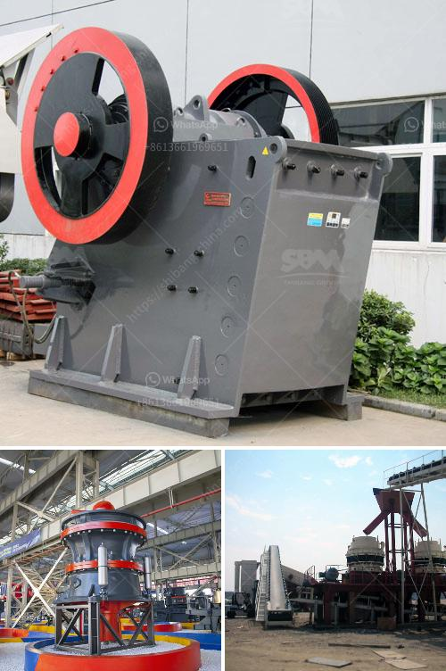

<h3>عملية تصنيع كسارة الطين المكلس</h3>
تصنيع كسارة الطين المكلس هو عملية تهدف إلى إنتاج كسارة الطين المكلسة التي تُستخدم في تحويل الطين إلى مسحوق الطين المكلس. يعتبر الطين المكلس مادة ضرورية في العديد من الصناعات مثل صناعة الأسمدة والسيراميك والزجاج ومعالجة المياه.

تبدأ عملية تصنيع كسارة الطين المكلس بالفحص الأولي للطين المستخدم، حيث يتم فحص قوة التكسير والقدرة على الطحن ومواصفات الجسيمات. يتم ملاحظة الصفات المختلفة للطين المكلس، مثل تركيبته الكيميائية وسلوكه الميكانيكي.

بعد ذلك، يتم سحق الطين المحتوي على الجسيمات الكبيرة إلى قطع صغيرة باستخدام كسارات أولية. تتم عملية السحق بطرق ميكانيكية كالكسارات الفكية أو الكسارات الصدمية، وتختلف الطريقة المستخدمة اعتمادًا على تركيبة الطين.

ثم، يتم التمهيد لعملية الطحن، حيث تنقل القطع الصغيرة من كسارات الطين الحجري الأولية إلى كسارة الطحن. في هذه المرحلة، تتم ضبط إعدادات الكسارة الطحن، مثل سرعة الدوران ومستوى التكسير المرغوب.

بعد عملية الطحن، يتم تصنيف الجسيمات المكسرة وفقًا لحجم الجسيمات المطلوب. يتم استخدام شاشات ومرشحات لتجزئة الجسيمات وتصفيتها وفقًا للحجم.

ثم، يتم تجفيف الطين المكسر باستخدام أفران التجفيف. يتم تحتوي الأفران على أنظمة تدوير للهواء الساخن، مما يتيح تجفيف الطين بشكل فعال وسريع.

أخيرًا، تتم عملية التعبئة والتغليف للطين المكسر. يتم تعبئة المنتج في أكياس أو أوعية مختلفة ووضع علامات وشروط التخزين والتوزيع.

باختصار، تتطلب عملية تصنيع كسارة الطين المكلس العديد من المراحل والخطوات المختلفة. تتطلب المنتجات المستخدمة وتكوين الطين المحتوي على الجسيمات والحجم المطلوب والاحتياجات النهائية للإنتاج جميعها دراسات وتحليلات مسبقة. يتطلب تنظيم العملية معدات متخصصة وخبرة تقنية لتحقيق الجودة والكفاءة في إنتاج كسارة الطين المكلس.
<h3>Contact us</h3><ul><li><strong>Whatsapp:&nbsp;<a href="https://wa.me/8613661969651">+8613661969651</a></strong></li><li><a href="https://swt.shibang-china.com/?git&amp;zhl&amp;عملية تصنيع كسارة الطين المكلس"><strong>Online Service(chat now)</strong></a></li></ul><h3>Related</h3><ul><li><a href='من مصنع تصنيع البوكسيت في الصين.md'>من مصنع تصنيع البوكسيت في الصين</a></li><li><a href='قائمة أسعار كسارة الجرانيت.md'>قائمة أسعار كسارة الجرانيت</a></li><li><a href='مطحنة الكرة لطحن الفلسبار.md'>مطحنة الكرة لطحن الفلسبار</a></li><li><a href='مطحنة الضغط العالي.md'>مطحنة الضغط العالي</a></li><li><a href='كيفية سحق خام الذهب في ماين كرافت.md'>كيفية سحق خام الذهب في ماين كرافت</a></li></ul>