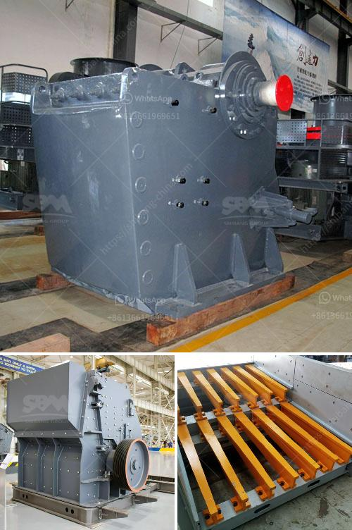

<h3>عملية تصنيع كسارة الطين</h3>
تعتبر الكسارة من الأدوات المستخدمة في صناعة الطوب ومواد البناء، حيث تجري عملية تكسير وسحق المواد الخام بواسطتها. وتتلقى كسارة الطين اهتمامًا خاصًا في هذا السياق، حيث تستخدم لتكسير الطين الذي يعتبر المادة الأساسية في صناعة الطوب.

تتكون عملية تصنيع كسارة الطين من العديد من الخطوات التقنية المعقدة والمتنوعة، والتي يتم تنفيذها في المصانع المتخصصة لهذا الغرض. يتم تصنيع كسارة الطين عادةً من الفولاذ عالي الجودة، حيث يتم قطع وتشكيل المواد الخام وفقًا للتصميم والمواصفات المحددة.

تتكون كسارة الطين من عدة أجزاء مهمة تعمل معًا لتنفيذ عملية التكسير. وتشمل هذه الأجزاء العناصر التالية:

1. الفك المتحرك: يعمل على تكسير الطين الخام وسحقه بفعل الضغط والحركة الدورانية.

2. الفك الثابت: يعمل كنقطة ثابتة ويدعم حركة الفك المتحرك أثناء عملية التكسير.

3. الفتحات الفرعية: تعمل على تنظيم حجم الطين بعد التكسير الأولي، حيث تسمح بتمرير الجزء الصغير من الحصى وتثبيط المواد الأكبر.

4. المحرك: يوفر الطاقة اللازمة لتشغيل كسارة الطين، حيث يعمل على تحويل الطاقة الكهربائية إلى طاقة ميكانيكية لتشغيل الأجزاء المتحركة.

تختلف أحجام كسارات الطين المتاحة بحسب الاحتياجات والمواصفات المطلوبة. ويتم تثبيت كسارة الطين في المواقع لتكون جاهزة للاستخدام في عملية التكسير.

يجب أخذ العديد من العوامل في الاعتبار عند تصميم وتصنيع كسارة الطين، بما في ذلك القوة اللازمة لتكسير المواد، والسرعة المطلوبة لعملية التكسير، وكفاءة الأداء، وعمر الكسارة التشغيلي المتوقع. ويجب أيضًا مراعاة سلامة وصحة العمال والاحتياجات البيئية المتعلقة بعملية التشغيل.

وفي الختام، تعتبر كسارة الطين أداة أساسية في صناعة الطوب، حيث تساهم في تحسين جودة المنتجات وزيادة الإنتاجية. وتتطلب عملية تصنيعها اتباع إجراءات صارمة واستخدام مواد عالية الجودة لضمان الأداء الفعال والموثوق بها في العملية التكسير.
<h3>Contact us</h3><ul><li><strong>Whatsapp:&nbsp;<a href="https://wa.me/8613661969651">+8613661969651</a></strong></li><li><a href="https://swt.shibang-china.com/?git&amp;zhl&amp;عملية تصنيع كسارة الطين"><strong>Online Service(chat now)</strong></a></li></ul><h3>Related</h3><ul><li><a href='عملية تصنيع مسحوق البنتونيت.md'>عملية تصنيع مسحوق البنتونيت</a></li><li><a href='التكلفة المقدرة لإنشاء محجر.md'>التكلفة المقدرة لإنشاء محجر</a></li><li><a href='مطحنة الكرات المطحنة في الهند.md'>مطحنة الكرات المطحنة في الهند</a></li><li><a href='كسارة الحجر في المملكة المتحدة.md'>كسارة الحجر في المملكة المتحدة</a></li><li><a href='أفضل آلات الكسارة.md'>أفضل آلات الكسارة</a></li></ul>