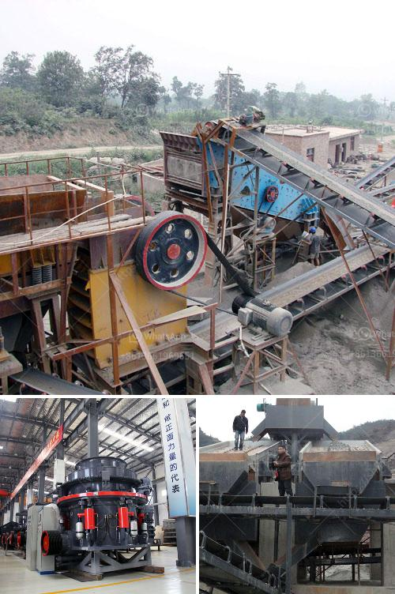

<h3>عملية تصنيع لوح الجبس</h3>
تتم عملية تصنيع لوح الجبس بواسطة عدة خطوات تحتاج إلى مواد وتقنيات محددة لإنتاج المنتج النهائي عالي الجودة. يُستخدم لوح الجبس بشكل شائع في بناء الجدران الداخلية والسقوف، حيث يتم استخدامه كمادة بناء وديكور.

الخطوة الأولى في تصنيع لوح الجبس هي استخراج الجبس من المناجم. يتم طحن الجبس الخام إلى مسحوق ناعم ويتم تسخينه في فرن خاص لإزالة الرطوبة والشوائب. بعد ذلك، يتم طحن الجبس المجفف للحصول على مسحوق ناعم جاهز للاستخدام.

يتم خلط المسحوق مع مواد أخرى مثل الماء والألياف الطبيعية أو الاصطناعية ومكونات أخرى مثل الأسمنت أو الألومنيوم لتحقيق القوة والمرونة والاستقرار الكيميائي للوح الجبس. يتم خلط هذه المكونات في خلاط كبير لضمان توزيع متجانس.

عملية التصنيع تتضمن صب المزيج الرطب في قوالب مستطيلة أو مربعة خاصة. يتم ضغط المزيج في القوالب لإزالة الهواء الزائد وتحقيق شكل موحد ومسطح. بعد ذلك، يتم إحضار القوالب إلى غرف الجفاف حيث يتم تجفيفها بواسطة تدفئة هواء ساخن. تؤخذ القوالب من غرفة الجفاف بعد فترة زمنية محددة وتُبرد تدريجيًا.

بعد تجفيف الواح الجبس، يتم تقطيعها إلى أحجام مختلفة وتنعيم حوافها باستخدام آلة خاصة. ثم يتم تجميع الألواح في حزم والتخزين تمهيدًا للتوزيع.

يتعدد استخدامات لوح الجبس، فهو يستخدم في بناء أسقف مستوية وجدران فاصلة وتجديدات الديكور الداخلي. كما يمكن تطبيقه في بناء الملاعب والأماكن الرياضية لاحتواءه على ميزات مثل العزل الحراري والمظهر الجمالي.

باختصار، عملية تصنيع لوح الجبس تتطلب استخدام مواد خام عالية الجودة وتقنيات حديثة لضمان إنتاج المنتج النهائي الأمثل. خلال عملية التصنيع، تتم معالجة الجبس الخام للتخلص من الرطوبة والشوائب، ثم يُخلط بمواد أخرى ويُصب في قوالب ويتجفف وينعم ويقطع ويجمع ويعبأ ليكون جاهزًا للاستخدام في مجموعة واسعة من التطبيقات البنائية والديكورية.
<h3>Contact us</h3><ul><li><strong>Whatsapp:&nbsp;<a href="https://wa.me/8613661969651">+8613661969651</a></strong></li><li><a href="https://swt.shibang-china.com/?git&amp;zhl&amp;عملية تصنيع لوح الجبس"><strong>Online Service(chat now)</strong></a></li></ul><h3>Related</h3><ul><li><a href='آلة تكسير الفك.md'>آلة تكسير الفك</a></li><li><a href='كسارات محمولة جنوب أفريقيا.md'>كسارات محمولة جنوب أفريقيا</a></li><li><a href='مطحنة الأسطوانة الرأسية.md'>مطحنة الأسطوانة الرأسية</a></li><li><a href='مصنع كسارة البنتونيت.md'>مصنع كسارة البنتونيت</a></li><li><a href='شركة تصنيع آلات رمل السيليكا في الهند.md'>شركة تصنيع آلات رمل السيليكا في الهند</a></li></ul>