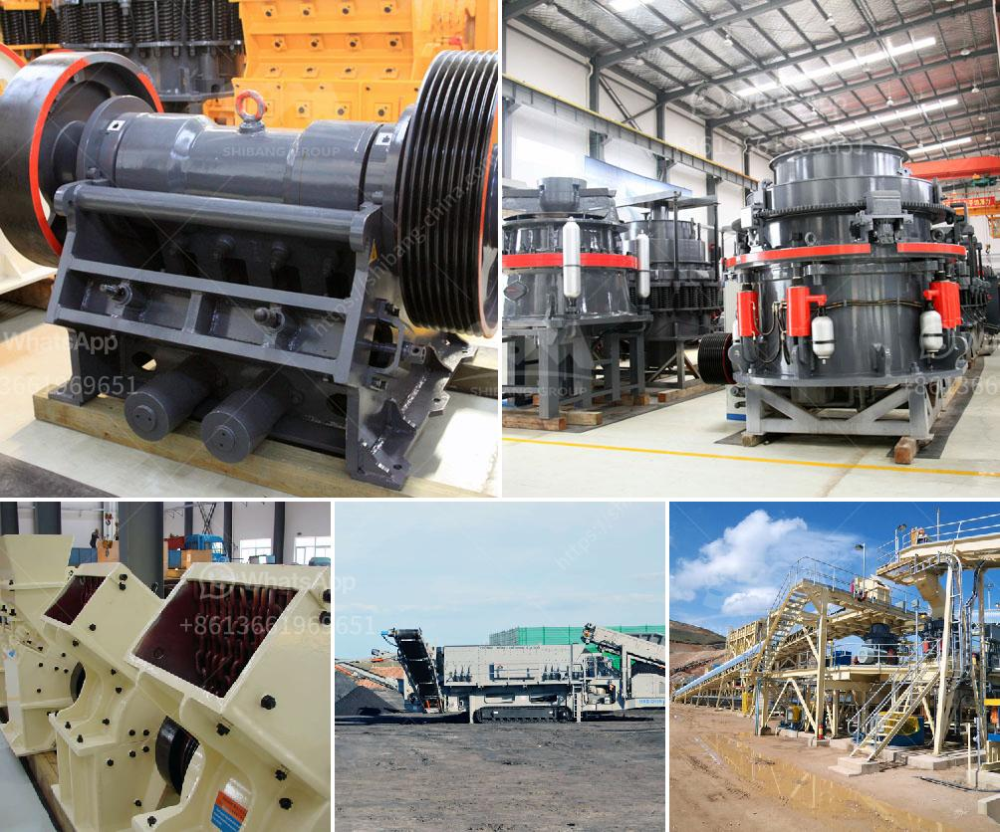

<h3>عملية تصنيع لوحات الجبس</h3>
تُستخدم لوحات الجبس في البناء والديكور الداخلي كواحدة من أكثر الخيارات شيوعًا وشعبيةً في جميع أنحاء العالم. إن عملية تصنيع الجبس تتضمن عدة خطوات تهدف إلى إنتاج لوحات ذات جودة عالية واستخدامها في مختلف التطبيقات.

الخطوة الأولى في عملية تصنيع الجبس هي استخراج الجبس الخام من المناجم. يتم ضخ الماء في الموقع وتتم عملية الحفر لاستخراج الجبس الخام الذي يكون عبارة عن صخور كبريتات الكالسيوم المائية. يتم تكسير الجبس الخام إلى قطع صغيرة ثم يتم طحنها إلى مسحوق ناعم.

بعد ذلك، يتم مزج الجبس الخام المطحون مع الماء لإنتاج معجون الجبس. يتم ضبط نسبة الماء بدقة للحصول على معجون جبسي مناسب. يتم تخزين المعجون في صوامع خاصة للسماح بالترسيب وتجهيزه للمرحلة التالية.

ثم يتم نقل المعجون إلى خط الإنتاج، حيث يتم صب المعجون الجبسي في قوالب مستطيلة من المعدن. يتم استخدام نظام تعبئة تلقائي لتحقيق توزيع متساوٍ في القوالب وضمان عدم وجود فراغات أو عيوب في اللوحات.

بعد صب المعجون في القوالب، يتم تجفيف اللوحات بواسطة فرن جاف. يتم تسخين القوالب إلى درجات حرارة عالية للسماح بتبخر الماء الموجود في المعجون وتصلبه. يستغرق الأمر عدة ساعات لاكتمال عملية التجفيف، وبعدها تتم إزالة اللوحات من القوالب.

بالنهاية، يتم تفحيم اللوحات بواسطة آلة التفحيم لإزالة أي عيوب سطحية وتحسين جودة اللوحات النهائية. يتم تقطيع اللوحات إلى أحجام مختلفة حسب الاحتياجات ويتم فرزها لفصل اللوحات التالفة.

تظهر عملية تصنيع لوحات الجبس الملموسة كيف يتم تحويل الجبس الخام إلى لوحات جاهزة للاستخدام. يتطلب الأمر معدات وعمال مهرة لتحقيق جودة وأداء ممتاز في اللوحات النهائية. يتم استخدام هذه اللوحات في بناء الجدران الداخلية والأسقف والديكورات الداخلية، وتعتبر خيارًا شائعًا واقتصاديًا للعديد من المشاريع البناء.
<h3>Contact us</h3><ul><li><strong>Whatsapp:&nbsp;<a href="https://wa.me/8613661969651">+8613661969651</a></strong></li><li><a href="https://swt.shibang-china.com/?git&amp;zhl&amp;عملية تصنيع لوحات الجبس"><strong>Online Service(chat now)</strong></a></li></ul><h3>Related</h3><ul><li><a href='آلة طحن السليكات في الهند.md'>آلة طحن السليكات في الهند</a></li><li><a href='مطحنة طحن الحجر من ألمانيا.md'>مطحنة طحن الحجر من ألمانيا</a></li><li><a href='كسارة الكرة النحاس آلة كسارة النحاس.md'>كسارة الكرة النحاس آلة كسارة النحاس</a></li><li><a href='عملية التئام الذاتي للحجر الجيري.md'>عملية التئام الذاتي للحجر الجيري</a></li><li><a href='كسارة محمولة في الفلبين بسعر مناسب.md'>كسارة محمولة في الفلبين بسعر مناسب</a></li></ul>