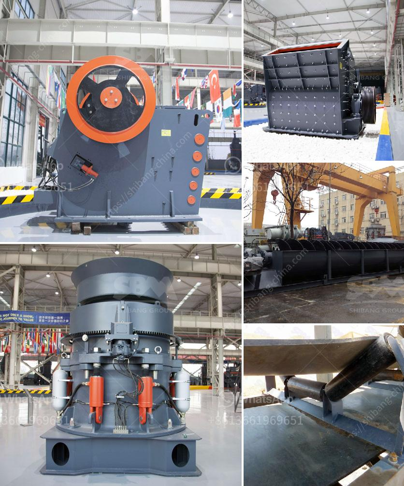

<h3>عملية تصنيع مسحوق البنتونيت</h3>
تعتبر عملية تصنيع مسحوق البنتونيت عملية مهمة في صناعة الطين ومواد البناء ومستحضرات التجميل والصناعات الأخرى. يتم استخدام مسحوق البنتونيت بشكل شائع لخصائصه الفعالة في امتصاص السوائل والعناصر الضارة، وكذلك في تحسين خصائص التربة والمواد الأخرى.

في البداية، يتم استخراج البنتونيت من الطبقات السطحية للأرض، وهو أحد أنواع الطين المعدني الذي يحتوي على مواد كيميائية مهمة مثل السيليكا والألومينا. يتم استخراج البنتونيت عن طريق حفر الآبار العميقة وسحب الطين المحتوي عليه من الطبقات السطحية.

ثم يتم نقل الطين المستخرج إلى ورشة التصنيع حيث يتم طحنه وتحويله إلى مسحوق دقيق. يتم استخدام أجهزة الطحن الميكانيكية مثل المطاحن والكسارات لتفتيت الطين إلى قطع صغيرة، وبعد ذلك يتم إجراء عملية الطحن النهائية للحصول على مسحوق ناعم.

بعد ذلك، يتم إجراء عملية التجفيف للمسحوق، حيث يتم نشره بشكل رقيق على أسطح مسطحة مثل حلقات تسخين أو ألواح معدنية. تعمل هذه الأسطح على تبخير الماء المتبقي في المسحوق وتجفيفه للحصول على مسحوق نهائي ذو رطوبة منخفضة.

أخيرًا، يتم تعبئة مسحوق البنتونيت في حاويات مناسبة للنقل والتخزين. يتم تعبئة المسحوق في أكياس أو حاويات بلاستيكية تحميه من الرطوبة والعوامل الخارجية الضارة. يتم تخزينها في مستودعات جافة حتى يتم نقلها للاستخدام النهائي في الصناعات المختلفة.

في الختام، عملية تصنيع مسحوق البنتونيت هي عملية معقدة تتضمن استخراج البنتونيت الخام، طحنه، تجفيفه، وتعبئته. يتم استخدام مسحوق البنتونيت في العديد من الصناعات بسبب خصائصه الفريدة مثل قدرته على امتصاص السوائل والعناصر الضارة، وتحسين خصائص المواد الأخرى.
<h3>Contact us</h3><ul><li><strong>Whatsapp:&nbsp;<a href="https://wa.me/8613661969651">+8613661969651</a></strong></li><li><a href="https://swt.shibang-china.com/?git&amp;zhl&amp;عملية تصنيع مسحوق البنتونيت"><strong>Online Service(chat now)</strong></a></li></ul><h3>Related</h3><ul><li><a href='استخدامات الصناعية لمسحوق الرخام الأبيض.md'>استخدامات الصناعية لمسحوق الرخام الأبيض</a></li><li><a href='خطة عمل لكربونات الكالسيوم.md'>خطة عمل لكربونات الكالسيوم</a></li><li><a href='اليابان لمصنع تكسير متنقل.md'>اليابان لمصنع تكسير متنقل</a></li><li><a href='كسارة للبيع بسعر دبي.md'>كسارة للبيع بسعر دبي</a></li><li><a href='الفصل المغناطيسي لرمل خام الحديد.md'>الفصل المغناطيسي لرمل خام الحديد</a></li></ul>