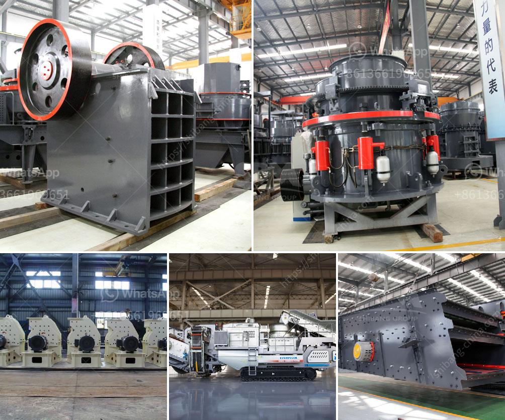

<h3>عملية تصنيع هيدروتون الحصى الطيني</h3>
تعتبر الحصى الطيني هيدروتون، المعروف أيضًا باسم الكتل الطينية الهيدروليكية، من المنتجات الأساسية لصناعة البناء والإنشاء. وتتم عملية تصنيع هيدروتون الحصى الطيني بعدة خطوات مدروسة وتقنيات محددة لضمان الحصول على منتج ذو جودة عالية.

أولًا، تبدأ عملية التصنيع بجمع الخامات الطينية العالية الجودة. تتمثل هذه الخامات في الطين والرمال والجير المكلس. يتم جمع هذه المواد من مناطق تواجد الطبيعية المناسبة والتي تتميز بنسبة عالية من الطين والرمل.

بعد ذلك، يتم نقل الخامات إلى مصنع التصنيع. في المصنع، يتم التحكم في جودة الخامات وفصل الشوائب الموجودة بها. يتم فصل الأحجار الكبيرة والأشياء الغريبة عن الخامات الرئيسية لضمان سلامة المنتج النهائي.

تأتي الخطوة التالية في عملية تصنيع هيدروتون الحصى الطيني من خلال تجفيف الخامات بشكل جيد. يتم وضع الخامات في أفران التجفيف، حيث تتعرض لدرجة حرارة محددة لفترة زمنية معينة. هذه العملية تعمل على تجفيف الخامات من الرطوبة الموجودة فيها وتحضيرها للخطوة النهائية.

بعد تجفيف الخامات، تتم إضافة مواد مضافة إليها لتحسين خواص الحصى الطيني. تتمثل هذه المواد في السيليكا والأملاح والألوان والمواد المضادة للتجمد. تختلف النسب المضافة من هذه المواد حسب الاستخدام المطلوب للحصى الطيني. يتم خلط الخامات مع المواد المضافة بطريقة دقيقة لضمان توزيع متساوٍ للمواد وتحقيق أداء ممتاز للمنتج النهائي.

وأخيرًا، بعد عملية الخلط، تتم عملية الضغط والتشكيل للحصى الطيني. يتم وضع الخليط في القوالب المعدنية ويتم ضغطها بطريقة تساعد على تقوية المنتج النهائي وإعطائه شكلًا محددًا. تتم آلية الضغط بواسطة آلات متخصصة تعمل على تطبيق قوة ضغط عالية على الحصى الطيني؛ مما يساهم في تحقيق المتانة والقوة المثلى للمنتج النهائي.

في الختام، يمكننا القول أن عملية تصنيع هيدروتون الحصى الطيني تتطلب عمليات دقيقة للحصول على منتج ذو جودة عالية. تشمل هذه العمليات جمع وتفصيل الخامات، وتجفيفها، وإضافة المواد المضافة، وعملية الضغط والتشكيل النهائية. يعتبر الحصى الطيني هيدروتون منتجًا هامًا في صناعة البناء والإنشاء بسبب قوته ومرونته في الاستخدام.
<h3>Contact us</h3><ul><li><strong>Whatsapp:&nbsp;<a href="https://wa.me/8613661969651">+8613661969651</a></strong></li><li><a href="https://swt.shibang-china.com/?git&amp;zhl&amp;عملية تصنيع هيدروتون الحصى الطيني"><strong>Online Service(chat now)</strong></a></li></ul><h3>Related</h3><ul><li><a href='كسارة حجر إيطالية.md'>كسارة حجر إيطالية</a></li><li><a href='آلة غسيل الفحم طن.md'>آلة غسيل الفحم طن</a></li><li><a href='خدمة خطة الكسارة.md'>خدمة خطة الكسارة</a></li><li><a href='أسعار كسارة الحجر بسعة 500 طن في الساعة.md'>أسعار كسارة الحجر بسعة 500 طن في الساعة</a></li><li><a href='مطحنة أسطوانية عمودية.md'>مطحنة أسطوانية عمودية</a></li></ul>