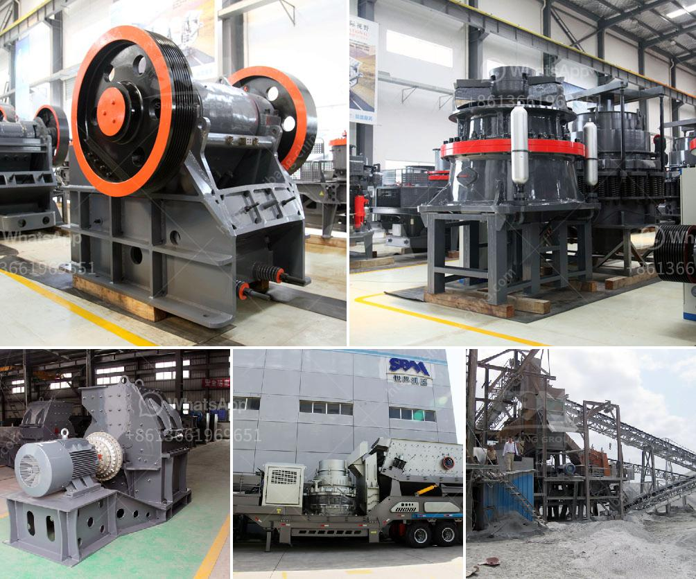

<h3>عملية تعبئة الأسمنت</h3>
تعتبر عملية تعبئة الأسمنت جزءًا أساسيًا من عمليات صناعة الأسمنت وتعبئتها للتوزيع والاستخدام النهائي في مشاريع البناء. يتم تعبئة الأسمنت في العادة في أكياس بلاستيكية أو أكياس من الورق بسعة تتراوح بين 50 و 50 كجم. يتم تنفيذ عملية التعبئة على خط إنتاج يشمل مجموعة متنوعة من المعدات والآلات المختلفة.

في بداية العملية، يتم تفريغ الأسمنت من المصنع عبر أنابيب خاصة إلى صومعة تخزين كبيرة مصنوعة عادة من الحديد. يتم ترتيب صومعات التخزين بصورة مناسبة لتسهيل عملية التعبئة وتقليل تكاليف النقل الداخلي. ثم يتم تغذية الأسمنت من الصومعة إلى قادوس الإمداد للآلة العبء باستخدام ناقل برغي. يستخدم الناقل البرغي لضخ ونقل الأسمنت من الصومعة إلى الآلة العبء بشكل دقيق ومنتظم لضمان الكمية المناسبة من الأسمنت في كل كيس.

بعد ذلك، يتم توجيه الأكياس الفارغة عبر سير ناقل إلى محطة التعبئة. تكون محطة التعبئة عادة مكونة من عدة مكونات رئيسية ، بما في ذلك جهاز تعبئة الأكياس ، ووحدة الختم ، وناقل الأكياس الخاصة بالإرسال. يتم تعبئة الأسمنت في الأكياس بشكل آلي باستخدام جهاز التعبئة الذي يقوم بوزن الأسمنت ونقله إلى الأكياس بطريقة محكمة. يتم ضغط الأسمنت داخل الأكياس بواسطة نظام ضغط هوائي لضمان عدم وجود فراغات أو فضاءات في الأكياس.

بعد ذلك، يتم إغلاق الأكياس بواسطة وحدة الختم عن طريق طي أعلى الأكياس وختمها باستخدام الحرارة أو بالترابط الكيميائي. هذا يضمن أن الأكياس محكمة الإغلاق وتحمي الأسمنت من التلوث أو التعرض للرطوبة التي قد تؤثر على جودة الأسمنت.

أخيرًا، يتم تحميل الأكياس المعبأة على ناقل الأكياس الخاص بالإرسال. يتم توجيه الأكياس المعبأة من محطة التعبئة إلى الشاحنات أو الحاويات أو السفن للنقل والتوزيع. قد تستخدم آلات رافعة شوكية أو سيور ناقلة آخرى لضمان تحميل الأكياس بطريقة آمنة وفعالة.

باختصار، يعتبر عملية تعبئة الأسمنت عملية دقيقة ومتطورة تتطلب تنظيمًا وتنسيقًا جيدين بين المعدات والآلات المختلفة. تهدف هذه العملية إلى توفير الأسمنت بكميات محددة ومعبأة بشكل جيد للتوزيع والاستخدام النهائي في مشاريع البناء المختلفة.
<h3>Contact us</h3><ul><li><strong>Whatsapp:&nbsp;<a href="https://wa.me/8613661969651">+8613661969651</a></strong></li><li><a href="https://swt.shibang-china.com/?git&amp;zhl&amp;عملية تعبئة الأسمنت"><strong>Online Service(chat now)</strong></a></li></ul><h3>Related</h3><ul><li><a href='كم تكلفة مطحنة الكرة.md'>كم تكلفة مطحنة الكرة</a></li><li><a href='كسارة مخروطية لنيجيريا.md'>كسارة مخروطية لنيجيريا</a></li><li><a href='مصنع تكسير الحجر في نيجيريا.md'>مصنع تكسير الحجر في نيجيريا</a></li><li><a href='آلة صنع المسحوق في جنوب أفريقيا.md'>آلة صنع المسحوق في جنوب أفريقيا</a></li><li><a href='محجر مستعمل بشكل معقول في نيجيريا.md'>محجر مستعمل بشكل معقول في نيجيريا</a></li></ul>