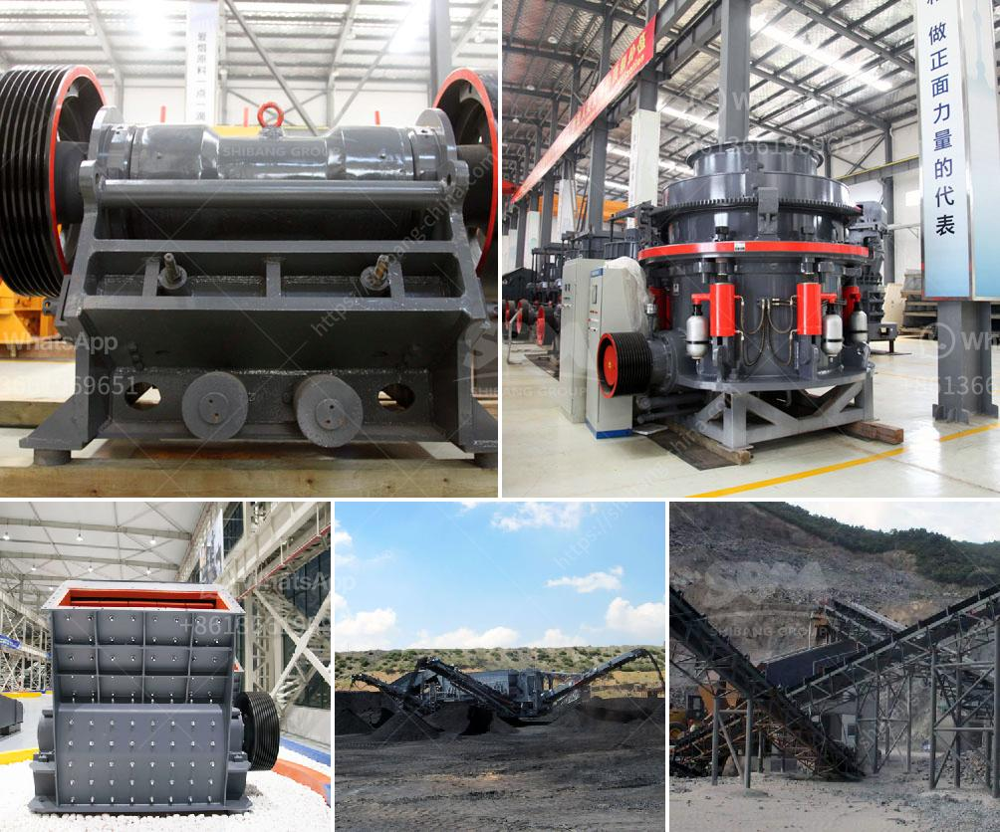

<h3>عملية تعدين الدولوميت</h3>
تعتبر عملية تعدين الدولوميت عملية استخراج المعدن من الصخور والتربة التي تحتوي على ترسبات هذا المعدن. الدولوميت هو معدن يتكون من كربونات المغنيسيوم والكالسيوم، وهو يستخدم بشكل رئيسي في صناعة الحديد والصلب والأسمدة.

يتم تعدين الدولوميت في العديد من الدول حول العالم، وتُعد الصين وإيطاليا والولايات المتحدة أكبر المنتجين لهذا المعدن. تتم عملية التعدين بواسطة استخراج التربة التي تحتوي على الدولوميت، وبعد ذلك يتم نقلها إلى المصانع لمعالجتها.

أولاً، يتم البحث عن مناطق الاحتياطيات المرجحة للدولوميت. يتم ذلك عن طريق تجميع البيانات الجيولوجية وإجراء الدراسات الجغرافية، والتحليلات الكيميائية. يتم استخراج أنماط الترسب الجغرافية ودراسة التضاريس وعمق الترسبات لاكتشاف المواقع الأمثل للتعدين.

بعد تحديد المواقع، تتم عملية التعدين بواسطة آلات ومعدات متخصصة مثل الحفارات والشاحنات الضخمة. يتم استخلاص الدولوميت من التربة وتلطيخها بالماء لتسهيل نقلها. تُنقل الدولوميت المعدنية إلى المصانع المخصصة لمعالجتها.

في المصنع، يتم تنقيتها وتجهيزها للاستخدام الصناعي. تتضمن عملية التجهيز تكسير الدولوميت إلى جزيئات صغيرة ثم طحنها للحصول على مسحوق دقيق. يتم تنقية المسحوق من الشوائب وغيرها من المواد غير المرغوب فيها.

بعد تجهيز الدولوميت، يتم استخدامه في مختلف الصناعات. يستخدم في صناعة الحديد والصلب كعامل خام لإزالة الشوائب والشمعات في عملية التصنيع. كما يستخدم أيضًا في صناعة الأسمدة لتحسين خواص التربة وزيادة نمو النباتات.

من الجدير بالذكر أنه يتم تنفيذ عملية تعدين الدولوميت وفقًا للقوانين واللوائح المحلية والدولية لحماية البيئة والحفاظ على السلامة والصحة. توجد العديد من الإجراءات والتدابير الوقائية التي يجب اتخاذها أثناء جميع مراحل العملية لضمان تقليل التأثير البيئي والحفاظ على سلامة العمال.

باختصار، تعتبر عملية تعدين الدولوميت عملية استخراج المعدن من التربة والصخور التي تحتوي على هذا المعدن. تمثل هذه الصناعة جزءًا هامًا من الاقتصاد في عدة دول حول العالم وتوظف العديد من العمال، كما يتم تنفيذها بمراعاة القوانين البيئية واللوائح الصحية والأمان.
<h3>Contact us</h3><ul><li><strong>Whatsapp:&nbsp;<a href="https://wa.me/8613661969651">+8613661969651</a></strong></li><li><a href="https://swt.shibang-china.com/?git&amp;zhl&amp;عملية تعدين الدولوميت"><strong>Online Service(chat now)</strong></a></li></ul><h3>Related</h3><ul><li><a href='طبقة من مطحنة ريمون.md'>طبقة من مطحنة ريمون</a></li><li><a href='شركة تصنيع آلات الحجر في إيروود.md'>شركة تصنيع آلات الحجر في إيروود</a></li><li><a href='آلة كسارة الفك في المملكة العربية السعودية.md'>آلة كسارة الفك في المملكة العربية السعودية</a></li><li><a href='كسارة الصخور الصين.md'>كسارة الصخور الصين</a></li><li><a href='أسعار كسارات الحجر الصغيرة.md'>أسعار كسارات الحجر الصغيرة</a></li></ul>