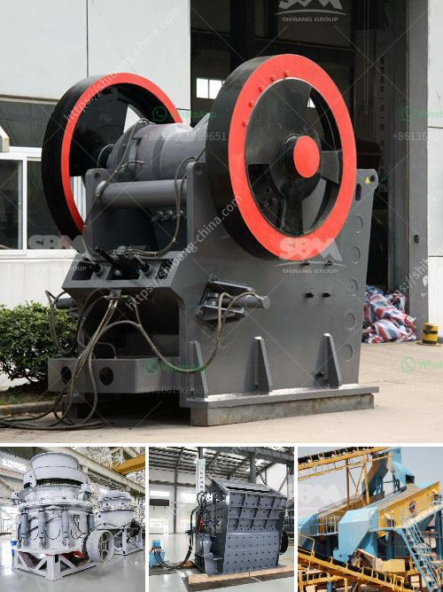

<h3>عملية تعدين الذهب</h3>
تعتبر عملية تعدين الذهب من عمليات استخراج المعادن القديمة التي استخدمها الإنسان لآلاف السنين. وتعدّ الذهب أحد المعادن النفيسة التي تتمتع بقيمة وجاذبية استثنائية.

تعدين الذهب يتم عن طريق استخلاصه من الصخور والتربة التي تحتوي على الذهب، وذلك باستخدام العديد من التقنيات والأساليب التعدينية. يعود تاريخ استخراج الذهب إلى العديد من الحضارات القديمة، مثل الحضارة المصرية والرومانية والإغريقية، واستخدمت هذه الحضارات تقنيات بسيطة مثل غسل المواد الخام في الأنهار واستخراج الذهب بواسطة أدوات يدوية.

بتقدم التكنولوجيا، ظهرت تقنيات تعدين الذهب المتطورة التي تسمح بزيادة كفاءة وإنتاجية عملية التعدين. وتتضمن هذه التقنيات الحفر والتفجير واستخدام الحفارات والمعدات الثقيلة لنقل الصخور والتربة المحتوية على الذهب. كما استخدمت التكنولوجيا الحديثة أيضًا في استخراج الذهب من الصخور، مثل استخدام المواد الكيميائية لفصل الذهب عن الصخور واستخدام الأجهزة المتطورة لتحليل الصخور والاحتفاظ بالذهب.

تعتبر عملية تعدين الذهب عملية معقدة تتطلب الكثير من الجهد والمهارة. وبالإضافة إلى المخاطر البيئية المرتبطة بعملية التعدين، فإنها تعترض على بعض التحديات الفنية والاقتصادية. فعلى سبيل المثال، يمكن حفر آبار عميقة واستخراج الذهب من المواقع العمودية، وهذه تعتبر تكاليف عالية وتشكل تحديًا للعمالة المهنية والمعدات المتطورة التي تستخدمها عملية التعدين.

ومع ذلك، فإن تعدين الذهب لا يزال من المهمات الاقتصادية الهامة في العديد من الدول. فالذهب يعد موردًا قيمًا للدول التي تملك مقاطعات تعدين الذهب، حيث يساهم في دعم الاقتصاد وتوفير فرص العمل وتحسين معيشة السكان المحليين.

تعدين الذهب هو عملية مهمة ومعقدة تستند إلى تقنيات وأساليب تنقيب واستخراج الذهب. يساهم تعدين الذهب في توفير الثروة وتنمية الاقتصاد، لكنه يتطلب أيضًا اهتمامًا كبيرًا بالآثار البيئية والاجتماعية المرتبطة بهذه العملية.
<h3>Contact us</h3><ul><li><strong>Whatsapp:&nbsp;<a href="https://wa.me/8613661969651">+8613661969651</a></strong></li><li><a href="https://swt.shibang-china.com/?git&amp;zhl&amp;عملية تعدين الذهب"><strong>Online Service(chat now)</strong></a></li></ul><h3>Related</h3><ul><li><a href='كسارة بوزولانا الماليزية.md'>كسارة بوزولانا الماليزية</a></li><li><a href='مصنع غسيل رمل السيليكا بالحمض.md'>مصنع غسيل رمل السيليكا بالحمض</a></li><li><a href='كسارة للجرانيت.md'>كسارة للجرانيت</a></li><li><a href='الفصل المغناطيسي لرمل خام الحديد.md'>الفصل المغناطيسي لرمل خام الحديد</a></li><li><a href='شاشة اهتزاز صناعية.md'>شاشة اهتزاز صناعية</a></li></ul>