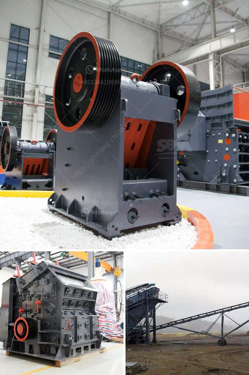

<h3>عملية تعدين الكوارتز في ولاية أندرا براديش</h3>
تعتبر ولاية أندرا براديش في الهند منطقة رائدة في إنتاج الكوارتز. تقع الولاية في منطقة الساحل الجنوبي الشرقي للهند وتمتاز بمواردها الطبيعية الغنية بالمعادن والمصادر المائية الوفيرة.

تعتبر عملية تعدين الكوارتز من أهم الصناعات في ولاية أندرا براديش. الكوارتز هو معدن يتميز بصلابته وشفافيته، ويستخدم على نطاق واسع في العديد من الصناعات مثل صناعة الزجاج والسيراميك والإلكترونيات.

تعمل العديد من الشركات والمناجم في ولاية أندرا براديش على استخراج وتعدين الكوارتز من الأرض. وتتم عملية التعدين عن طريق حفر البئر واستخراج الصخور الكوارتزية من الطبقات السطحية والأرضية. تعد عملية التعدين معقدة وتتطلب تقنيات ومعدات متطورة لضمان استخلاص الكوارتز بكفاءة عالية.

تتم معالجة الصخور في مصانع خاصة لاستخراج الكوارتز النقي من الشوائب والأوساخ الأخرى. يتم طحن الصخور وغسلها بدقة للحصول على الكوارتز النقي. يتم بعد ذلك فصل الكوارتز عن الفحم والدياتومايت والطين وغيرها من المواد المختلفة.

بعد استخلاص الكوارتز النقي، يتم تصنيفه وفقًا لدرجة الجودة والنقاوة. يتم استخدام الكوارتز العالي الجودة في صناعة الزجاج البلوري والمعدات الإلكترونية والمصابيح المتوهجة والعديد من المنتجات الصناعية الأخرى. أما الكوارتز ذو النقاوة المنخفضة، فيستخدم في صناعة المواد الكيميائية والحجر الصناعي.

تسهم صناعة تعدين الكوارتز في ولاية أندرا براديش في توفير فرص عمل للسكان المحليين وتعزز النمو الاقتصادي للمنطقة. كما تعزز أيضًا المشاريع الصناعية الأخرى وتعزز التنمية الاقتصادية للولاية. وبالإضافة إلى ذلك، فإن صناعة تعدين الكوارتز تساهم في توفير موارد طاقة نظيفة وصديقة للبيئة، حيث تستخدم العديد من المناجم تقنيات حديثة للحفاظ على البيئة وتقليل التأثير البيئي لعمليات التعدين.

باختصار، تعتبر عملية تعدين الكوارتز في ولاية أندرا براديش في الهند عملية حيوية وإنتاجية. وتساهم في توفير فرص عمل وتعزز النمو الاقتصادي في المنطقة، بالإضافة إلى توفير مواد أساسية لعدة صناعات مختلفة. كما تهتم صناعة تعدين الكوارتز بالاستدامة البيئية وتعمل على تقليل التأثير البيئي لعمليات التعدين.
<h3>Contact us</h3><ul><li><strong>Whatsapp:&nbsp;<a href="https://wa.me/8613661969651">+8613661969651</a></strong></li><li><a href="https://swt.shibang-china.com/?git&amp;zhl&amp;عملية تعدين الكوارتز في ولاية أندرا براديش"><strong>Online Service(chat now)</strong></a></li></ul><h3>Related</h3><ul><li><a href='موردين لفات الناقل في جنوب أفريقيا.md'>موردين لفات الناقل في جنوب أفريقيا</a></li><li><a href='كيفية صنع مسحوق التلك.md'>كيفية صنع مسحوق التلك</a></li><li><a href='سعر كسارة تأثير الصخور.md'>سعر كسارة تأثير الصخور</a></li><li><a href='آلات مستخدمة في مصنع الفحم المسحوق.md'>آلات مستخدمة في مصنع الفحم المسحوق</a></li><li><a href='معدات فحص الصخور.md'>معدات فحص الصخور</a></li></ul>