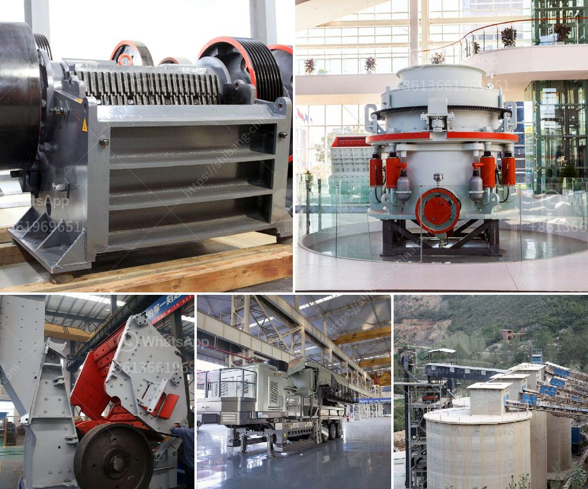

<h3>عملية تعويم التلك</h3>
تُعتبر عملية تعويم التلك عملية هامة في صناعة الألغام التي تستخدم الكيمياء والفيزياء لفصل الجسيمات المعدنية عن الجسيمات غير المرغوب فيها. تُعد عملية التعويم طريقة فعالة لتحقيق تركيز عالٍ من خام المعدن المستهدف، حيث يُستخدم في هذه العملية الطرق الكيميائية والفيزيائية لفصل الجسيمات المعدنية المختلفة عن بعضها البعض.

بحثًا عن استخراج التلك، يُتبع عملية تعويم تحتوي على عدة خطوات رئيسية. يتم تكسير الصخور المحتوية على التلك في مرحلة مبكرة، وتُطحن إلى حجم صغير جدًا. بعد ذلك، تُمزج الصخور المطحونة بالماء لتشكيل طين تحتوي على جزيئات التلك. يتم تنظيف الطين وتقوية تركيزه قبل دخوله إلى خطوة التعويم.

تبدأ عملية التعويم بإضافة مواد كيميائية إلى الطين، تُعرف بـ "عوامل التعويم"، والتي تتفاعل مع الجسيمات المعدنية المرغوب في فصلها. هذه المواد الكيميائية تعزز استخلاص الجسيمات المعدنية وتعيدها إلى السطح لتكون جاهزة للفصل. تشير بعض هذه المواد الكيميائية إلى كبريتيدات الفُلْمِور والأيونات الإيونية المؤينة.

بعد ذلك، يتم تشكيل طبقة من الرغوة على سطح خليط التلك والماء. يتسبب التدفق الهوائي في تشكيل رغوة وفقاً لخواص السطح للجزيئات المعدنية. الرغوة تحتوي على الجزيئات المعدنية المراد فصلها بالإضافة إلى بعض المواد الكيميائية المتبقية. تتكون الرغوة من فقاعات صغيرة تحول دون اندماج الجزيئات المعدنية.

بعد ذلك، يتم جمع الرغوة المحتوية على الجزيئات المعدنية المستهدفة وتنقيتها بواسطة حضنة اهتزازية. يسمح بذلك بفصل الجزيئات المعدنية عن الشوائب والجسيمات الغير مرغوب فيها. بعد ذلك، تُزال المياه الزائدة وتُجفف الرغوة المجمعة للحصول على المنتج النهائي للتلك.

يُستخدم التلك في العديد من الصناعات، مثل صناعة الطلاء والبلاستيك ومواد التجميل. يُعتبر التلك من المعادن القيمة التي يمكن استخدامها في عمليات الإنتاج المختلفة. تُعمل عملية تعويم التلك على تحسين جودة هذا المعدن المهم وفصله عن الجزيئات الأخرى غير المرغوب فيها.

في النهاية، يمكن القول إن عملية تعويم التلك هي عملية فعالة وحديثة تستخدم في صناعة الألغام لتركيز وفصل التلك عن غيره من المركبات. تساهم هذه العملية في استخلاص تلك ذات جودة عالية يمكن استخدامها في العديد من التطبيقات الصناعية المختلفة.
<h3>Contact us</h3><ul><li><strong>Whatsapp:&nbsp;<a href="https://wa.me/8613661969651">+8613661969651</a></strong></li><li><a href="https://swt.shibang-china.com/?git&amp;zhl&amp;عملية تعويم التلك"><strong>Online Service(chat now)</strong></a></li></ul><h3>Related</h3><ul><li><a href='شركة تصنيع آلات الحجر في إيروود.md'>شركة تصنيع آلات الحجر في إيروود</a></li><li><a href='مصنع كسارة الحجر 100 tph.md'>مصنع كسارة الحجر 100 tph</a></li><li><a href='مطحنة الكرة مع محول mercadolibre.md'>مطحنة الكرة مع محول mercadolibre</a></li><li><a href='الكسارة المحمولة ١٥٠ طن في الساعة.md'>الكسارة المحمولة ١٥٠ طن في الساعة</a></li><li><a href='كسارة الفك 100 طن في الساعة للبيع.md'>كسارة الفك 100 طن في الساعة للبيع</a></li></ul>