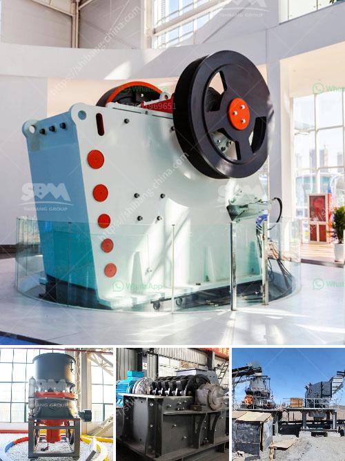

<h3>عملية تلبيس خام المنغنيز</h3>
عملية تلبيس خام المنغنيز هي عملية تحضير خام المنغنيز للاستخدام الصناعي من خلال إزالة المواد الغير مرغوب فيها وزيادة تركيز المنغنيز في الخام. يعتبر المنغنيز واحدًا من العناصر الأساسية في صناعة الحديد والصلب، وتلعب أهمية كبيرة في تعزيز خواص القوة والمتانة للمعدن.

تبدأ عملية تلبيس خام المنغنيز بعملية السحق والطحن، حيث يتم سحق الخام إلى قطع صغيرة ثم يتم طحنها بواسطة الطواحين الصناعية. يتم ذلك للحصول على حجم الحبيبات المطلوب وتسهيل عملية التركيز في الخطوات التالية.

بعد ذلك، يتم استخدام الطرق المختلفة للفصل بين المعدن المطلوب والشوائب الأخرى. أحد هذه الطرق هو الفصل المغناطيسي، حيث يتم استخدام المغناطيسية لجذب الجسيمات المشحونة مغناطيسيًا وفصلها عن الجسيمات الاخرى. يتم تحقيق هذا الفصل المغناطيسي باستخدام جهاز المغناطيسي الدائم أو المغناطيس الكهربائي، حسب المتطلبات.

ثم، يتم استخدام عملية التعويم، حيث يضاف مواد كيميائية معينة إلى الخام لجعل المعادن تعوم على السطح وفصلها عن الشوائب الأخرى. يبنى الفصل على اختلافات الخواص الفيزيائية والكيميائية للمعادن المختلفة. يتم تحقيق ذلك من خلال إضافة مواد مثل المواد الرغوية والماء ومواد الحموضة المناسبة للخام.

بعد اكتمال عملية التعويم، يتم تجفيف المنتج النهائي وتعبئته للاستخدام الصناعي. يتم غالبًا إرسال هذا المنتج النهائي إلى شركات صناعة الحديد والصلب لإنتاج سبائك المنغنيز والحديد.

باختصار، يعتبر عملية تلبيس خام المنغنيز عملية هامة لتحضير الخام للاستخدام الصناعي، وتتضمن عدة خطوات للفصل بين المعدن المطلوب والشوائب الأخرى. تستخدم تقنيات متنوعة ومختلفة مثل السحق والطحن والفصل المغناطيسي وعملية التعويم لتحقيق ذلك.
<h3>Contact us</h3><ul><li><strong>Whatsapp:&nbsp;<a href="https://wa.me/8613661969651">+8613661969651</a></strong></li><li><a href="https://swt.shibang-china.com/?git&amp;zhl&amp;عملية تلبيس خام المنغنيز"><strong>Online Service(chat now)</strong></a></li></ul><h3>Related</h3><ul><li><a href='مصانع محمولة للبيع في جنوب أفريقيا.md'>مصانع محمولة للبيع في جنوب أفريقيا</a></li><li><a href='كسارات محمولة في السعودية.md'>كسارات محمولة في السعودية</a></li><li><a href='معدات تعدين كاثود النحاس.md'>معدات تعدين كاثود النحاس</a></li><li><a href='آلة طحن المطرقة بمعدل طن في الساعة.md'>آلة طحن المطرقة بمعدل طن في الساعة</a></li><li><a href='تكلفة آلات الحديد الاسفنجي 300 طن في اليوم.md'>تكلفة آلات الحديد الاسفنجي 300 طن في اليوم</a></li></ul>