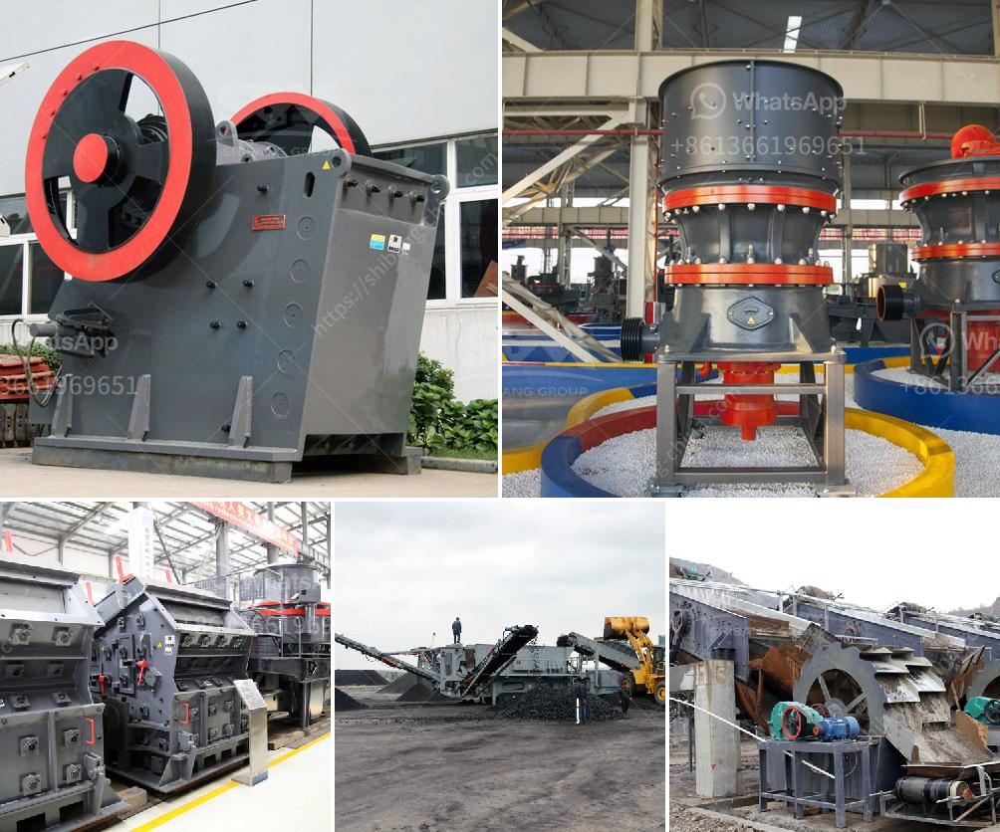

<h3>عملية تنشيط الكالسيوم</h3>
عملية تنشيط الكالسيوم تعتبر عملية هامة جدا في الصناعات المتعددة. يُعد الكالسيوم عنصرًا كيميائيًا فلزيًا ثانويًا، ويُستخدم على نطاق واسع في العديد من التطبيقات، بدءًا من صناعة الحديد وصولاً إلى صناعة البلاستيك.

تنشيط الكالسيوم يعني زيادة قابلية الكالسيوم للتفاعل مع المواد الأخرى. بالعادة، يتم تنشيط الكالسيوم عن طريق إزالة الأكسجين من سطحه أو بواسطة تغطيته بمادة محفزة للتفاعل، مثل الألومنيوم أو النحاس.

تعتبر عملية تنشيط الكالسيوم ضرورية للعديد من التطبيقات الصناعية. على سبيل المثال، في صناعة الحديد، يتم استخدام الكالسيوم المنشط مع الحديد الساخن لإزالة الشوائب والشوائب الأخرى من الصهر. بالإضافة إلى ذلك، يعتبر الكالسيوم المنشط أحد المكونات الرئيسية في صناعة الألومنيوم، حيث يساعد في تحسين الخواص الميكانيكية للسبائك الألومنيوم وتخفيض درجة الحرارة اللازمة للذوبان.

تستخدم عملية تنشيط الكالسيوم أيضًا في صناعة الزجاج، حيث يُستخدم الكالسيوم المنشط لإزالة الشوائب والأوكسيدات الموجودة في الزجاج المصنوع. بالإضافة إلى ذلك، يُمكن تنشيط الكالسيوم باستخدامه في صناعة الصابون، حيث يتفاعل مع الدهون لإنتاج صابون قابل للذوبان في الماء.

تنشيط الكالسيوم يتطلب المهارات والمعرفة المناسبة. يجب الحذر عند التعامل مع الكالسيوم المنشط، حيث يكون عادةً في حالة صلبة ويمكن أن يكون قليلاً قابلاً للاشتعال عند تعرضه للهواء. لذا، يجب دائمًا ارتداء القفازات والنظارات الواقية عند التعامل معه.

في الختام، تنشيط الكالسيوم عملية هامة في عدة صناعات. يساهم في تحسين خواص المواد وتنظيفها من الشوائب والأوكسيدات، مما يؤدي إلى تطبيقات أكثر كفاءة وجودة في العديد من الصناعات والمجالات.
<h3>Contact us</h3><ul><li><strong>Whatsapp:&nbsp;<a href="https://wa.me/8613661969651">+8613661969651</a></strong></li><li><a href="https://swt.shibang-china.com/?git&amp;zhl&amp;عملية تنشيط الكالسيوم"><strong>Online Service(chat now)</strong></a></li></ul><h3>Related</h3><ul><li><a href='شركات تصنيع آلات الكسارة في شنغهاي.md'>شركات تصنيع آلات الكسارة في شنغهاي</a></li><li><a href='مصنع معالجة أكسيد النحاس.md'>مصنع معالجة أكسيد النحاس</a></li><li><a href='مصانع تحسين الكوارتز في الهند.md'>مصانع تحسين الكوارتز في الهند</a></li><li><a href='كسارة الحجر وأسعارها.md'>كسارة الحجر وأسعارها</a></li><li><a href='كسارة الفك والشاشة بتنسيق PDF.md'>كسارة الفك والشاشة بتنسيق PDF</a></li></ul>