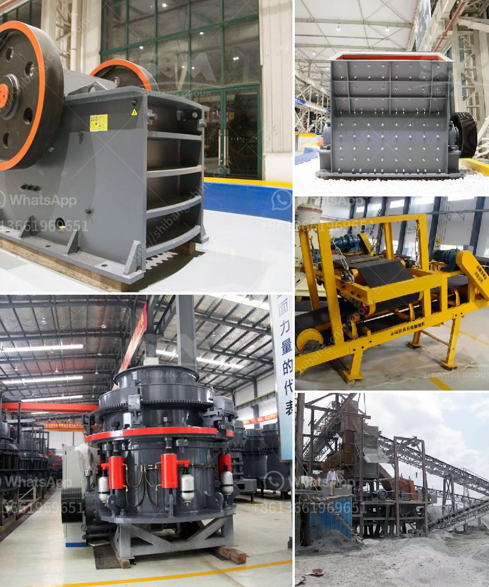

<h3>عملية سحق التعدين لخام الحديد</h3>
عملية سحق التعدين لخام الحديد هي إحدى الخطوات الهامة في صناعة الحديد. تستخدم عملية سحق التعدين لخام الحديد في تفتيت الصخور وتقطيعها إلى قطع صغيرة تجعل عملية التعدين أكثر كفاءة.

تعتمد عملية سحق التعدين على استخدام آلات مختلفة مثل الكسارات والمطارق لتحطيم الصخور الكبيرة إلى أحجام أصغر. وتستخدم هذه الآلات القوة الميكانيكية لتطبيق ضغط على الصخور حتى يتم تفتيتها.

يتم استخدام الكسارات لتفتيت الصخور الكبيرة إلى قطع صغيرة. وتحتوي الكسارات على فكين قادرين على التحرك وفتح وإغلاق، حيث يتم ضغط الصخرة بين الفكين لتفتيتها. وتوفر هذه العملية عملية سحق سريعة وفعالة للحصول على حجم الجسيمات المطلوب.

بالإضافة إلى الكسارات، تستخدم المطارق في عملية سحق التعدين لخام الحديد. تعمل المطارق عن طريق تطبيق قوة صدمة على الصخور لتكسيرها. وتحتوي المطارق على رأس معدني ثقيل يتم توجيهه نحو الصخرة، وبفعل القوة التي يتم تطبيقها، يتم تفتيت الصخرة إلى جزيئات صغيرة.

من أجل زيادة كفاءة عملية سحق التعدين لخام الحديد، يتم استخدام الفحاصات لفصل الجسيمات المفتتة حسب حجمها. تعمل الفحاصات عن طريق تمرير الجسيمات عبر شبكة نصف مسامية تسمح فقط للجسيمات ذات الحجم المطلوب بالمرور. ويتم فصل الجسيمات الأصغر مع السحق النهائي.

تعتبر عملية سحق التعدين لخام الحديد مهمة لاستخلاص الحديد من الصخور. فبعد سحق الصخور وتفتيتها، يتم تقطيع الحديد إلى قطع أصغر وتوجيهها إلى عمليات أخرى مثل تجهيز الفلزات وتكوين سبائك الحديد. وبفضل تطور التكنولوجيا، أصبحت عملية سحق التعدين أكثر كفاءة وأدق، مما يساهم في زيادة إنتاجية صناعة الحديد وتحسين جودة المنتج النهائي.
<h3>Contact us</h3><ul><li><strong>Whatsapp:&nbsp;<a href="https://wa.me/8613661969651">+8613661969651</a></strong></li><li><a href="https://swt.shibang-china.com/?git&amp;zhl&amp;عملية سحق التعدين لخام الحديد"><strong>Online Service(chat now)</strong></a></li></ul><h3>Related</h3><ul><li><a href='شركة تصنيع معدات تعدين الذهب في الصين.md'>شركة تصنيع معدات تعدين الذهب في الصين</a></li><li><a href='حجم وقدرة كسارة الفك النموذجية.md'>حجم وقدرة كسارة الفك النموذجية</a></li><li><a href='شركة كسارة الحجر.md'>شركة كسارة الحجر</a></li><li><a href='آلة معالجة النحاس.md'>آلة معالجة النحاس</a></li><li><a href='جميع نماذج كسارة البازلت.md'>جميع نماذج كسارة البازلت</a></li></ul>