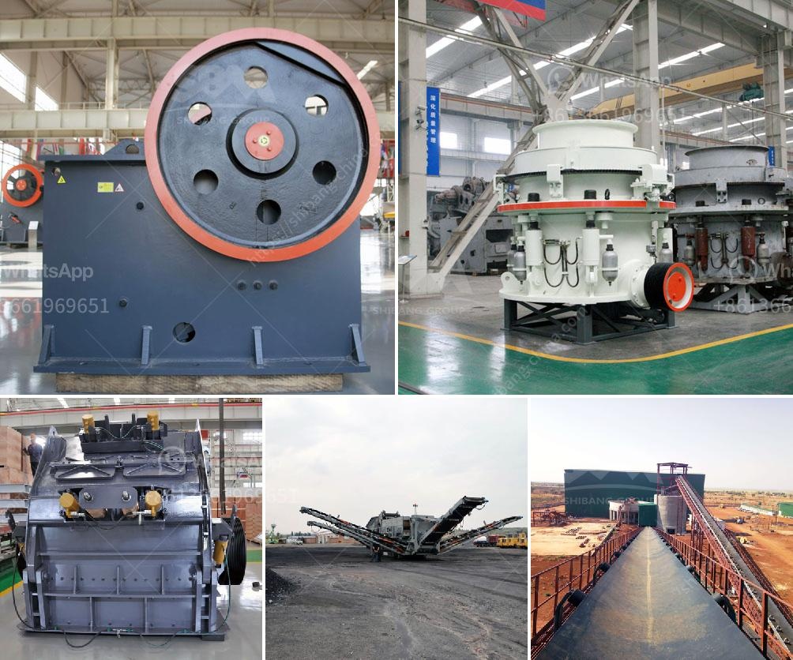

<h3>عملية سحق الصخور في الركام</h3>
عملية سحق الصخور في الركام تعد من العمليات الهامة في صناعة البناء والإنشاء، حيث تهدف إلى تحطيم الصخور الكبيرة إلى جزيئات صغيرة يمكن استخدامها في إنتاج مواد البناء المختلفة، مثل الخرسانة والأسفلت والحصى.

تتم عملية سحق الصخور عادة في محجر أو منجم، حيث يتم جمع الصخور الكبيرة من الموقع ونقلها إلى المرافق المخصصة لسحقها. وتتم هذه العملية عن طريق استخدام كسارة صخور تعمل بواسطة الطاقة الهيدروليكية، وتكون مجهزة بأسنان معدنية قوية تستخدم للضغط على الصخور وكسرها.

تحدث عملية سحق الصخور في عدة مراحل. في المرحلة الأولى، تتم تحطيم الصخرة الكبيرة إلى أحجام أصغر باستخدام الكسارة الأولية، التي تتميز بأسنان معدنية كبيرة وقوية. يتم تحطيم الصخرة في الفتحة الموجودة في الكسارة، ويتم إصدار الحجارة المحطمة إلى المرحلة التالية.

في المرحلة الثانية، تمر الحجارة المحطمة عبر ناقل ينقلها إلى الكسارة الثانوية، وهذه الكسارة تعمل بنفس الطريقة باستخدام أسنان معدنية أصغر وأكثر دقة. يتم تحطيم الحجارة المحطمة مرة أخرى في هذه الكسارة للحصول على أجزاء صغيرة.

في المرحلة الأخيرة، تمر الحصيات المحطمة عبر غربال يفصل الحصيات الصغيرة المطلوبة من الغبار والمواد الأخرى غير المرغوب فيها. يتم تجميع الحصيات النهائية المنتجة ونقلها إلى موقع الاستخدام.

من المهم أن تتم عملية سحق الصخور في الركام بشكل صحيح وفقًا للمعايير الصناعية والبيئية. يجب أن يتم تشغيل المعدات بشكل آمن وفقًا للإجراءات الأمنية المطلوبة، ويجب أن يتم إعادة تدوير النفايات المتبقية بشكل صحيح للحفاظ على البيئة وتقليل التأثير السلبي على البيئة.

باختصار، يعتبر سحق الصخور في الركام عملية حيوية في صناعة البناء والإنشاء. تتمثل أهميتها في تحويل الصخور الكبيرة إلى حصى صغيرة يمكن استخدامها في إنتاج مواد البناء المختلفة. ومع تنفيذ العملية بشكل صحيح ومستدام، يمكن تحقيق فوائد اقتصادية وبيئية هامة إلى جانب تلبية الاحتياجات البنائية المتزايدة.
<h3>Contact us</h3><ul><li><strong>Whatsapp:&nbsp;<a href="https://wa.me/8613661969651">+8613661969651</a></strong></li><li><a href="https://swt.shibang-china.com/?git&amp;zhl&amp;عملية سحق الصخور في الركام"><strong>Online Service(chat now)</strong></a></li></ul><h3>Related</h3><ul><li><a href='الفصل المغناطيسي لرمل خام الحديد.md'>الفصل المغناطيسي لرمل خام الحديد</a></li><li><a href='معدات طحن مسحوق المطحنة.md'>معدات طحن مسحوق المطحنة</a></li><li><a href='محطة تكسير الصخور.md'>محطة تكسير الصخور</a></li><li><a href='مطحنة الأسطوانة للحجر.md'>مطحنة الأسطوانة للحجر</a></li><li><a href='شركة تصنيع لطحن الكلنكر.md'>شركة تصنيع لطحن الكلنكر</a></li></ul>