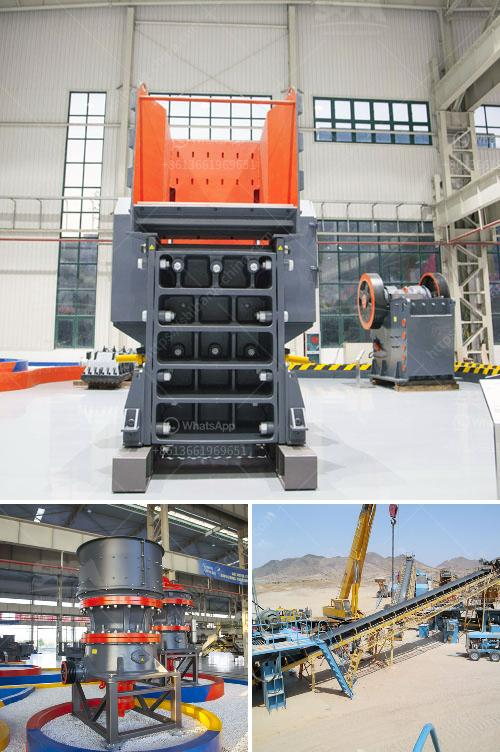

<h3>عملية سحق الفحم 200 tph</h3>
تعتبر عملية سحق الفحم 200 tph عملية هامة في صناعة الطاقة. يستخدم الفحم كمصدر رئيسي لتوليد الكهرباء في العديد من البلدان حول العالم، ولذلك فإن عملية سحق الفحم هي الخطوة الأساسية في تحضيره للاستخدام.

تهدف عملية سحق الفحم إلى جعل الفحم أصغر حجماً وأكثر ملاءمة للاستخدام النهائي. يتم استخدام معدات متخصصة لهذه العملية، مثل كسارات الفحم والمطارق والمطاحن. تختلف سرعة العملية والقدرة على سحق الفحم حسب تصميم المعدات والتكنولوجيا المستخدمة.

تتم عملية سحق الفحم بعد تحجيمه وتجفيفه وتنظيفه. يتم تغذية الفحم إلى الكسارات لتفتيته إلى قطع صغيرة. يتم اختيار حجم الكسر المناسب وفقًا لاستخدام الفحم في محطة توليد الكهرباء. من ثم، يتم تعديل حجم الفحم المكسر بواسطة المطارق والمطاحن للحصول على حجم مناسب.

يجب أيضًا مراعاة جودة الفحم المسحوق عند عملية سحقه. فتحمل الفحم المقاومة الداخلية للتآكل والتحميل يلعب دوراً هاماً في معدل الاستهلاك وعمر المعدات. لذلك، يجب تصنيع المعدات المستخدمة في عملية سحق الفحم بمواد عالية الجودة ومقاومة للتآكل.

يعتبر سحق الفحم هامًا لزيادة كفاءة حرقه وتقليل انبعاثات الغازات الضارة. بالتالي، يمكن القول إن عملية سحق الفحم 200 tph لا تهدف فقط لتحضير الفحم للاستخدام في محطات توليد الكهرباء، ولكنها تساهم أيضًا في الحفاظ على البيئة وتقليل التلوث.

في النهاية، يمكن القول أن عملية سحق الفحم 200 tph تعتبر عملية حاسمة لتحضير الفحم للاستخدام في توليد الكهرباء. يتطلب تنفيذها استخدام معدات متخصصة وجودة عالية، وكذلك اتباع معايير السلامة والحماية البيئية.
<h3>Contact us</h3><ul><li><strong>Whatsapp:&nbsp;<a href="https://wa.me/8613661969651">+8613661969651</a></strong></li><li><a href="https://swt.shibang-china.com/?git&amp;zhl&amp;عملية سحق الفحم 200 tph"><strong>Online Service(chat now)</strong></a></li></ul><h3>Related</h3><ul><li><a href='مصنع معالجة مسحوق الجبس في الهند.md'>مصنع معالجة مسحوق الجبس في الهند</a></li><li><a href='آلة كسارة للبيع.md'>آلة كسارة للبيع</a></li><li><a href='سحق مصنع لخام الحديد.md'>سحق مصنع لخام الحديد</a></li><li><a href='خط إنتاج الحجر الجيري.md'>خط إنتاج الحجر الجيري</a></li><li><a href='مشغل مصنع كسارة في كسارة.md'>مشغل مصنع كسارة في كسارة</a></li></ul>